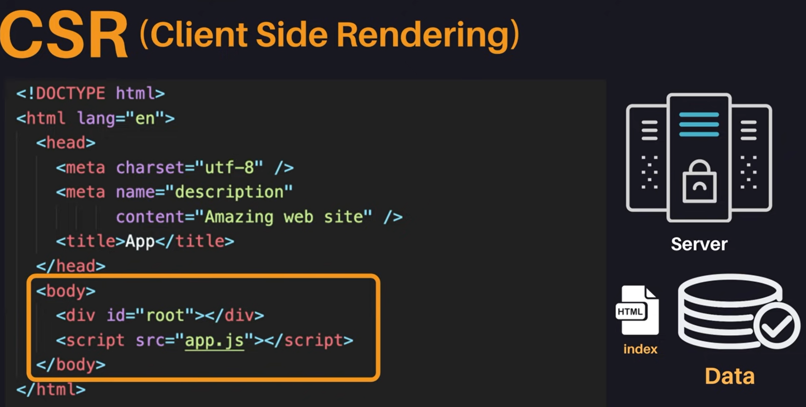
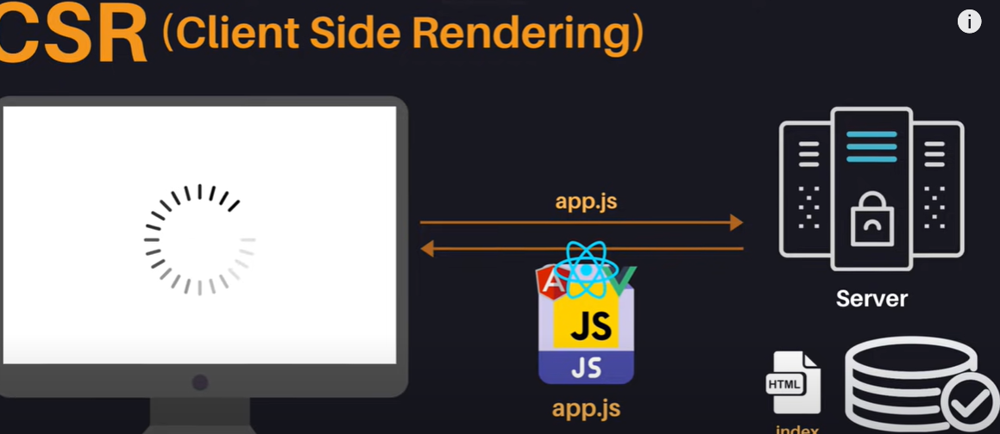
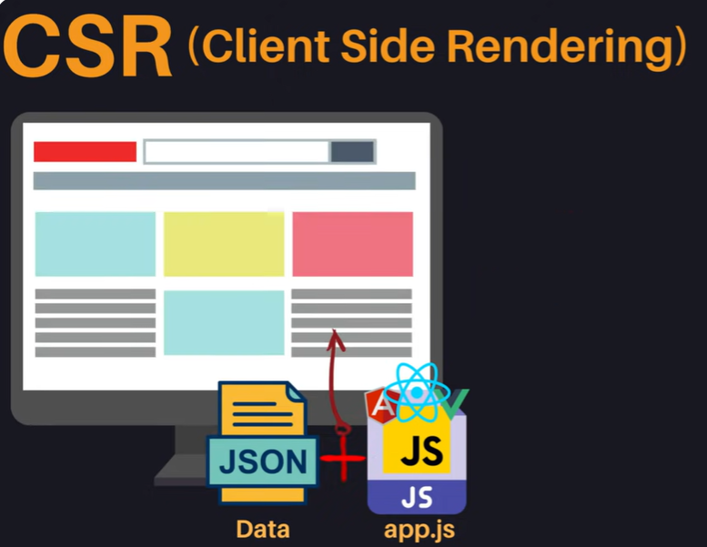
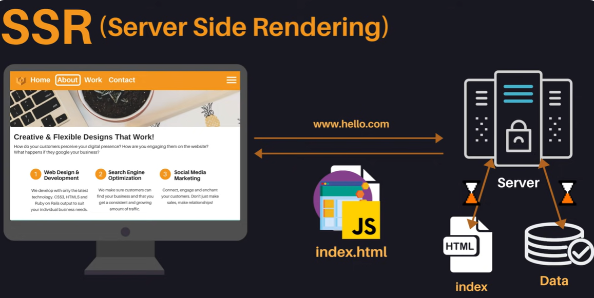
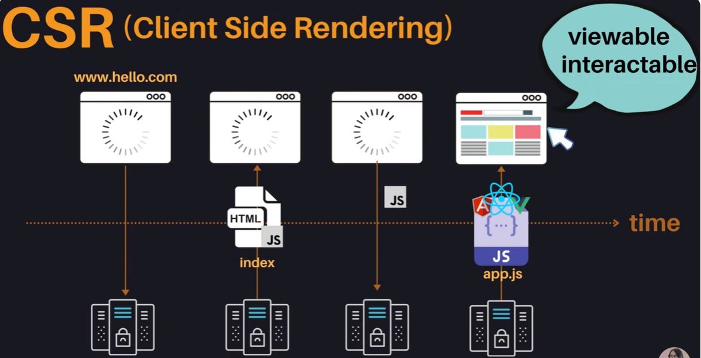
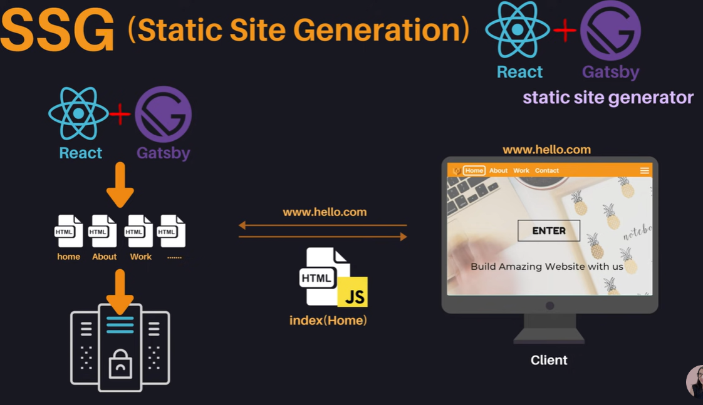

## CSR, SSR

### 1. 서버사이드 렌더링의 역사와 발전
 - 1990년 중반까지는 정적 웹 페이지(Staic Sites)가 주를 이루었으며, 사용자는 서버에서 HTML 문서를 요청하여 전체 페이지를 로드해야 했다.
  - 1996년 iframe 태그의 도입과 1998년 XmlHttpRequest API의 개발로 페이지 내에서 부분적으로 데이터(ex.JSON)를 받아와 js를 이용해 동적으로 html 요소 생성해서 페이지에 업데이트할 수 있는 방식이 생겼다.
  - 2005년, 위와 같은 방식이 AJAX라는 용어가 공식적으로 생기면서 구글은 이를 활용하여 Gmail과 Google Maps 같이 `싱글페이지 어플리케이션(SPA)`을 제작하였다.
    - 사용자가 한 페이지 내에서 머무르면서 필요한 데이터 서버에서 받아와 부분적으로만 업데이트
  - 사용자들의 PC 성능이이 점차 좋아져서 많은 것들을 무리 없이 처리 + 자바스크립트 표준화 + 강력한 커뮤니티 -> Angular, Vue, React와 같은 프레임워크 등장 : `CSR`
 

### 2. 클라이언트 사이드 렌더링(CSR)의 특징과 문제점
* 특징
  - 클라이언트 사이드 렌더링(CSR)은 클라이언트 측에서 모든 처리를 하며, 서버는 index라는 HTML 파일만 보내준다. 이 HTML에는 최소한의 요소만 포함되어 있다.
  

  
  - 처음 웹사이트에 접속하면 텅텅 빈 화면이 나타나며, JavaScript(어플리케이션에서 필요한 로직, 프레임워크와 라이브러리의 소스코드 포함)를 다운로드 받는다.
  - 추가로 필요한 데이터가 있다면 서버에 요청해서 데이터를 받아온 다음에 이것들을 기반으로 해서 동적으로 HTML을 생성해 사용자에게 어플리케이션을 보여준다.
  

* 문제점
  - 첫 화면을 보기까지의 지연 시간
  - 좋지 않은 검색 엔진 최적화(SEO)
  - SEO(Search Engine Optimization) : 검색 엔진(구글, 네이버 등)이 웹사이트 HTML 문서를 분석하여 검색 가능성을 높이는 과정. '🤖검색 엔진 : "여기 HTML은 이런 타이틀과 디스크립션이 있으니까 이런 검색어로 찾을 수 있는 웹사이트군, 그리고 여기에 이런 링크들이 있으니까 이것도 검색엔진에 등록해 놔야겠어" -> 검색할때 웹사이트를 검색할 수 있게 도와줌
  - CSR에서 사용되는 HTML은 빈 내용이 많아 검색 엔진이 이를 제대로 분석하기 어렵다.
  - 구글의 CSR 지원이 다소 개선되었지만 여전히 SEO는 좋지 않은 상태로 남아 있다.

 

### 3. 서버 사이드 렌더링(SSR)의 장단점

- SSR은 1990년 중반쯤 사용했던 Staic Sites에서 영감을 받음.
- 서버에서 필요한 데이터를 모두 가져와서 HTML 파일을 만듦 -> 이 HTML 파일을 동적으로 제어할 수 있는 소스코드(js)와 함께 클라이언트 측에 보냄 -> 클라이언트 측에서는 이 HTML문서를 바로 사용자에게 보여줌

 

* 장점
  - 서버 사이드 렌더링(SSR)은 클라이언트 측에서 처리하던 CSR의 문제를 해결하기 위해 도입되었으며, 서버에서 데이터를 가져와 HTML 파일을 생성한다.
  - SSR을 사용하면 첫 페이지 로딩 속도가 빨라지고, 모든 콘텐츠가 HTML에 포함되어 SEO 효율성이 증가한다.

* 단점
  - SSR은 Static Sites의 깜박임 이슈와 같은 문제를 여전히 가진다. 사용자 경험에 악영향을 미칠 수 있다.
  - 서버에 과부하 발생할 위험이 높아진다. 사용자가 클릭할때 마다 서버에 요청해서, 서버에서 필요한 데이터를 가지고와 HTML을 만들기 때문이다.
  - 사용자가 빠르게 웹사이트를 확인할 수 있지만, 동적으로 데이터를 처리하는 자바스크립트를 아직 다운로드받지 못해 클릭 이벤트에 반응이 없을 수 있다.

 

### 4. CSR과 SSR의 TTV 및 TTI 분석
- TTV(time to view)와 TTI(time to interact)는 웹사이트 성능을 이해하는 데 필수적인 요소이다.
  - TTV(Time to View) : 사용자에게 페이지가 로드되고 있음을 시각적으로 보여주는 시간
  - TTI(Time to Interact) : 페이지와 실제 상호작용이 가능한 상태가 되는 시간

* CSR과 SSR의 TTV, TTI 비교
  
  - CSR : 사이트 접속하면 서버에게서 index 파일 받아옴 -> index.html은 비어있으므로 사용자에게 아무것도 보여주지 않음 -> 이 html에 링크되어있는 js파일 요청 -> 동적으로 html 생성할 수 있는 js파일(app.js) 받아옴 -> 사용자에게 웹사이트 보임. 사용자가 클릭(인터렉션) 가능
  - CSR은 TTV동시에 TTI 가능

   

  - SSR : 서버에서 이미 만들어진 index파일 가져옴 -> 사용자가 웹사이트 볼 수 있음. 하지만 js 파일은 받아오지 않은 상태이므로 사용자가 상호작용할 수 없음. 이후 js파일 받아야 상호작용이 가능하다.
  - 그래서 SSR은 사용자가 사이트를 볼 수 있는 시간과 상호작용할 수 있는 시간 사이의 공백이 길어지는 경향이 있다.

=> 웹사이트의 성능 분석 시 TTV와 TTI는 중요 메트릭으로 활용.
  - CSR : 최종적으로 번들링해서 사용자에게 보내주는 자바스크립트 파일을 어떻게 효율적으로 많이 분할해서 첫번째로 사용자가 보기 위해 필요한 필수적인 것만 보낼 수 있을지 고려
  - SSR : 사용자가 보고 상호작용하는 시간의 단차를 줄이기 위해 어떤 노력을 할 수 있을지 고려

 

### 5. SSR과 SSG의 활용 및 중요성

- `SSG(Static Site Generation)`는 정적 웹 페이지 생성을 통해 서버에 배포 가능하게 하며, 리액트와 개츠비를 함께 사용하면 이를 실현할 수 있다.(리액트 웹 어플리케이션을 게츠비 활용해서 정적으로 웹페이지를 미리 생성해두어 서버에 배포)
- 생성된 웹사이트가 모두 정적이지는 않으며, 필요시 동적인 요소를 추가할 수 있다.
- Next.js는 강력한 SSR을 지원하며, 최근에는 SSG도 지원하면서 CSR과 SSR을 잘 섞어 사용할 수 있는 라이브러리이다.

 

---

 

* 웹사이트 개발 시, 정적, 동적 요소 및 사용자 수에 따라 TTV(해당 사이트의 로드 시간), TTI(인터랙티브 시작 시간)를 고려해야 한다.
* 관련 기술 선택에 있어 유연한 접근이 중요하며 각 사이트의 특성에 맞춰 적절히 혼합하여 사용하는 것이 바람직하다.