# 브라우저가 웹 페이지를 화면에 표시하는 원리

<details>
<summary>cf. 파싱이란</summary>

- 브라우저가 코드를 이해하고 사용하기 쉬운 구조로 변환하는 것
- 웹브라우저 **렌더링 과정**에서 **파싱(parsing)**은 **HTML, CSS, JavaScript**와 같은 문서를 읽고 구조화하는 과정이에요. 브라우저는 이 과정을 통해 화면에 웹페이지를 표시할 준비를 합니다.

## 렌더링 과정 간단 요약

1. **HTML 다운로드**: 브라우저가 서버에서 HTML 파일을 가져옵니다.
2. **HTML 파싱**: HTML 문서를 읽고 **DOM 트리**를 만듭니다.
3. **CSS 파싱**: CSS 파일을 읽고 **CSSOM 트리**를 만듭니다.
4. **JavaScript 실행**: JavaScript가 실행되면서 DOM이나 CSSOM을 수정할 수 있습니다.
5. **렌더 트리 생성**: DOM과 CSSOM을 결합해 화면에 표시될 요소들을 정리합니다.
6. **레이아웃 계산**: 각 요소의 위치와 크기를 계산합니다.
7. **페인팅**: 계산된 내용을 화면에 그립니다.

---

## 파싱(Parsing)이란?

**파싱**은 **문자열이나 파일을 읽고 구조화된 데이터로 변환하는 과정**

### HTML 파싱

- HTML 파일을 읽어 브라우저가 이해할 수 있는 **DOM(Document Object Model)** 구조를 만듭니다.
- DOM 트리는 HTML 문서의 요소를 계층적으로 표현해요.

**예시 HTML 코드**

```html
html 코드 복사
<html>
  <body>
    <h1>안녕하세요</h1>
    <p>이것은 예제입니다.</p>
  </body>
</html>
```

**파싱 후 DOM 트리**

```css
css
코드 복사
- html
└─ body
    ├─ h1 (안녕하세요)
    └─ p (이것은 예제입니다)
```

---

### CSS 파싱

- CSS 파일을 읽어 각 HTML 요소에 적용할 스타일 정보를 정리해 **CSSOM**(CSS Object Model) 트리를 만듭니다.

**예시 CSS 코드**

```css
css 코드 복사 h1 {
  color: red;
}
p {
  font-size: 16px;
}
```

**파싱 후 CSSOM 트리**

```css
css 코드 복사 - h1 {
  color: red;
}
- p {
  font-size: 16px;
}
```

---

### JavaScript 파싱

- JavaScript는 실행되기 전에 **파싱**을 통해 문법적으로 분석되고 **AST(Abstract Syntax Tree)**라는 구조로 변환됩니다.
- 이후 JavaScript 코드가 실행되면서 DOM이나 CSSOM에 변화를 줄 수 있습니다.

**예시 JavaScript 코드**

```jsx
javascript
코드 복사
document.querySelector("h1").style.color = "blue";
```

위 코드는 DOM 트리의 `h1` 요소를 찾아 글자 색을 파란색으로 바꾸는 역할을 합니다.

---

## 파싱의 역할 요약

1. **HTML 파싱**: HTML을 읽고 DOM 트리를 생성합니다.
2. **CSS 파싱**: CSS를 읽고 CSSOM 트리를 생성합니다.
3. **JavaScript 파싱**: JavaScript를 읽고 실행 가능한 형태로 변환한 후 DOM과 CSSOM을 수정합니다.
</details>

</br>

<details>
<summary>cf. 브라우저란</summary>

- **브라우저**는 **웹페이지를 불러와 화면에 보여주는 프로그램**이에요. 우리가 인터넷을 사용할 때 웹사이트를 열어볼 수 있도록 도와주는 도구

---

## 브라우저의 정의

- 브라우저는 **웹 서버에서 받은 HTML, CSS, JavaScript 등의 파일을 해석(파싱)**해서 화면에 **렌더링**해 주는 **소프트웨어**입니다.
- **크롬(Chrome)**, **파이어폭스(Firefox)**, **사파리(Safari)**, **엣지(Edge)** 등이 가장 많이 사용되는 브라우저입니다.

---

## 브라우저의 주요 역할

1. **웹페이지 요청** : 사용자가 주소창에 URL을 입력하면, 브라우저는 웹서버에 웹페이지를 요청합니다.

2. **웹페이지 파일 다운로드** : 서버에서 HTML, CSS, JavaScript, 이미지 파일 등을 다운로드합니다.

3. **파싱(Parsing)** : 
다운로드한 파일들을 해석해서 구조화된 데이터(DOM, CSSOM)로 만듭니다.

4. **렌더링(Rendering)** : 구조화된 데이터를 바탕으로 화면에 웹페이지를 표시합니다.

5. **JavaScript 실행** : JavaScript를 실행해서 웹페이지를 동적으로 동작하게 합니다.

---

## 브라우저의 핵심 구성 요소

브라우저는 여러 부분으로 나뉘어져 있습니다.

1. **사용자 인터페이스(UI)**

- 주소창, 뒤로 가기 버튼, 북마크 등 사용자가 상호작용할 수 있는 부분입니다.

2. **브라우저 엔진**

- UI와 렌더링 엔진 사이에서 작동하는 중간 관리자입니다.

3. **렌더링 엔진**

- HTML, CSS를 **파싱**하고 화면에 표시하는 역할을 합니다.
- 예: 크롬(Chrome)은 **Blink**, 사파리(Safari)는 **WebKit** 사용.

4. **JavaScript 엔진**

- JavaScript 코드를 실행하는 엔진입니다.
- 예: 크롬의 **V8 엔진**, 파이어폭스의 **SpiderMonkey**.

5. **네트워킹**

- 서버와 통신하며 웹페이지의 파일을 요청하고 다운로드합니다.

6. **데이터 저장소**

- 쿠키, 캐시, 로컬 스토리지와 같은 데이터를 저장합니다.

---

## 브라우저의 동작 과정

1. **URL 입력**: 사용자가 주소창에 `www.example.com`을 입력합니다.
2. **DNS 조회**: 브라우저가 도메인 주소를 IP 주소로 변환합니다.
3. **서버 요청**: 해당 IP 주소의 서버에 웹페이지를 요청합니다.
4. **파일 다운로드**: 서버가 HTML, CSS, JS 파일 등을 브라우저에 전달합니다.
5. **파싱 & 렌더링**:

- **HTML 파일** → DOM 트리 생성
- **CSS 파일** → CSSOM 트리 생성
- **JavaScript 실행**
- DOM과 CSSOM을 합쳐 **렌더 트리**를 생성하고 화면에 표시합니다.

6. **화면 출력**: 완성된 웹페이지를 사용자에게 보여줍니다.

---

## 결론

브라우저는 **웹사이트를 사용자에게 보여주는 도구**이며, 핵심 역할은 **서버에서 파일을 받아와 해석하고 화면에 출력하는 것**입니다. 이를 위해 다양한 엔진과 기능들이 작동하며, 우리가 보는 웹페이지는 이 과정을 통해 만들어져요!

</details>

</br>

---

[[코딩알려주는 누나] : 웹개발자면서 이것도 모름? | DOM과 CSSOM, 렌더링 과정](https://www.youtube.com/watch?v=Mqh13dNI8jc)

[[제주코딩베이스캠프] : 브라우저는 어떻게 화면을 렌더링할까?(프론트엔드 개발 지망생이라면 필수 시청!!)](https://www.youtube.com/watch?v=z1Jj7Xg-TkU)

---

## 1. 브라우저의 기본 구조와 구성 요소
 
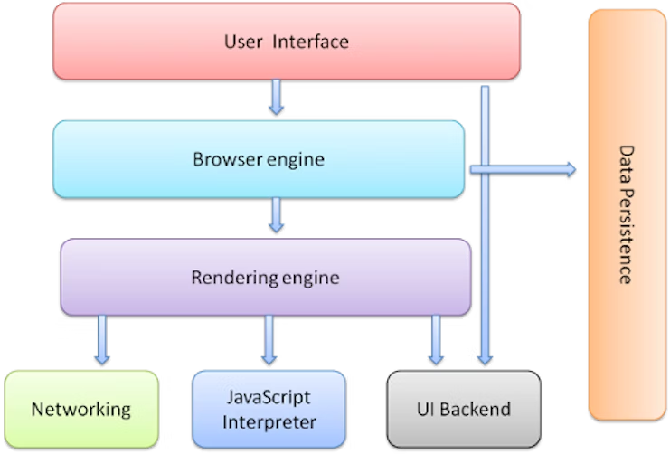

- 브라우저의 기본 구조에는 사용자 인터페이스, 렌더링 엔진, 브라우저 엔진, 네트워크 엔진, 자바스크립트 해석기, 자료 저장소 등이 포함되어 있다.
- **사용자 인터페이스**는 : 브라우저의 고정된 요소들로, 뒤로 가기 버튼이나 주소창과 같은 기능으로 구성되어 있어 사용자가 항상 활용할 수 있다.
- **렌더링 엔진 :** 웹사이트를 실제로 보여주는 기능을 하며, 사용자의 요청에 따라 페이지를 그리는 역할을 수행한다. (렌더 : 그리다)
- **브라우저 엔진 :** 사용자의 행동(예: 뒤로 가기) 인식을 통해 렌더링 엔진에 지시를 전달하는 중개자 역할을 한다.
- **통신** : 웹 브라우저의 네트워크 담당 → 개발자 툴에서 네트워크 탭에서 활동을 볼 수 있다.
- **자바스크립트 해석기 :** 자바스크립트 코드를 해석하여 브라우저가 동작할 수 있도록 도와주며, 대표적인 예로 크롬의 V8 엔진이 있다.
- **UI 백엔드** : 사용자 입력, 마우스 움직임, 클릭 등을 핸들링
- **자료저장소** : 브라우저도 정보를 저장할 수 있다. (ex. 로컬스토리지, 세션스토리지)

## 2. 웹사이트 주소 입력 시 브라우저의 동작 과정

- 🤔 naver.com을 입력하고 엔터를 쳤을 때 무슨 일이 일어날까
- naver.com은 인간이 보기 편하게 부여한 이름이며, 브라우저는 이 이름을 이해하지 못하고 ip주소를 이해한다.
- 컴퓨터가 해야 할 일

  1. naver.com에 ip주소 찾기
     1. 이 주소를 들고 DNS(Domain Name System)에 찾아간다.
        - 사용자가 "네이버.com"을 입력하면 브라우저는 이 도메인을 IP 주소로 변환하기 위해 DNS에 질의하게 된다.
     2. **DNS**는 도메인 이름과 IP 주소를 연결해 주는 시스템으로, 여러 단계의 질의를 통해 최종적인 IP 주소를 찾아낸다. (DNS : “ip주소 여기있다.”)
        - DNS 검색 과정은 사전에서 단어를 찾듯 여러 번의 확인을 통해 진행되며, 사용자는 최종적으로 해당 웹사이트의 주소를 얻는다.
        - 요청한 IP 주소는 DNS에 캐시되어 다음 번 방문 시 빠르게 접근할 수 있도록 저장된다.
  2. 마지막으로 브라우저는 서버에 요청하여 HTML파일을 포함한 바이트 스트림 형태(01010101형태)의 데이터를 수신하게 되며, 이를 다시 해석하여 화면에 표시한다.

     

     - 010101 형태로 표현 되어 있는 것을 **utf-8 인코딩**해서 변환한다.
     - html haed의 meta에 “utf-8” 쓰는 이유가 무엇으로 인코딩 됐는지 멘션해주기 위해서 작성하는 것이다.

## 3. HTML 렌더링 과정의 토큰화 및 노드 생성


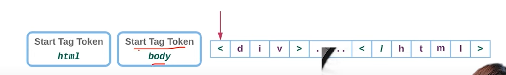
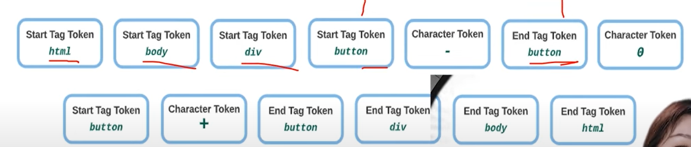

- HTML파일의 바이트 스트림을 바탕으로 2단계 렌더링 과정에서 **토큰화**를 통해 각 문자와 태그를 읽어들여야 한다. 이 과정을 통해 태그가 열리고 닫힘을 이해하게 된다.
- 토큰화 과정 후에, 읽어들인 내용을 **객체 형태**로 변환하여 각각의 태그와 속성을 명확히 구분할 수 있는 **노드**를 생성한다.

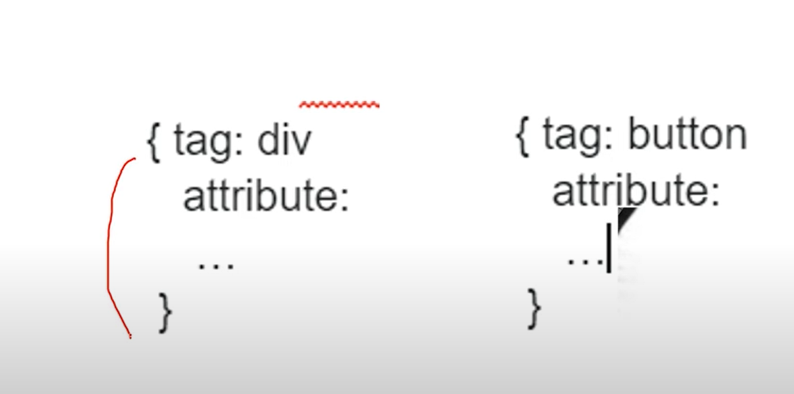

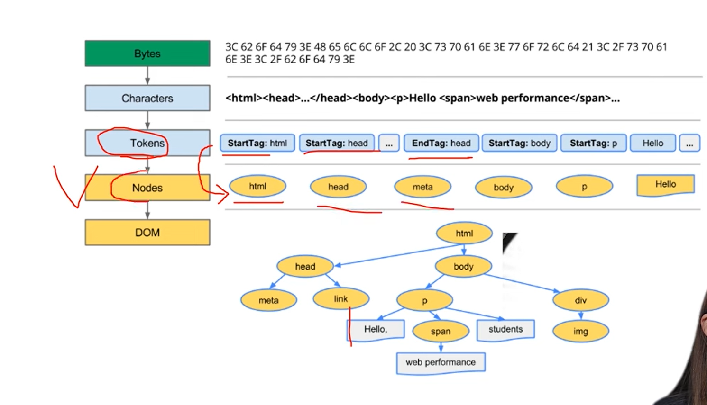

- HTML요소 간에는 부모-자식 관계가 있으며, 이를 모델링하여 태그 간의 관계를 설정함으로써 **트리 구조**를 형성한다. 이 트리는 각 요소의 층위를 명확히 나타내는 자료 구조로 이해된다. (이런 관계를 설정해 주는 것을 Model 이라고 함)
  - DOM(Document Object Model) : 노드에 관계 설정해준 것
  - html의 최종목표 : DOM Tree 만들기
- 최종적으로, 이 모든 과정을 통해 HTML문서를 해석하여 사용자가 보는 웹 페이지를 생성할 수 있게 된다.
- 브라우저가 DOM트리를 생성할 때 link나 img 태그를 만나면 해당 태그 안에 명시되어 있는 리소스를 다운로드한다.
  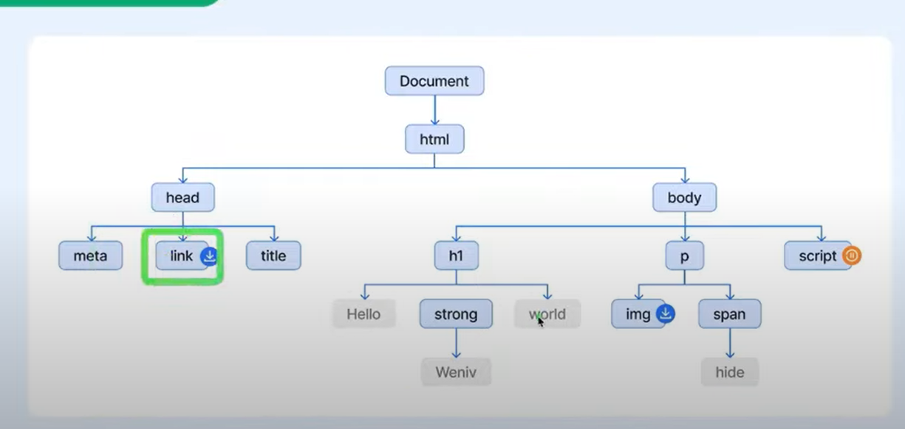

</br>

## 4. CSS와 자바스크립트의 역할 및 렌더링 과정

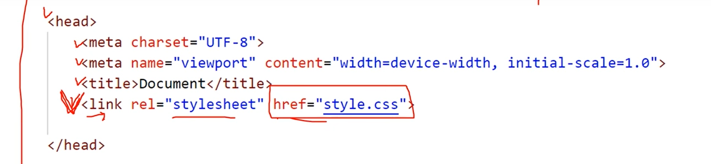

- html은 한 줄씩 읽다가 link 태그를 만나면 만나면 ‘어 style.css 요청해야겠다.’ 하고 아까 받아온 ip주소를 찾아간다. “css 파일 좀 주세요”
  - 네트워크 탭을 보면 css파일에 대해 한번 더 요청하는 것을 볼 수 있음.
    
- CSS도 바이트 스트림 → 캐릭터화 → 토큰화 → 노드 → CSSOM 트리 과정을 DOM 트리 과정처럼 진행한다.
  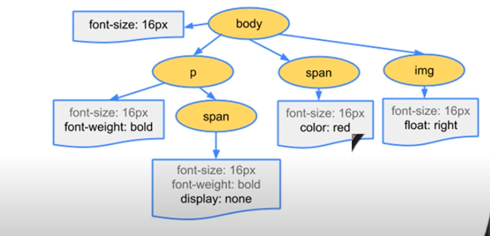
- CSS는 웹사이트의 시각적 요소를 담당하며, HTML문서의 특정 링크 태그를 통해 요청되어야 한다. 이는 HTML을 파싱하는 과정에서 이루어진다.
- CSS가 요청되면, 이를 통해 **CSS 오브젝트 모델(CSSOM)**이 생성되며, 각 태그와 스타일 간의 관계를 구성하여 트리를 형성한다.
- **자바스크립트가 실행되는 동안 CSS와 HTML의 렌더링 과정이 중단**되며, 이는 자바스크립트가 HTML구조를 수정하거나 새로운 요소를 추가하기 위한 요청을 처리하기 위해 필요하다.
- **자바스크립트 파일의 위치**가 HTML문서의 **순서와 관련하여 중요**하며, 잘못된 위치에 있을 경우 에러를 유발할 수 있다. 이를 방지하기 위해 script 태그는 보통 문서의 하단에 위치시킨다.
- 최종적으로, HTML과 CSS가 결합되어 **렌더 트리**가 생성되며, 화면에 표시될 콘텐츠를 결정한다. 이는 화면에 필요 없는 요소를 제거하여 효율적으로 시각적 요소를 배치하는 과정이기도 하다.

<details>
<summary><h3> 4.1. ️ CSS의 필요성과 요청 과정</h3></summary>

- 웹사이트는 **CSS 없이** 그 자체로는 적절한 형태를 갖추지 못하며, 스타일링이 필수적이다.
- 따라서, HTML문서 내에서 CSS를 **어떻게 호출하는지** 확인해야 하는 과정이 중요하다.
- HTML을 읽으면서 링크 태그를 통해 CSS요청을 만나는 것이 기본적인 구조로, 이 순간 CSS파일을 요청하는 명령을 포함한다.
- 스타일 시트를 요청할 때, 이전에 받은 **IP 주소**를 바탕으로 다시 요청을 전송하게 된다.
- 이와 같은 과정을 통해 필요한 CSS를 서버에 요청하며, 최종적으로 웹사이트의 스타일을 완성하게 된다.
</details>

<details>
<summary><h3>4.2. CSS 요청 및 처리 과정</h3></summary>

- 웹사이트를 열 때 HTML이 먼저 로드되며, 그 후에 CSS파일이 추가로 요청된다.
- CSS요청은 스트림 형태로 이루어지며, 이 과정에서 파일은 인코딩되고, 캐릭터화, 토큰화과정을 거쳐 노드로 변환된다.
- 변환된 노드는 관계를 주입받아 최종적으로 모델화되고, 전체 구조가 완성된다.
- CSS처리 후 생성된 모델은 초기 HTML구조와 동일한 형태를 이루게 된다.
</details>

<details>
<summary><h3>4.3. CSS 오브젝트 모델(CSSOM)과 그 구조</h3></summary>

- CSS오브젝트 모델은 **CSSOM**이라고 부르며, 특히 이를 **썸**이라고 부르는 경향이 있다.
- CSSOM은 HTML문서의 구조를 트리형태로 표현하며, 이 트리는 기본적으로 **태그**를 포함하고 있다.
- 각 태그 아래에는 스타일이 적용된 다양한 요소들, 예를 들어 **span**, **div**, **a**, **p** 등이 있으며 이들을 구체적으로 **스페이스**라고 지칭하고 있다.
- 트리의 최상단은 **바디** 태그로, 그 아래에 스타일 정보가 포함된 다양한 요소가 존재한다.
- 그러나 CSSOM이 생성되었다고 하더라도, 이를 통해 웹사이트를 바로 그릴 수는 없으며 추가적인 작업이 필요하다.
</details>

<details><summary><h3> 4.4. ️ 자바스크립트 실행과 DOM 변경 과정</h3></summary>

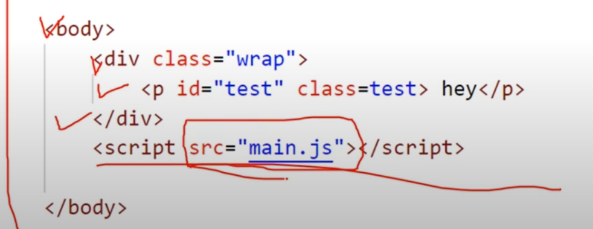

- 자바스크립트는 페이지 로딩 중 **HTML** 요소를 선택하고 추가하거나 수정하는 데 매우 **강력한** 기능을 제공하여, DOM을 통한 다양한 변화를 가능하게 한다.
- 그래서 html은 스크립트 실행 중에는 **DOM** 생성(파싱을 멈추고, 요청 사항을 모아 한 번에 내용을 업데이트하는 것이 더 **효율적**이다.
  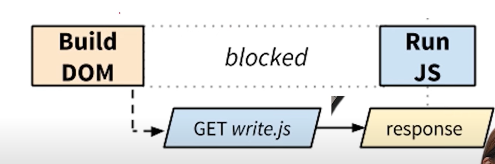
- 스크립트 태그가 DOM보다 먼저 오면 에러가 발생하며, HTML구조를 제대로 읽을 수 없으므로 스크립트 위치에 주의해야 한다. ⇒ 자바스크립트는 아래에 둬라~!
  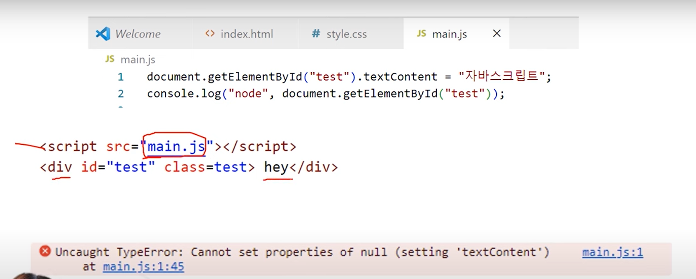
  스크립트가 먼저 나옴. html은 script 본 순간 DOM 생성 멈췄기 때문에 div태그 못가져옴
  cf. 자바스크립트가 DOM의 생성을 막지 않게하는 옵션도 있음. defer / async
  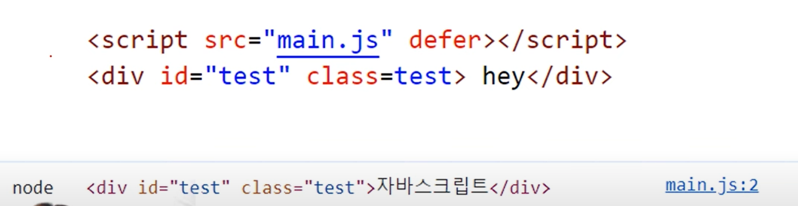
  - **defer** 및 **async** 옵션을 사용하면 스크립트가 DOM생성을 방해하지 않도록 할 수 있다.
- 왜 css는 위에 두는 거야?
  - **CSS**는 DOM생성을 차단하지 않으며, 최대한 빠른 속도로 그려지는 것 중요함에 따라 일반적으로 HTML문서의 상단에 위치하게 된다.
  - DOM을 막지는 않지만 DOM은 항상 CSSOM을 기다린다. 둘 다 완성돼야 다음으로 넘어갈 수 있다. → html 입장에서 CSSOM을 빨리 만드는 것이 중요하다.(그래서 CSS 파일이 너무 크면 성능이 안좋다. 계속 기다려야되니까…) → 스타일 파일을 필요에 따라 나누는 것이 좋다.
    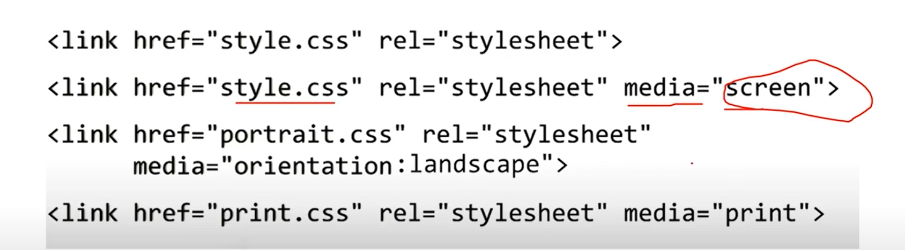
</details>

<details>
<summary><h3>4.5. 렌더링 과정의 단계별 설명</h3></summary>

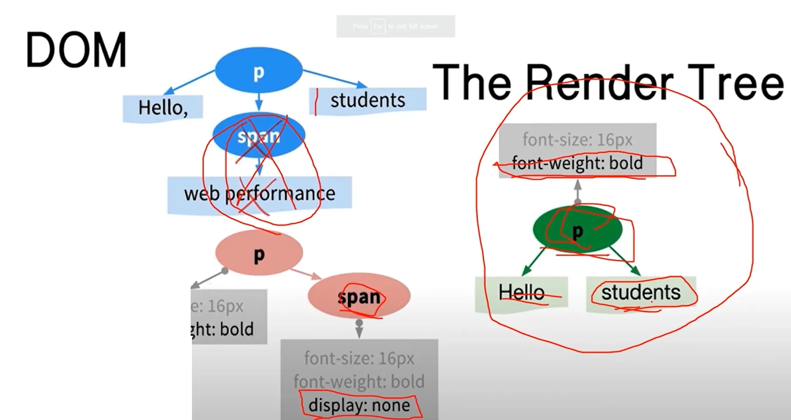

- 화면에 보일 필요 없는 head 태그 같은 건 빼고 렌더 트리 만들게 된다.
- span태그의 display가 none이므로 화면에 보일 필요 없어서 빼고 렌더 트리를 만든다.

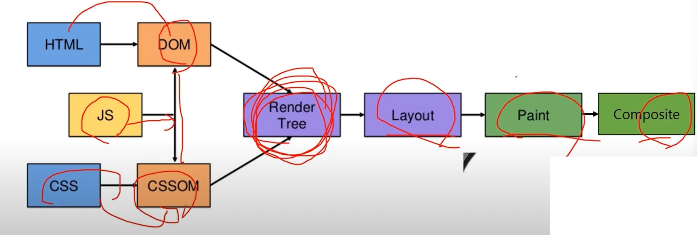

- HTML은 도면을 만드는 역할을 하며, 자바스크립트는 이를 불러오는 과정에 포함된다. 이어서 CSS를 통해 도면에 색상과 모양을 추가한다.
- 최종 결과물인 '렌더 트리'는 HTML과 CSS의 결합으로 생성되며, 이 과정은 단계적으로 레이아웃, 페인트, 컴포짓으로 나누어진다.
- **레이아웃** 단계에서는 화면과 도면을 비교하여 요소의 배치와 크기를 계산하며, 이는 반응형 웹사이트의 구현에 중요한 역할을 한다.
  - 정확한 px값을 계산하는 단계
- **페인트** 단계는 픽셀 단위로 그리기를 시작하며, 여러 레이아웃으로 나누어 그리면 변화가 있을 때 전체를 다시 그리지 않고 성능을 향상시킬 수 있다.
  - 레이아웃 나눠서 그림 → 컴포짓(합치기)
- 레이아웃은 사용자가 웹사이트에서 상호작용할 때마다 반복적으로 계산되며, 이 과정은 성능 저하를 초래할 수 있으므로 최소화하는 것이 중요하다.

  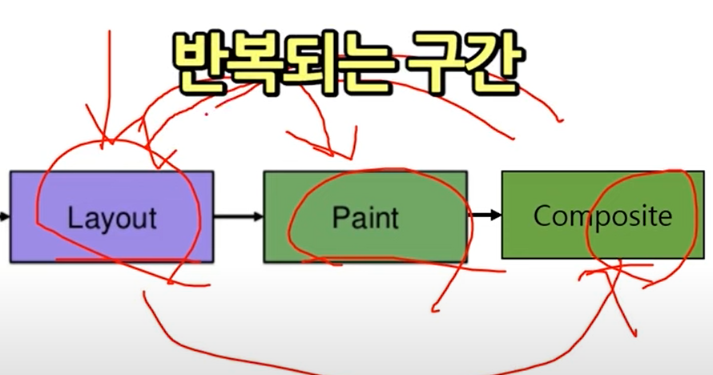

  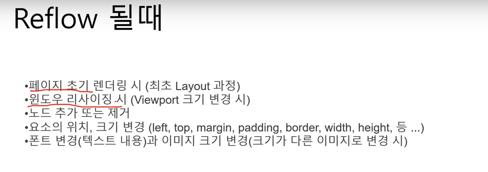

- 추가)

  - **페인트** : 앞서 만들어진 렌더 트리를 따라서 페인트 기록을 생성한다. 페인트 기록에는 요소를 렌더링 하는 순서, 지금까지의 정보를 바탕으로 한 페이지를 여러 개의 레이어로 나눈 다음 그 위에 텍스트, 색, 이미지, 보더 등 모든 시각적인 부분을 그리는 작업을 진행한다.

    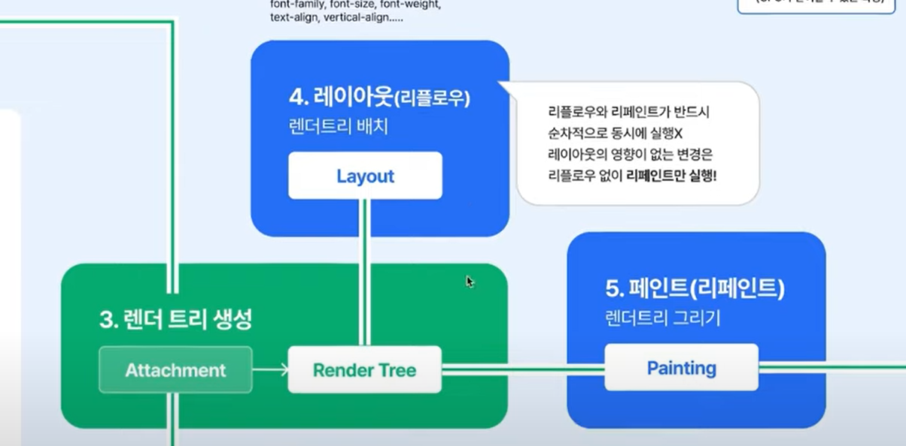

  - css 속성을 이용해 레이아웃이 변경되면 → 브라우저는 렌더 트리를 재생성하고, 다시 레이아웃 → 다시 페인트 → 컴포짓 → 사용자에게 화면 보여준다.
    - 변경한 css 속성이 레이아웃 속성과 상관없고 paint 속성과 관련있는 속성을 변경했다면 굳이 layout단계가 실행되지는 않는다.
      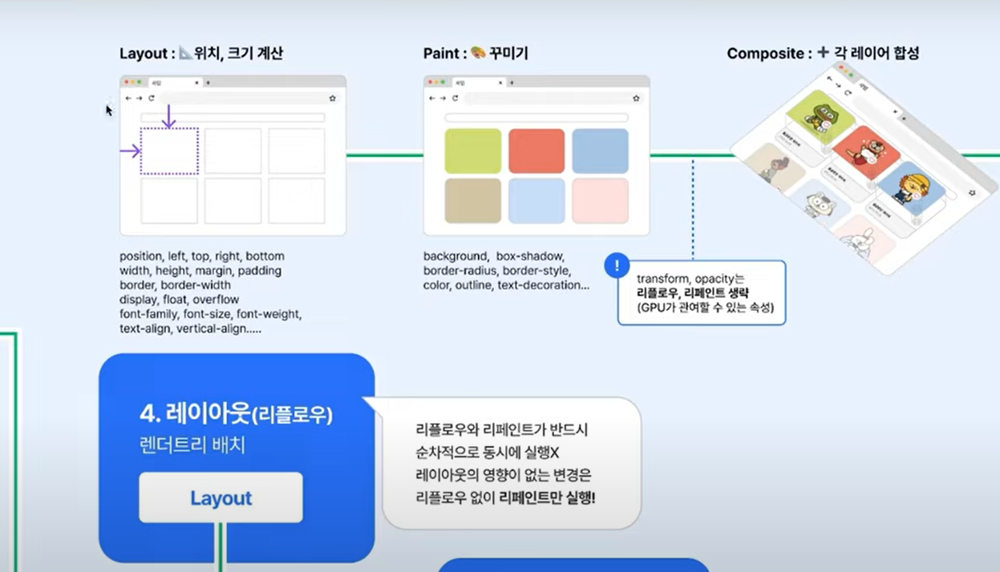
    - transform과 opacity는 DOM 트리를 변경하지 않도록 설계되어 있어서 리플로우, 리페인트를 생략한다.
      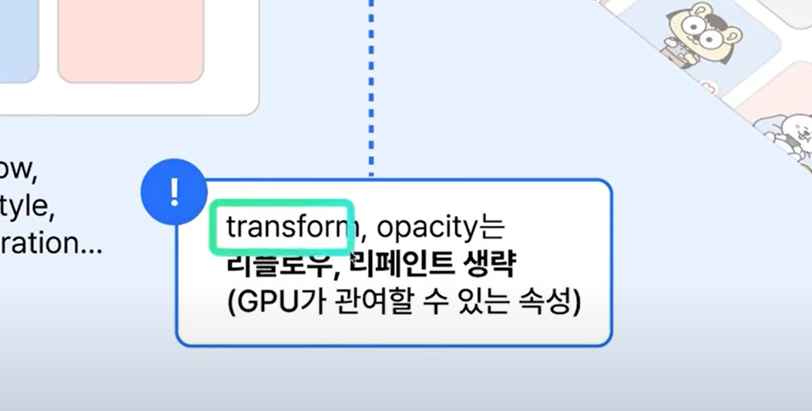
</details>

</br>

## 5. 웹사이트 성능 향상을 위한 최적화 전략

- **소스의 사이즈를 줄이는** 것이 중요하며, 이는 불필요한 코드 제거로 이루어진다.
- **외부 리소스 양을 줄이는** 방법이 있으며, CSS파일을 한 번에 너무 많이 가져오는 것을 피해야 한다.
- 외부 리소스를 가져오는 **횟수도 줄여야** 하며, 특정 CSS파일을 반복적으로 사용할 경우 하드 코딩보다는 별도의 파일로 관리하는 것이 효율적이다.
- CSS스타일의 구현은 **리플로우와 리페인트**를 피하는 방향으로 접근해야 하며, 이는 웹사이트의 성능에 긍정적인 영향을 미친다.
