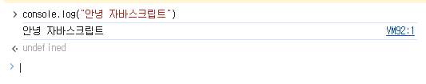

# section1_start

## 1.1 안녕 자바스크립트

- 웹서버, 데스크탑 어플리케이션, 모바일 어플리케이션 etc.. 개발언어
- js, html, css와 함께 web페이지를 개발하기 위한 언어
- html이 요소들의 내용, 배치 모양을 정하기 위해 사용되는 언어지만 색상이나 디자인 등의 수정은 불가능하다, css가 요소들의 색상, 크기 등의 스타일을 설정하게 만들어주나 아직 부족하다. 웹 내부에서 작용하는 상호작용을 만들어주기 위해서 웹을 움직이게 하는 웹의 근육의 역할을 한다고 표현할 수 있다. (웹을 실질적으로 움직임, 동적으로 움직이게 만들어준다.)
- 그럼 js가 어떻게 실행될까?
  - js엔진에 의해 실행된다. 이 엔진이 없다면 실행은커녕 해석조차 불가능하다. 이 엔진은 크롬이나 사파리같은 웹 브라우저에 기본으로 탑재되어있다. 따라서 웹 브라우저를 이용하면 간단한 js코드를 직접 실행해 볼 수 있다.
- 개발자도구
  - 웹개발을 할 때 필요한 여러가지 도구들을 모아놓은 패널이라고 생각하면 됨
  - 콘솔에서 깜빡이는 커서를 프롬프트(prompt)라고함, 콘솔에서 위와 같은 기능을 수행할 수 있다. undefined는 무시해도 괜찮음



## 1.3 자바스크립트 실습 환경 설정하기

- live server(extension으로 설치)를 실행하면 기존에 싸피에서 교육했던 방식(alt + b로 html파일을 브라우저에서 여는 방법)과는 다르게 진행할 수 있다.
- html파일을 만들고 script태그에 src경로에 js파일경로를 설정해 놓은 후 html파일에서 ctrl + shift + p 를 누르고 live server를 실행하게 되면 js파일이 바뀔 때마다 자동으로 새로고침되게 됨
- live server를 우측하단에서 종료하게 되면 브라우저에서 새로고침 했을 때 연결할 수 없다고 뜸, 이 방법도 알아놓기

### 1.4 변수와 상수

- 변수, 상수는 값을 저장하는 박스

```jsx
console.log("chapter4");
// 1. 변수
// let age = 27
// let과같이 없던 변수를 만드는 것을 선언이라하며 27과같은 어떠한 값을 저장하는 것을 초기화한다 함
let age;
// 처음에 변수를 선언하고 초기화를 해주지 않아도 괜찮음
// let으로 만든 키워드는 이름으로 구분이 되기 때문에 중복된이름으로 다시 선언하는건 불가능

// 2. 상수
// 상수는 변수와는 달리 한 번 저장된 값을 다시는 바꿀 수가 없다
const birth = "1997.01.07";
// birth = "123" // 이런거 불가능하다
// 생일처럼 값이 변할 수 없거나 변하지 말아야할 일이 있을 때 사용
// 즉 let과 달리 선언만하고 초기화를 하지 않는 것은 불가능하다

// 3. 변수 명명규칙(네이밍 규칙)
// 3-1. $, _ 제외한 기호는 사용할 수 없다.
let $_name;

// 3-2. 숫자로 시작할 수 없다.
let name1;
// let 2name 이런거 불가능
// 꼭 앞에 숫자를 넣고싶다면
let _2name; // 혹은
let $2name; // 이렇게 사용함

// 3-3. 예약어를 사용할 수 없다.

// 4. 변수 명명 가이드
let a = 1;
let b = 1;
let c = a - b;
// 이런식으로 명명하게되면 협업할 때 너무 힘듦, 혼자는 괜찮음
let salesCount = 1;
let refundCount = 1;
let totalSalesCount = salesCount - refundCount;
// 이렇게 하는게 나중에 내가 직접수정할 때에도 편하다.
```

## 1.5 자료형(Type) = 집합

- 동일한 속성이나 특징을 가진 원소들을 묶은 것이라 생각 ex) string, number ..
- 원시타입
  - Number
  - String
  - Boolean
  - Null
  - Undefined
  - 기본형 타입이라고 불림
  - 프로그래밍에 있어 가장 기본적인 값들의 타입을 의미함
  ```jsx
  // 1. Number Type
  let num1 = 27;
  let num2 = 1.5;
  let num3 = -20;
  // 사칙연산 모두지원

  let inf = Infinity;
  let mInf = -Infinity;
  let nan = NaN; // Not a Number
  console.log(1 * "Hello"); // 불가능한 수치연산 -> 결과가 NaN으로 나옴

  // 2. String Type
  let myName = "김정우";
  // 따옴표를 사용하지 않는다면 김정우를 문자열이 아닌 변수로 취급함
  let myLocation = "목동";
  let introduce = myName + myLocation;
  console.log(introduce); // 김정우목동
  // 즉 js에서는 string 덧셈연산을 지원함
  let introduceText = `${myName}는 ${myLocation}에 거주합니다`;
  // python의 f-string과 같음
  console.log(introduceText); // 김정우는 목동에 거주합니다
  // 이를 템플릿 리터럴 문법이라고 부른다. 중요함

  // 3. Boolean Type
  let isSwitchOn = true;
  let isEmpty = false;

  // 4. Null Type (아무것도 없다)
  let empty = null;

  // 5. Undefined Type
  // null타입처럼 특수한타입, 변수를 선언하고 그 변수에 어떠한값도 지정하지 않았을 때(초기화 안했을 때)
  // 자동으로 할당되는 값이다.
  let none;
  console.log(none); // undefined
  // null과의 차이점은 null은 개발자가 '직접' 명시해서 할당을 해줘야함
  ```
- 객체타입
  - Object
  - Array
  - Function
  - RegexExp

## 1.6 형변환

- 어떤 값의 타입을 다른 타입으로 변경하는 것을 말한다.
- 묵시적 형 변환(암묵적 형 변환)
  - 개발자가 직접 설정하지 않아도 알아서 js엔진이 형 변환 하는 것
- 명시적 형 변환
  - 개발자가 직접 함수를 이용해 형변환을 일으킨다.

```jsx
// 1. 묵시적 형 변환
// -> js 엔진이 알아서 형 변환 하는 것
let num = 10;
let str = "20";
const result = num + str;
console.log(result); // 1020
// num이 묵시적으로 string으로 형변환이 됨
// 모든 불가능한 연산에 묵시적형변환이 진행되는 것이 아닌
// 특정 하나의 변수의 값을 형변환했을 때 오류가 발생하지 않고 연산이 잘 종료되는 경우에만 됨

// 2. 명시적 형 변환
// -> 프로그래머가 내장함수 등을 이용해서 직접 형 변환을 명시
// -> 문자열을 숫자로 변환한다면
let str1 = 10;
let strToNum1 = Number(str1);
console.log(10 + strToNum1); // 20

let str2 = "10개";
// let strToNum2 = Number(str2)
// console.log(strToNum2) // NaN
let strToNum2 = parseInt(str2);
console.log(strToNum2); // 10
let str3 = "adsfa10개";
let strToNum3 = parseInt(str3);
console.log(strToNum3); // NaN
// 앞에 문자열이 있으면 안됨

let num1 = 20;
let numTostr1 = String(num1);
console.log(numTostr1 + "입니다"); // 20입니다
```

## 1.7~8 연산자1, 2

- +, -, \*, /

```jsx
// 1. 대입 연산자 '='
let var1 = 1;

// 2. 산술 연산자
let num1 = 3 + 2;
let num2 = 3 - 2;
let num3 = 3 * 2;
let num4 = 3 / 2;
let num5 = 3 % 2;
// * / % 가 +,-보다 우선순위가 높다
let num6 = 1 + 2 * 10;
console.log(num6); // 21
let num7 = (1 + 2) * 10; // 30
// 그냥 수학이랑 똑같다고 생각

// 3. 복합 대입 연산자
let num8 = 10;
num8 = num8 + 20; // 이렇게 해도 되지만
num8 += 20; // 이렇게해도 됨
num8 %= 10; // 이것도 가능
console.log(num8); // 50

// 4. 증감 연산자
let num9 = 10;
num9++; // 이 라인이 끝나야 1이 추가되는 것임, 후위연산
console.log(num9); // 11
console.log(++num9); // 12, 전위연산

// 5. 논리 연산자
let or = true || false;
let and = true && false;
let not = !true;

console.log(or, and, not); // true, false, false

// 6. 비교 연산자
let comp1 = 1 === 2;
let comp2 = 1 !== 2;
console.log(comp1, comp2); // false, true
// = 을 2개써도 같은결과지만 3개쓰는이유는 2개만쓰면 값의 자료형까지 같은지는 비교가 안됨
// 예를들어 1=='1' 이렇게하면 true로 출력되게 된다.
let comp3 = 2 > 1;
let comp4 = 2 < 1;
console.log(comp3, comp4); // true, false

let comp5 = 2 >= 2;
let comp6 = 2 <= 2;
console.log(comp5, comp6); // true, true
```

---

- 연산자2는 js에만 있는 특수한 연산자

```jsx
// 1. null 병합 연산자 '??'
// -> 존재하는 값을 추려내는 기능
// -> null, undefined가 아닌 값을 찾아내는 연산자

let var1;
let var2 = 10;
let var3 = 20;

let var4 = var1 ?? var2;
console.log(var4); // 10
// var1은 undefined var2는 10, 즉 var4에 undefined가 아닌 10값을 찾아서 저장함

let var5 = var1 ?? var3;
console.log(var5); // 20

let var6 = var2 ?? var3;
// 둘다 undefined이나 null이 아니면 그냥 맨 처음에 오는 var2가 할당됨
console.log(var6); // 10

let userName;
let userNickName = "Winterlood";

let displayName = userName ?? userNickName;
console.log(displayName); // Winterlood

// 2. typeof 연산자
// -> 값의 타입을 문자열로 반환하는 기능을 하는 연산자
let var7 = 1;
var7 = "hello";
let t1 = typeof var7;
console.log(t1); // string

// 3. 삼항 연산자
// -> 항을 3개 사용하는 연산자
// -> 조건식을 이용해서 참, 거짓일 때의 값을 다르게 반환
let var8 = 10;

// 요구사항: 변수 res에 var8의 값이 짝수라면 "짝", 홀수라면 "홀"저장
let res = var8 % 2 === 0 ? "짝수" : "홀수";
// 조건식 ? 참일때 : 거짓일때
console.log(res); // 짝수
```

## 1.9 조건문

- 특정 조건을 만족했을 때에만 실행되는 코드를 작성하기 위한 문법
- 대표적으로 if, switch 조건문이 존재

```jsx
// 1. if 조건문 (if문)
let num = 9;

if (num >= 10) {
  console.log("num은 10 이상입니다.");
  console.log("조건이 참 입니다!");
} else if (num >= 5) {
  console.log("num은 5 이상입니다");
} else {
  console.log("조건이 거짓입니다!");
}
// if문은 반드시 if로 시작해서 else로 끝나야 한다.

// 2. switch 문
// -> if문과 기능 자체는 동일
// -> 다수의 조건을 처리할 때 if보다 더 직관적이다.

let animal = "cat";

// 소괄호 안에 비교하고싶은 변수를 넣는다
switch (animal) {
  case "cat": {
    console.log("고양이");
    break;
  }
  case "dog": {
    console.log("강아지");
    break;
  }
  case "bear": {
    console.log("곰");
    break;
  }
  case "snake": {
    console.log("뱀");
    break;
  }
  case "tiger": {
    console.log("호랑이");
    break;
  }
  default: {
    console.log("그런 동물은 전 모릅니다");
  }
}
// break가 없으면 다실행됨, 왜냐면 switch-case문은 기본적으로 소괄호 안에 변수값과 일치하는값을
// 위에서부터 쭉 탐색을 하다가 일치하는 case를 만나게되면 그 아래에있는 모든 코드를 실행시킴
// 그래서 case문 아래는 break를 다 써주는게 일반적
// 만약 일치하는 case가 없다면 default를 실행시켜주도록 만들면 됨
```

## 1.10 반복문

- 어떠한 동작을 반복해서 수행할 수 있도록 만들어 주는 문법
- 예를 들어 1부터 100까지 콘솔에 하나씩 출력하라고 한다면 다 쓸수는 없으니 반복문을 사용한다.

```jsx
// for (초기식; 조건식; 증감식) {
//   console.log("반복!")
// }

// 초기식에는 count 하는 값을 저장, count변수라고도 함
// 조건식에는 이 반복문이 언제까지? 조건식이 참일때에만 동작

for (let idx = 1; idx <= 10; idx++) {
  if (idx % 2 === 0) {
    continue;
  }
  console.log(idx);

  if (idx >= 5) {
    break;
  }
}
```

- 중간에 if, continue, break 등을 활용하여 반복문을 자유롭게 조작

## 1.11 함수

- 중복으로 작성되는 유사한 기능을 하는 코드들을 유지보수하기 용이하게 하기위해 함수로 활용한다.

```jsx
// 함수선언
function greeting() {
  console.log("안녕하세요!");
}

console.log("호출 전");
greeting(); // 함수호출을 해야만 실행이 된다.
// 소괄호 없이 greeting만 쓰면 아무일도 일어나지 않는다.
console.log("호출 후");

getArea(120, 200);
// getArea라는 함수는 아래에서 정의했지만 여기서 해도 실행이 된다.
// 호이스팅 때문 js의 독특한 특징
// -> 끌어올리다 라는 뜻

function getArea(width, height) {
  function another() {
    console.log("another");
  }
  another();
  // 중첩함수로 함수내부에 함수를 선언할 수 있다.

  // width, height는 매개변수
  let area = width * height;
  return area; // 반환값
  // 함수는 return을 만나면 무조건 종료, 아래 코드르 써도 실행이 안됨
}

let area1 = getArea(10, 20); // 10, 20을 인수라함
console.log(area1); // 200
```

## 1.12 함수 표현식과 화살표 함수

```jsx
// 1. 함수 선언문, 호이스팅의 대상
function funcA() {
  console.log("funcA");
}

let varA = funcA; // 호출해서 담은게 아니라 그냥 funcA로 담음
console.log(varA);
// ƒ funcA() {
//   console.log("funcA");
// }
varA(); // 이런식으로 변수에 담아서 함수를 호출하는 것도 가능

// 이 아래에서 만든 함수들은 함수표현식이기 때문에 호이스팅 되지않음
let varB = function funcB() {
  console.log("funcB");
};
// 단, 이렇게 쓰는 것은 함수를 선언하는 게 아님 단순히 값으로써 함수가 생성된 것
// 즉 funcB() 이러면 오류가 발생함
// 따라서 funcB라는 이름은 굳이 불필요, 지워도됨
varB();

let varC = function () {
  // 익명함수라 부름
  console.log("funcC");
};

// 2. 화살표 함수
// let varD = () => {
//   return 1;
// };
// 만약 값을 반환하기만 한다면 중괄호와 return 모두 지워도 됨
let varD = (value) => value + 1;

console.log(varD(10)); // 11
```

## 1.13 콜백함수

- 자신이 아닌 다른 함수에, 인수로써 전달된 함수를 의미 함


```jsx
// 1. 콜백함수
function main(value) {
  console.log(1);
  console.log(2);
  value();
  console.log("end");
}

function sub() {
  console.log("I am sub");
}
main(sub); // 함수를 인수로 전달, I am sub 출력
// 콜백함수는 나중에 실행되는 함수이다. 라고 이해 main함수가 원하는 때 쓸수있다.
// 이렇게 sub 함수를 선언하고 사용해도 되지만
main(() => {
  console.log("i am sub");
});
// 위와같이 해도 됨

// 2. 콜백함수의 활용
function repeat(count, callback) {
  for (let idx = 1; idx <= count; idx++) {
    callback(idx);
  }
}
// function repeatDouble(count) {
//   for (let idx = 1; idx <= count; idx++) {
//     console.log(idx * 2);
//   }
// }
// repeatDouble(5); // 2 4 6 8 10
// 구조가 흡사한 함수들을 만들 때 이렇게 함수들을 계속 선언할 필요가 없다.

repeat(5, function (idx) {
  console.log(idx);
}); // 1 2 3 4 5

repeat(5, function (idx) {
  console.log(idx * 2);
}); // 2 4 6 8 10

repeat(5, function (idx) {
  console.log(idx * 3);
}); // 3 6 9 12 15
// 콜백함수를 함수표현식이 아닌 화살표함수로 바꿔도 된다. 이게 가장 깔끔
```

## 1.14 스코프

- 우리말로 범위를 뜻함, 변수나 함수에 접근하거나 호출할 수 있는 범위를 말한다.


- 위처럼 함수 밖에서는 a라는 변수를 알아들을 수 없다.

```jsx
// 스코프
// -> 전역(전체 영역) 스코프 / 지역 스코프
// -> 전역 스코프 : 전체 영역에서 접근 가능
// -> 지역 스코프 : 특정 영역에서만 접근 가능

let a = 1; // 전역 스코프
function funcA() {
  let b = 2; // 지역 스코프
  console.log(a);
}
funcA(); // 1 아무문제 없음
// console.log(b); // 오류발생

if (true) {
  let c = 1; // 지역 스코프
}
// 블록 = {} 내에 선언된 변수들은 다 지역스코프라고 생각하면 된다.

for (let i = 0; i < 10; i++) {
  let d = 1; // 이것도 지역스코프, i도 지역스코프
}
// 함수 선언식 안에서 중첩함수를 선언했다면 그 중첩함수도 지역스코프를 갖는다.
// 하지만 if나 for 같은 조건문이나 반복문 안에서 선언식함수는 지역스코프를 갖지 않는다. 예외적이다
// 함수 선언식만 그렇다~
```

## 1.15 객체1

- 원시 타입이 아닌 객체 타입의 자료형
- 여러가지 값을 동시에 저장할 수 있는 자료형을 의미한다.
- 객체를 이용하면 현실세계에 존재하는 어떤 사물이나 개념을 표현하기 용이하다.

```jsx
// 1. 객체 생성
let obj1 = new Object(); // 객체 생성자 방법
let obj2 = {}; // 객체 리터럴 방법 (대부분 사용)

// 2. 객체 프로퍼티 (객체 속성)
let person = {
  // key: value 형태
  // value에는 어느 type이 다 와도 된다
  // key는 문자나 숫자만 올 수 있다
  name: "김정우",
  age: 27,
  hobby: "테니스",
  job: "FE Developer",
  extra: {},
  10: 20,
  "like cat": true,
  // 혹시 key로 띄어쓰기를 넣고싶다면 따옴표로 감싸야한다.
};

// 3. 객체 프로퍼티를 다루는 방법
// 3.1 특정 프로퍼티에 접근 (점 표기법, 괄호 표기법)
let name = person.name;
console.log(name); // 이런 중간 줄은 ts관련한 문구라 일단지금은 스킵
// 존재하지 않는 key로 접근하면 undefined가 출력

let age = person["age"];
// 꼭 쌍따옴표와 함께 문자열로 접근해야함
// 문자열로 접근하면 변수로 해석해서 오류발생
// 존재하지 않는 key로 접근하면 undefined가 출력

let property = "hobby";
let hobby = person[property];
console.log(hobby); // 테니스

// 3.2 새로운 프로퍼티를 추가, 수정하는 방법
person.job = "fe developer"; // 수정
person["favoriteFood"] = "떡볶이"; // 추가
console.log(person);

// 3.3 프로퍼티를 삭제하는 방법
delete person.job;
delete person["favoriteFood"];

// 3.4 프로퍼티의 존재 유무를 확인하는 방법 (in 연산자)
let result1 = "name" in person;
console.log(result1); // true
let result2 = "cat" in person;
console.log(result2); // false
```

## 1.16 객체2

```jsx
// 1. 상수 객체
const animal = {
  type: "고양이",
  name: "나비",
  color: "black",
};

// animal = { a: 1 }; // 이런건 오류뜸

// 이런건 가능
animal.age = 2; // 추가
animal.name = "까망이"; // 수정
delete animal.color; // 삭제

// 2. 메서드
// -> 값이 함수인 프로퍼티를 말함
const person = {
  name: "김정우",
  // 메서드 선언
  // 이 객체의 동작을 정의하는데에 사용이 된다.
  sayHi() {
    console.log("안녕!");
  },
};

person.sayHi();
person["sayHi"]();
```

## 1.17 배열

- 여러개의 값을 순차적으로 담을 수 있는 자료형

```jsx
// 1. 배열 생성
let arrA = new Array(); // 배열 생성자
let arrB = []; // 배열 리터럴 (대부분 사용)

let arrC = [1, 2, 3, true, "hello", null, undefined, () => {}, {}, []];

// 2. 배열 요소 접근
let item1 = arrC[0];
let item2 = arrC[1];
console.log(item1, item2); // 1,2
// 0번부터 시작한다는 점만 주의할 것

arrC[0] = "hello";
console.log(arrC); // 수정도 됨
```
