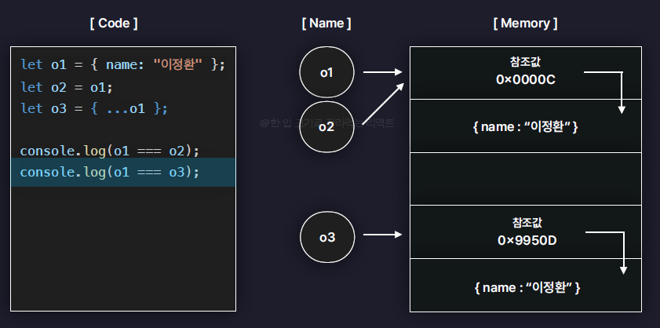

# section2_Javascript 기본

## 2.1 Truthy와 Falsy

- js는 불리언타입이 아니라도 상황에따라서 참,거짓이 아닌값도 참,거짓으로 평가함
- Truthy한 값 (참 같은 값) ex.123
- Falsy한 값(거짓 같은 값) ex.undefined
- js에 존재하는 모든 값들은 Trythy하거나 Falsy하다

```jsx
// 1. Falsy한 값
let f1 = undefined;
let f2 = null;
let f3 = 0;
let f4 = -0;
let f5 = NaN;
let f6 = "";
let f7 = 0n; // big integer 아주 큰 숫자를 저장할 때 사용하는 값

if (!f1) {
  console.log("falsy");
} // f1~f7은 falsy 출력

// 2. Trythy한 값
// -> 일일이 나열할 수가 없음, 7가지 falsy한 값을 제외한 나머지 모든 값
let t1 = "hello";
let t2 = 123;
let t3 = [];
let t4 = {};
let t5 = () => {};

if (t4) {
  console.log("Truthy");
}

// 3. 활용 사례

function printName(person) {
  // person === undefined 이런식으로 나열할 필요 없이 not으로 간편하게
  if (!person) {
    console.log("person의 값이 없음");
    return;
  }
  console.log(person.name);
}
// let person = undefined
let person = null;
printName(person);
```

## 2.2 단락 평가

- and나 or같은 논리연산식에서 첫번째 피연산자값만으로도 연산의 결과를 확정할 수 있다면 두번째 피연산자값에는 아예 접근하지 않는 것
- Truthy나 Falsy한 값에도 적용이 됨
- T || T 면 앞에꺼 반환
- T && T면 뒤에꺼 반환

```jsx
// function returnFalse() {
//   return false;
// }

// function returnTrue() {
//   return true;
// }

// console.log(returnFalse() && returnTrue());
// 콘솔에 false가 출력이 된다.

function returnFalse() {
  console.log("False 함수");
  return false;
  // 만약 return undefined라면 false대신 undefined가 출력됨
}

function returnTrue() {
  console.log("True 함수");
  return true;
}

console.log(returnFalse() && returnTrue());
// 콘솔에 False함수 (문자열)과 false가 출력됨
// -> 단락평가가 적용된 것

console.log(returnTrue() && returnFalse());
// True함수, False함수, false 출력

console.log(returnTrue() || returnFalse());
// True함수, True 출력
// -> 단락평가 적용
```

```jsx
// 단락평가 활용 사례

function printName(person) {
  console.log(person && person.name);
}

printName(); // 오류대신 undefined 출력

function printName2(person) {
  const name = person && person.name;
  console.log(name || false);
}

printName2(); // person의 값이 없음 문자열이 truthy한 값이기때문
printName2({ name: "김정우" }); // 김정우
```

## 2.3 구조분해할당

- 배열이나 객체에 저장된 여러값들을 분해해서 다른변수에 할당하는 것

```jsx
// 1. 배열의 구조 분해 할당
let arr = [1, 2, 3];

let one1 = arr[0];
let two1 = arr[1];
let three1 = arr[2];
// 이렇게하면 조금 불편함

let [one, two, three] = arr; // 이러면 각각 할당
console.log(one, two, three); // 1, 2, 3
// 굳이 3개 다 안하고 2개만해도됨
// let[one, two, three, four] 이렇게해도 오류는 뜨지않지만 four는 undefined가 저장
// let [one, two, three, four = 4] 이런식으로 기본값할당도 가능

// 2. 객체의 구조 분해 할당
let person = { name: "김정우", age: 27, hobby: "테니스" };
// let name = person.name
// let age = person.age
// let hobby = person.hobby

// let { name, age, hobby } = person;
let {
  age: myAge, // 다른변수명에 저장하고 싶을 때
  hobby,
  name,
  extra = "hello",
} = person;
console.log(name, myAge, hobby); // 김정우, 27, 테니스
// let { name, age, hobby, extra } 이러면 extra에 undefined저장
// let { name, age, hobby, extra='hello' } 이런것도 가능

// 3. 객체 구조분해할당을 이용해서 함수의 매개변수를 받는 방법
// 단, 매개변수로 반드시 중괄호와 함께 넘겨야함
const func = ({ name, age, hobby, extra }) => {
  console.log(name, age, hobby, extra);
};

func(person); // 김정우 27 테니스 undefined
```

## 2.4 Spread 연산자와 Rest 매개변수

```jsx
// 1. Spread 연산자
// -> 흩뿌리다, 펼치다
// -> 객체나 배열에 저장된 여러개의 값을 개별로 흩뿌려주는 역할

let arr1 = [1, 2, 3];
let arr2 = [4, ...arr1, 5, 6];
// let arr2 = [4, arr[0], arr[1], ...] 원래 이런식으로 하는데 귀찮음
// 혹은 삭제나 추가가 될 수도 있음

let obj1 = {
  a: 1,
  b: 2,
};

let obj2 = {
  // a: obj1.a
  ...obj1,
  c: 3,
  d: 4,
};

console.log(obj2); // a:1, b:2, c:3, d:4

function funcA(p1, p2, p3) {
  console.log(p1, p2, p3);
}
funcA(...arr1); // 1,2,3

// 2. Rest 매개변수
// 나머지라는 뜻

// rest는 매개변수자리에 썼으니 spread연산자와는 엄연히 다른것
// rest는 배열로 묶어서출력
function funcB(one, ...rest) {
  // one에만 배열의 첫번째 속성이 저장되고 나머지들은 배열로저장
  // rest뒤에는 추가로 매개변수를 설정할 수 없음 ...rest, four 이런거 불가능
  console.log(rest);
}
funcB(...arr1);
```

## 2.5 원시타입 vs 객체타입

- js가 자료형을 원시타입과 객체타입으로 나눈 이유는 값이 저장되거나 복사되는 과정이 서로 다르기 때문
- 원시타입은 값 자체로써 변수에 저장되고 복사가 된다
  - 원시타입=불변값(메모리 값 수정x)
- 객체타입은 참조값을 통해 변수에 저장되고 복사된다
  - 객체타입=가변값(메모리 값 수정o)
  - 예를들어 let o1 = {name: ‘김정우}
  - let o2 = o1
  - [o2.name](http://o2.name) = ‘홍길동’
  - 이렇게 작성한다면 o1.name도 같이수정됨
  - 객체의 참조값을 복사함 → 얕은복사
    **주의사항**
  1. 의도치 않게 값이 수정될 수 있다. (side effect)
  - 위의 예처럼 let o2 = {…o1}과같이 새로운 참조값을 만들어서 저장하면 안전한 객체생성 가능
  - 새로운 객체를 생성하면서 프로퍼티만 따로 복사함 → 깊은복사
  1. 객체간의 비교는 기본적으로 참조값을 기준으로 이루어진다.
     
  - 위와 같은 o1===o2를 비교하는 것은 참조값을 기준으로 비교하는 얕은비교
    
  - JSON.stringify로 객체를 문자열로 변환하여 비교하는 것은 깊은비교
  1. 배열과 함수도 사실 객체이다
  - 따라서 추가적인 프로퍼티나 메서드를 가질 수 있다 정도만 기억하고 넘어갈 것

## 2.6 반복문으로 배열과 객체 순회하기

- 순회란 배열,객체에 저장된 여러개의 값에 순서대로 하나씩 접근하는 것을 말함

```jsx
// 1. 배열 순회
let arr = [1, 2, 3];

// 1.1 배열 인덱스
for (let i = 0; i < arr.length; i++) {
  // console.log(arr[i]); // 1 2 3 한 줄씩 출력
}

// 1.2 for of 반복문, 배열에서만 사용
for (let item of arr) {
  // console.log(item); // 1 2 3
}

// 2. 객체 순회
let person = {
  name: "김정우",
  age: 27,
  hobby: "테니스",
};

// 2.1 Object.keys 사용
// -> 객체에서 key 값들만 뽑아서 새로운 배열로 반환
let keys = Object.keys(person);
// console.log(keys); // [name, age, hobby]

for (let i = 0; i < keys.length; i++) {
  console.log(keys[i]);
}

for (let key of keys) {
  const value = person[key];
  console.log(key, value); // value에도 접근가능
}

// 2.2 Object.values 사용
// -> 객체에서 value 값들만 뽑아서 새로운 배열로 반환
let values = Object.values(person);
console.log(values); // [김정우, 27, 테니스]

for (let value of values) {
  console.log(value);
}

// 2.3 for in 객체에서만 사용가능
for (let key in person) {
  const value = person[key];
  console.log(key, value);
}
```

## 2.7 배열 메서드 1. 요소 조작

- [https://reactjs.winterlood.com/fc0a951e-41cd-4cc5-8f47-7507965bbe41#8f2d70d5e8334377bb56f0a3f9101de2](https://reactjs.winterlood.com/fc0a951e-41cd-4cc5-8f47-7507965bbe41#8f2d70d5e8334377bb56f0a3f9101de2%EF%BB%BF)
- 위 주소는 배열메서드에 대한 자세한 정보니 참고할 것[](https://reactjs.winterlood.com/fc0a951e-41cd-4cc5-8f47-7507965bbe41#8f2d70d5e8334377bb56f0a3f9101de2%EF%BB%BF)

```jsx
// 6가지의 요소 조작 메서드

// 1. push
// 배열의 맨 뒤에 새로운 요소를 추가하는 메서드
let arr1 = [1, 2, 3];
const newLength = arr1.push(4, 5, 6);
console.log(arr1); // 1 2 3 4 5 6
console.log(newLength); // 6반환, push메서드는 그 배열의 길이를 반환한다

// 2. pop
// 배열의 맨 뒤에 있는 요소를 제거하고, 제거된 요소를 반환
let arr2 = [1, 2, 3];
const poppedItem = arr2.pop();
console.log(poppedItem);
console.log(arr2);

// shift, unshift는 push, pop보다 느리게 동작한다!!!
// 배열은 인덱스가 부여되니까 shift, unshift는 모든 인덱스가 다 바뀌므로

// 3. shift
// 배열의 맨 앞에 있는 요소를 제거 후 반환
let arr3 = [1, 2, 3];
const shiftedItem = arr3.shift();
console.log(shiftedItem, arr3);

// 4. unshift
// 배열의 맨 앞에 새로운 요소를 추가하는 메서드, 추가된 길이를 반환
let arr4 = [1, 2, 3];
const newLength2 = arr4.unshift(-1, 0);
console.log(newLength2, arr4);

// 5. slice
// 마치 가위처럼, 배열의 특정 범위를 잘라내서 새로운 배열로 반환
// 그래도 원본배열의 값이 바뀌지는 않음!
let arr5 = [1, 2, 3, 4, 5];
let sliced = arr5.slice(2, 5); // 이렇게 해야 4까지 잘라내는 것
// 근데 끝까지 자를거면 인수두번째거는 생략해도됨
let sliced2 = arr5.slice(2);
let sliced3 = arr5.slice(-3); // 뒤에서부터 몇 개 잘라라
console.log(sliced); // [3,4,5]
console.log(sliced2); // [3,4,5]
console.log(sliced3); // [3,4,5]

// 6. concat
// 두개의 서로 다른 배열을 이어 붙여서 새로운 배열을 반환
let arr6 = [1, 2];
let arr7 = [3, 4];

let concatedArr = arr6.concat(arr7);
console.log(concatedArr); // [1,2,3,4]
```

## 2.8 배열 메서드 2. 순회와 탐색

```jsx
// 5가지 요소 순회 및 탐색 메서드

// 1. forEach
// 모든 요소를 순회하면서, 각각의 요소에 특정 동작을 수행시키는 메서드
let arr1 = [1, 2, 3];

arr1.forEach(function (item, idx, arr) {
  // console.log(idx, item * 2);
});

let doubledArr = [];

arr1.forEach((item) => {
  doubledArr.push(item * 2);
});
console.log(doubledArr); // [2,4,6]

// 2. includes
// 배열에 특정 요소가 있는지 확인하는 메서드
let arr2 = [1, 2, 3];
let isInclude = arr2.includes(3);
console.log(isInclude); // true, 존재하는게 아니라면 false

// 3. indexOf
// 특정 요소의 인덱스(위치)를 찾아서 반환하는 메서드
let arr3 = [2, 2, 2];
let index = arr3.indexOf(2);
console.log(index); // 0, 겹치는게 있다면 맨앞인덱스 반환
// 만약 존재하지 않는 요소를 찾는다면 -1반환

// 4. findIndex
// 모든 요소를 순회하면서, 콜백함수를 만족하는
// 특정 요소의 인덱스(위치)를 반환하는 메서드, 가장먼저 만족하는 인덱스
// 만약 존재하지 않는다면 -1반환
let arr4 = [1, 2, 3];
const findedIndex = arr4.findIndex((item) => item % 2 !== 0);

console.log(findedIndex); // 0

// indexOf는 원시타입의 자료가 아니라 객체타입이 들어있을 때는 찾을 수 없음
let objectArr = [{ name: "김정우" }, { name: "홍길동" }];
console.log(objectArr.indexOf({ name: "김정우" })); // -1
// indexOf는 기본적으로 얕은비교(===)로 찾기때문
// 객체값들은 참조값을 기준으로 비교되기 때문에 프로퍼티를 기준으로 비교되지 않는다
// 이럴때 findindex를 이용
console.log(objectArr.findIndex((item) => item.name === "홍길동")); // 1

// 5. find
// 모든 요소를 순회하면서 콜백함수를 만족하는 요소를 찾는데, 요소를 그대로 반환
let arr5 = [{ name: "김정우" }, { name: "홍길동" }];
const finded = arr5.find((item) => item.name === "김정우");
console.log(finded); // {name:김정우}
```

## 2.9 배열 메서드 3. 배열 변형

```jsx
// 5가지 배열 변형 메서드
// 1. filter
// 기존 배열에서 조건을 만족하는 요소들만 필터링하여 새로운 배열로 반환

let arr1 = [
  { name: "김정우", hobby: "테니스" },
  { name: "김효빈", hobby: "테니스" },
  { name: "홍길동", hobby: "독서" },
];

const tennisPeople = arr1.filter((item) => item.hobby === "테니스");
console.log(tennisPeople);

// 2. map
// 배열의 모든 요소를 순회하면서, 각각 콜백함수를 실행하고 그 결과값들을 모아서 새로운 배열로 반환
let arr2 = [1, 2, 3];
const mapResult1 = arr2.map((item, idx, arr) => {
  return item * 2;
});

console.log(mapResult1); // [2,4,6]

let names = arr1.map((item) => item.name);
console.log(names); // 김정우, 김효빈, 홍길동

// 3. sort
// 배열을 '사전순'으로 정렬하는 메서드
// let arr3 = ["b", "a", "c"];
// arr3.sort();
// 배열이 문자가아닌 숫자로이뤄져있다면 정상적으로 동작하지 않음
// arr3 = [10,3,5] 이러면 정렬안되고 그냥그대로 출력
// console.log(arr3); // [a,b,c]

let arr3 = [10, 3, 5];
arr3.sort((a, b) => {
  if (a > b) {
    // b가 a앞에 와라
    return 1;
  } else if (a < b) {
    // a가 b 앞에 와라
    return -1;
  } else {
    // 두값의 자리를 바꾸지 마라
    return 0;
  }
});
console.log(arr3); // [3, 5, 10] 오름차순 정렬
// 내림차순은 반대로 하면 됨

// 4. toSorted (가장 최근에 추가된 최신 함수)
// sort는 원본배열자체를 정렬, 이거는 정렬된 새로운 배열을 반환
let arr5 = ["c", "a", "b"];
const sorted = arr5.toSorted();

console.log(arr5); // [c,a,b]
console.log(sorted); // [a,b,c]

// 5. join
// 배열의 모든 요소를 하나의 문자열로 합쳐서 반환하는 메서드
let arr6 = ["hi", "im", "winterlood"];
const joined = arr6.join("-");
console.log(joined); // hi-im-winterlood
// 구분자가 기본으로는 ,임
// 구분자를 바꾸고싶다면 join 안에 넣으면 됨
```

## 2.10 Date 객체와 날짜(실무에서 많이 활용되는 분야)

```jsx
// 1. Date 객체를 생성하는 방법
let date1 = new Date(); // 생성자
console.log(date1); // 아무것도 없다면 현재날짜기준

let date2 = new Date("1997-01-07/10:10:10"); // /가능, .가능, 띄어쓰기도가능
// 1997, 1, 7, 23, 59, 59 이런형식으로도 가능
console.log(date2);

// 2. 타임 스탬프
// 특정 시간이 "1970.01.01 00시 00분 00초"로 부터 몇 ms가 지났는지를 의미하는 숫자값
// 위 시간은 협정세계시, UTC라부름
let ts1 = date1.getTime();
console.log(ts1);

let date4 = new Date(ts1);
console.log(date1, date4); // 똑같은 시간을 저장하고 있음

// 3. 시간 요소들을 추출하는 방법
let year = date1.getFullYear();
let month = date1.getMonth() + 1;
// month는 js의 월은 0부터 시작하기때문에 0~11을 갖고있음
let date = date1.getDate();

let hour = date1.getHours();
let minute = date1.getMinutes();
let seconds = date1.getSeconds();

console.log(year, month, date, hour, minute, seconds);

// 4. 시간 수정하기
date1.setFullYear(2023);
date1.setMonth(2); // js는 월이 0부터니까 이러면 실제로 3월
date1.setDate(30);
date1.setHours(23);
date1.setMinutes(59);
date1.setSeconds(59);

console.log(date1);

// 5. 시간을 여러 포맷으로 출력하기
console.log(date1.toDateString()); // Thu Mar 30 2023
console.log(date1.toLocaleString()); // 2023. 3. 30 오후 11:59:59
```

## 2.11 동기와 비동기

### 동기

- 동기란 여러개의 작업을 순서대로 한 번에 하나씩만 처리하는 방식을 동기적으로 처리한다고 표현함,
- 작업을 직접 실행하고 처리해주는 역할을 하는 것을 쓰레드(Thread)라고 표현함
- js는 기본적으로 모든 코드가 동기적으로 처리된다.
- 동기방식의 단점
  - 만약 어떤 하나의 작업이 매우 오래걸리는 작업이라면, 쓰레드가 그 작업을 처리하기 전에는 다음 작업을 수행할 수가 없음
  - java나 c#에서는 멀티쓰레드를 활용하여 이 단점을 해소함
  - 그러나 js는 쓰레드가 1개밖에 없다. 따라서 비동기처리방식으로 해결한다.

### 비동기

- 동기적이지 않다. 작업을 순서대로 처리하지 않음
- 작업을 동시에 실행시키는 것이 가능
- 비동기작업들은 js엔진이 아닌 Web APIs에서 실행됨 (웹 브라우저가 직접 관리하는 별도의 영역)

```jsx
console.log(1);

setTimeout(() => {
  console.log(2);
}, 3000); // 3000ms만큼 대기했다가 콜백함수를 실행

console.log(3);
// 이런건 기본적으로 동기적으로 실행됨
```


## 2.12 비동기 작업 처리하기 1. 콜백함수

```jsx
function add(a, b, callback) {
  setTimeout(() => {
    const sum = a + b;
    callback(sum);
  }, 3000);
}

add(1, 2, (value) => {
  console.log(value);
});

// 음식을 주문하는 상황
function orderFood(callback) {
  setTimeout(() => {
    const food = "떡볶이";
    callback(food);
  }, 3000);
}

function cooldownFood(food, callback) {
  setTimeout(() => {
    const cooldownedFood = `식은 ${food}`;
    callback(cooldownedFood);
  }, 2000);
}

function freezeFood(food, callback) {
  setTimeout(() => {
    const freezedFood = `냉동된 ${food}`;
    callback(freezedFood);
  }, 1500);
}

orderFood((food) => {
  console.log(food);

  cooldownFood(food, (cooldownedFood) => {
    console.log(cooldownedFood);

    freezeFood(cooldownedFood, (freezedFood) => {
      console.log(freezedFood);
    });
  });
});
// indent(들여쓰기)가 깊어지는 형태로 코드가 써짐, 이거 가독성 매우 안좋음
// callback 지옥이라 부름 이걸 피하기 위해서 Promise를 사용
```

## 2.13 비동기 작업 처리하기 2. Promise

- Promise란 비동기작업을 효율적으로 처리할 수 있도록 도와주는 js의 내장 객체
- 비동기작업을 감싸는 객체
  - 비동기 작업 실행
  - 비동기 작업 상태 관리
  - 비동기 작업 결과 저장
  - 비동기 작업 병렬 실행
  - 비동기 작업 다시 실행
  - etc…
  - 비동기작업에 필요한 모든 기능을 담고있다고 생각해도 무방함
- Promise의 3가지 상태

  - 대기(Pending) 아직 작업이 완료되지 않은 상태
  - 성공(Fulfilled) 비동기 작업이 성공적으로 마무리 된 상태
  - 대기 → 성공 resolve
  - 실패(Rejected) 비동기 작업이 실패한 상태
  - 대기 → 거부 reject

  ```jsx
  function add10(num) {
    const promise = new Promise((resolve, reject) => {
      // 비동기 작업 실행하는 함수
      // executor
      setTimeout(() => {
        if (typeof num === "number") {
          resolve(num + 10);
        } else {
          reject("num이 숫자가 아닙니다");
        }
        // console.log("안녕");
        // resolve("안녕");
        // reject("왜 실패했는지 이유...");
      }, 2000);
    });
    return promise;
  }

  add10(0)
    .then((result) => {
      console.log(result); // 10
      return add10(result);
    })
    .then((result) => {
      console.log(result); // 20
    })
    .catch((error) => {
      console.log(error);
    });

  // then 메서드 (성공했을때)
  // -> then은 promise값을 저장한다! 그래서 계속 .then 으로 이어나가기 가능
  // promise
  //   .then((value) => {
  //     console.log(value); // 20
  //   })
  //   .catch((error) => {
  //     console.log(error); // num이 숫자가 아닙니다
  //   });

  // console.log(promise); // Promise 객체 출력
  // [[Prototype]]: Promise
  // [[PromiseState]]: "pending"
  // [[PromiseResult]]: undefined

  setTimeout(() => {
    // console.log(promise); // 이땐 PromiseState가 fulfilled로 바뀜
    // 하지만 아직 PromiseResult가 undefined로 나옴
    // resolve에 인자를 넣어주면 PromiseResult가 안녕으로 바뀜
    // reject로 하면 Uncaught 오류가 발생하고 reject의 인자가 출력됨
  }, 3000);
  ```

## 2.14 비동기 작업 처리하기 3. Async와 Await

```jsx
// async
// 함수앞에 붙이는 키워드, 어떤 함수를 비동기 함수로 만들어주는 키워드
// 함수가 프로미스를 반환하도록 변환해주는 그런 키워드

async function getData() {
  // return {
  //   name: "김정우",
  //   id: "winterlood",
  // };
  return new Promise((resolve, reject) => {
    setTimeout(() => {
      resolve({
        name: "김정우",
        id: "winterlood",
      });
    }, 1500);
  });
}

console.log(getData()); // Promise 객체 반환
// 만약 return에 객체가아닌 Promise로 저장한다면 async가 별다른 일을 하지 않고
// Promise 객체를 반환하도록 내버려둔다.

// await
// async 함수 내부에서만 사용이 가능 한 키워드
// 일반함수에 사용하면 오류가 발생함
// 비동기 함수가 다 처리되기를 기다리는 역할

async function printData() {
  const data = await getData(); // Promise함수의 비동기작업이 종료되기를 기다렸다가 그 작업이 종료된 값을 data에 저장함
  console.log(data);
}

printData();
```
