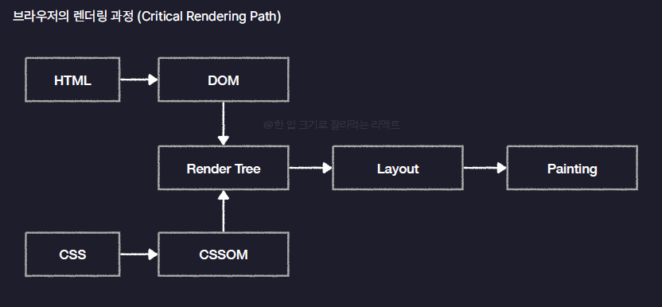

# section4_React.js개론

## 4.1 React.js를 소개합니다.

- Meta(Facebook)이 개발한 오픈소스 JS 라이브러리
- 대규모 웹 서비스의 UI를 더 편하게 개발하기 위해 만들어진 기술
- ex) netflix, facebook, instagram, notion etc…

### 장점

- 컴포넌트를 기반으로 UI를 표현
  - 컴포넌트(Component)
    - 구성요소, 화면을 구성하는 요소, UI를 구성하는 요소를 말함
    - 웹페이지를 레고를 조립하듯이 여러개의 컴포넌트를 조립하여 만듦
      - Header.js
      - Main.js
      - Footer.js
      - etc… 이런애들을 조립하여 페이지를 만듦
    - 중복된 코드를 줄일 수 있다. 유지보수차원이 매우 유리하다~
- 화면 업데이트 구현이 쉽다
  - 업데이트란 사용자의 행동(클릭, 드래그)에 따라 웹 페이지가 스스로 모습을 바꿔 상호작용 하는 것
  - React는 선언형 프로그래밍(과정은 생략하고 목적만 간결히 명시하는 방법)이라서 화면 업데이트를 구현하기가 쉽다.
    - 코드가 간결
  - 반대되는 개념으로는 명령형 프로그래밍 방식이라 한다. ( 목적을 이루기 위한 모든 일련의 과정을 설명하는 방식) ex) Vanillia js
    - 코드가 길고 복잡해짐!
  - React에서는 페이지를 컴포넌트단위로 나눠 개발하게 되는데 각 컴포넌트에는 State라는 현재 컴포넌트의 상태를 저장하는 특수한 공간이 있음, 이 State에 저장된 변수의 값에 따라 다른 종류의 UI를 렌더링(UI를 화면에 출력하는 것) 하도록 설정할 수 있다.
- 화면 업데이트가 빠르게 처리된다
  - 화면 업데이트를 쉽게 구현할 수 있으면서 동시에 빠르게도 처리해준다.
    - 브라우저는 어떻게 동작할까
      - 브라우저의 렌더링 과정(**Critical Rendering Path**)
        
      - HTML과 CSS로 작성한 웹 페이지를 여러단계의 과정을 거쳐 화면에 렌더링
      - Render Tree는 웹페이지의 청사진, 설계도의 역할
      - DOM은 요소들의 위치, 배치, 모양에 관한 모든 정보
      - CSSOM은 요소들의 스타일과 관련된 모든 정보, 이 둘을 모두합친게 Render Tree
      - Layout은 웹페이지 공간안에 요소의 배치를 잡는 작업 (방의 배치 잡듯이)
      - Painting은 실제로 화면에 그려내는 과정
    - 그렇다면 업데이트는 어떻게 이뤄질까
      - JS가 DOM을 수정하면 업데이트가 일어난다.
      - DOM이 수정되면 브라우저는 Critical Rendering Path를 전체부터 다시진행, Render Tree 재생성, Layout 다시, painting다시 ..
      - 그러나 Layout을 다시하는 <**Reflow**>와 Painting을 다시하는 <**Repaint**>라고 하는데 이는 매우 오래걸리는 과정이기 때문이다.
      - 그래서 JS로 업데이트를 하기 위해서는 다양한 업데이트를 한 곳에 모아두었다가 한 번에 수정하도록 DOM에 넘겨주는 것이 단순한 웹서비스에서는 좋은 방법이라 할 수 있으나 서비스의 규모가 커질수록 매우매우 힘들어진다.
      - But **React에서는 이 과정을 자동으로 해준다(React는 Virtual DOM이라는 가상의 DOM을 이용하고 있기 때문)**
        - DOM을 JS 객체로 흉내낸 것으로 일종의 복제판이라 생각하면 됨
        - React는 업데이트가 발생하면 실제 DOM을 수정하기 전에 이 가상의 복제 DOM에 먼저 반영해본다.
        - 이 Virtual DOM이 많은 업데이트를 모아놓는 역할을 하게 된다.

## 4.2 첫 React App 생성하기

- Create React App 오류발생시 [https://jeong-ran-e.tistory.com/entry/Create-React-App-오류-발생시-해결방법](https://jeong-ran-e.tistory.com/entry/Create-React-App-%EC%98%A4%EB%A5%98-%EB%B0%9C%EC%83%9D%EC%8B%9C-%ED%95%B4%EA%B2%B0%EB%B0%A9%EB%B2%95)
- React로 만든 웹 서비스들은 보통 React App, React Application이라고 불리움 (웹브라우저 위에서 동작하는 앱 같다고 해서 붙여진 이름)
- react도 하나의 js 라이브러리이기 때문에
  - node.js 패키지 생성
  - react 라이브러리 설치
  - 기타 도구 설치 및 설정(입문자에게 권장하기 어려움)
    - 그래서 대신 Vite(비트)라는 기본 설정이 적용된 차세대 프엔 개발 툴을 사용
      - React공식문서에서도 권장
      - 대부분의 React는 Vite으로 만들어진다.
- npm create vite@latest : 프로젝트 생성
  - framework, variant 상황에 맞게 설정후 완료
  - package.json
    - devDependencies항목
    - 오직 개발할 때에만 사용되는 라이브러리가 저장되는 곳
    - 개발 시 사용할 문법도구, 개발 시 사용할 테스트 도구
    - 실제로 나중에 배포한다면 이 개발용 라이브러리들은 포함되지 않음
- npm i 로 node_modules와 package-lock.json 생성하기

```json
{
  "name": "section4",
  "private": true,
  "version": "0.0.0",
  "type": "module",
  "scripts": {
    "dev": "vite",
    "build": "vite build",
    "lint": "eslint .",
    "preview": "vite preview"
  },
  "dependencies": {
    "react": "^18.3.1",
    "react-dom": "^18.3.1"
  },
  // 오직 개발할 때에만 사용되는 라이브러리가 저장되는 곳
  // 개발 시 사용할 문법도구, 개발 시 사용할 테스트 도구
  // 실제로 나중에 배포한다면 이 개발용 라이브러리들은 포함되지 않음
  "devDependencies": {
    "@eslint/js": "^9.15.0",
    "@types/react": "^18.3.12",
    "@types/react-dom": "^18.3.1",
    "@vitejs/plugin-react": "^4.3.4",
    "eslint": "^9.15.0",
    "eslint-plugin-react": "^7.37.2",
    "eslint-plugin-react-hooks": "^5.0.0",
    "eslint-plugin-react-refresh": "^0.4.14",
    "globals": "^15.12.0",
    "vite": "^6.0.1"
  }
}
```

- public폴더
  - vite.svg(이미지파일)
  - svg나 png, jpg같은 이미지파일을 보관하거나 코드가 아닌 폰트나 동영상같은 정적인 파일을 보관하는 저장소
- src폴더 (source의 약자)
  - 코드를 보관
  - jsx는 리액트에서만 사용되는 특수한 확장자, 코드가 작성되는곳
- eslint.config.js
  - 개발자들 사이에 코드를 통일하는데 도움을 주는 도구라고 생각
- index.html
  - 리액트앱의 기본틀역할
  - 컴포넌트들이 나중에 이 파일 틀에 맞춰 들어가는 것
- vite.config.js
  - 프로젝트를 만들 때 사용한 vite도구의 옵션을 설정하는 곳

### 실제 프로젝트 실행해보기

- package.json에서

```json
  "scripts": {
    "dev": "vite",
    "build": "vite build",
    "lint": "eslint .",
    "preview": "vite preview"
  },
```

- scripts 내부 부분이 패키지를 실행할 수 있는 명령어들
  - dev가 리액트 앱을 개발용으로 실행시켜보는 명령어

## 4.3 React App 구동원리 살펴보기

- React 앱은 어떻게 구동되는걸까?
  - Vite를 통해 생성한 리액트 앱에는 Web Server가 내장되어 있었다.
  - 현재 가동중인 리액트 웹 서버에 접속할 수 있는 주소가 [http://localhost:5173/](http://localhost:5173/) 되는 것임
  - localhost란 우리 컴퓨터를 의미함
    - 다른 컴퓨터에서 접속하면 localhost가 자기자신을 가리키기 때문에 다른주소를 나타냄
  - 5173은 포트번호(하나의 컴퓨터 내에서 여러개의 서버를 동작시키기 위해서 필요한 주소 체계)
  - 처음에 출력되는 화면은 App.jsx파일
