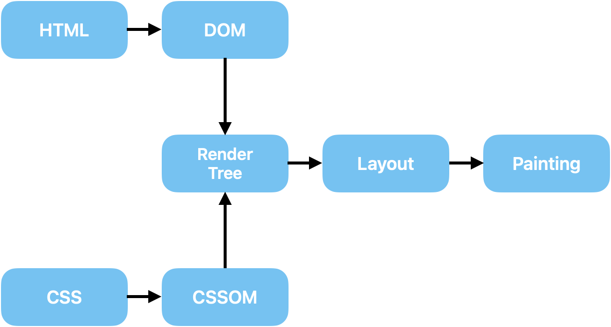
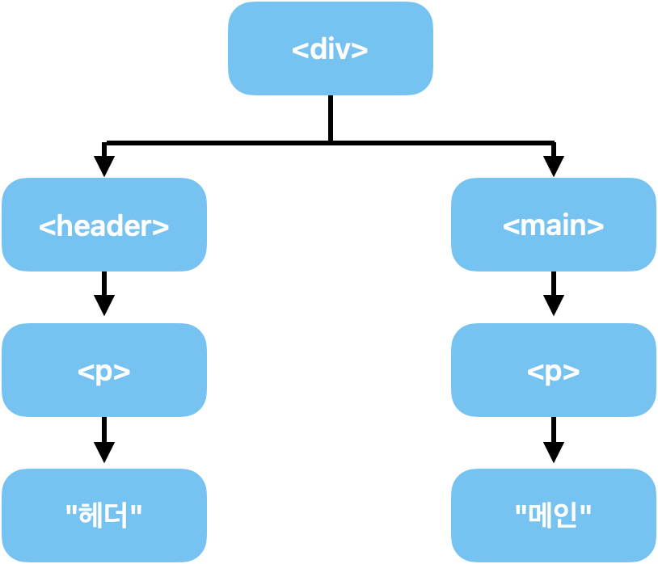

# React basic Study Note

# React.js란?
- Meta(Facebook)이 개발한 오픈소스 JavaScript 라이브러리
- 대규모 웹 서비스의 UI를 더 편하게 개발하기 위해 만들어진 기술
- 국내/외적으로 인기가 많은 프론트엔드 라이브러리
## React의 기술적인 특징
1. 컴포넌트를 기반으로 UI를 표현한다.
2. 화면 업데이트 구현이 쉽다.
3. 화면 업데이트가 빠르게 처리된다.
### 1. 컴포넌트 기반으로 UI를 표현한다.
- 컴포넌트(Componont)
    - 우리말로 '구성요소'라는 뜻
    - 화면을 구성하는 요소, UI를 구성하는 요소를 말함
- 예로 웹 페이지가 Header, Main, Footer로 구성이 되어있다고 한다면, Header.js, Main.js, Footer.js로 컴포넌트별로 나누어 모듈화한다. 
- 중복코드를 제거하는 데서 장점
    - 중복 코드 발생 : 페이지 수가 늘어날수록 코드를 수정하기 어려워짐
- 유지보수 차원에서 용이함.
### 2. 화면 업데이트 구현이 쉽다
- 업데이트
    - 사용자의 행동(클릭, 드래그)에 따라서 웹 페이지가 스스로 모습을 바꿔 상호작용 하는 것
- 선언형 프로그램
    - 과정은 생략하고 목적만 간결히 명시하는 방법
    - 목적만 깔끔하게 명시하기에 코드가 간결함
    - 마치 우리가 식당에서 주문하는 것과 유사
        - ex. 토마토 파스타 하나 주세요.
- 반대 - 명령형 프로그램
    - 목적을 이루기 위해 모든 일련의 과정을 설명하는 방식
    -  모든 과정을 하나 하나 다 설명하기에 코드가 길고 복잡함
    - 마치 진상 손님처럼 주문하는 방식
        - ex. 주방으로 가서 면을 100g 꺼내세요. 그리고 뜨거운 물에 9분간 삶고 후라이팬을 꺼내 불을 올리고...
- 업데이트를 위한 복잡한 동작을 직접 정의할 필요 없이 특정 변수의 값을 바꾸는 것만으로도 화면을 업데이트 시킬 수 있다.
### 3. 화면 업데이트가 빠르게 처리된다.
- 화면 업데이트를 쉽게 구현할 수 있으면서 동시에 빠르게도 처리해줌
- 어떻게 가능할까?
    - [선수지식필요]
        1. 브라우저는 어떻게 동작하는가?
        2. HTML, CSS로 만든 페이지를 어떻게 렌더링하는가?
        3. 화면 업데이트는 어떻게 처리되는가?
1. 브라우저의 랜더링 과정(Critical Rendering Path)
    
    - DOM : 아래와 같은 html 코드를 브라우저가 자기가 이해하기 더 쉬운 방식으로 변환한 아래 그림과 같은 것
      - html을 일종의 객체 모델로 변환한 것

        ```html
        <div>
          <header>
             <p>헤더</p>
          </header>
          <main>
            <p>메인</p>
          </main>
        <div>
        ```
        
    - CSSOM도 마찬가지
    - DOM과 CSSOM를 통해 RanderTree라는 것을 만들게 되는데 이는 웹 페이지의 청사진과 같은 존재. (웹 페이지의 설계도)
      - DOM - 요소들의 위치, 배치, 모양에 관한 모든 정보
      - CSSOM - 요소들의 스타일과 관련된 모든 정보
    - Layout : 요소의 배치를 잡는 작업
    - Painting : 요소를 실제로 화면에 그려내는 과정
  - 그럼 업데이트는 어떻게 발생하는가?
    - JavaScript가 DOM을 수정하면 업데이트가 일어난다. 
    - DOM이 수정되었으니 Rander Tree, Layout, Painting 과정이 다시 일어남.
      - layout과 painting은 다시 하는데 오래 걸리는 작업
      - Layout -> `<Reflow>` : layout을 다시 한다.
      - Painting -> `<Repaint>` : Painting을 다시 한다.
    - 때문에 JavaScript로 DOM을 여러번 수정하면 페이지에 과부화가 걸리기 쉬움
    - 다양한 업데이트를 진행할 때는 동시에 발생한 업데이트를 모은 후 다 모였다면 한번에 수정하도록 신경을 써서 코드를 작성해야 한다.
      - 서비스의 규모가 커질수록 힘들어짐
      - React에서는 이 과정을 자동으로 해줌
        - React는 Virtual DOM을 사용하기 때문
        - Virtual DOM
          - DOM을 자바스크립트 객체로 흉내낸 것으로 일종의 복제판
          - React는 업데이트가 발생하면 실제 DOM을 수정하기 전에 이 가상의 복제판 DOM에 먼저 반영해 봄
# React App 생성하기
- 과정
    1. Node.js 패키지 생성
    2. React 라이브러리 설치
    3. 기타 도구 설치 및 설정
        - 입문자에게 권장하기 어려움
## Vite
- 차세대 프론트엔드 개발 툴
- 기본 설정이 적용된 React App 생성 가능
- React 공식문서에서도 권장되고 있음
## 생성 방법
1. 터미널에 `npm create vite@latest` 작성
2. project name 설정 
3. framwork 설정
4. variant 설정
    ```
    ✔ Project name: … section04
    ✔ Select a framework: › React
    ✔ Select a variant: › JavaScript
    ```
## 생성 완료 후 살펴보기
- package.json에 들어가서 "dependencies" - "react-dom"이 18버전 아래라면 잘못 설치된 것으로 프로젝트 폴더 삭제 후 재생성 해야 함. 
- devDependencies에는 개발용 라이브러리로 배포시에는 포함되지 않음
- 위 라이브러리를 설치하기 위해 터미널에 `npm i` 입력
## 서버 접속해보기
- 터미널에 `npm run dev` 작성하기
- local 주소 `cmd + click` 하여 접속
- 서버 종료하기 : `ctrl + c`
# React App 구동 원리
- react 내부에는 web server가 내장되어 있었고, npm run dev라는 명령어를 통해 react app 서버를 가동 시키라고 명령한 것.

## 초기화면
`index.html`을 살펴보면 아무것도 없는데 초기화면에 다양한 구성이 들어 있음을 알 수 있음
- 이것은 `main.jsx`를 살펴보면 알 수 있음
    - `createRoot(document.getElementById('root')).render()`
    - 인수로 전달받은 요소를 리액트의 루트로 만드는 역할
    - `document.getElementById('root')` : index.html에 root를 id 값으로 갖는 요소들
    - `.rander()` 를 통해 루트에 무엇인가 랜더해주고 있음
        - React.StrictMode는 무시해도 되고, `<App />`이라는 것을 렌더링 해줌을 알 수 있음
        - 위와 같이 html 태그와 같이 작성하는 것은 컴포넌트를 랜더링하는 문법임.
- 이 App이 어디서 왔는지 위를 살펴보면 `App.jsx`에서 오고 있음을 알 수 있음
    - `App.jsx`를 살펴보면 함수가 html 태그들을 리턴해 주고 있음
    -  리액트에서는 함수가 html 태그들을 리턴하고 있으면 해당 함수를 컴포넌트라고 부름.
    - 때문에 app 컴포넌트라고 할 수 있음
    