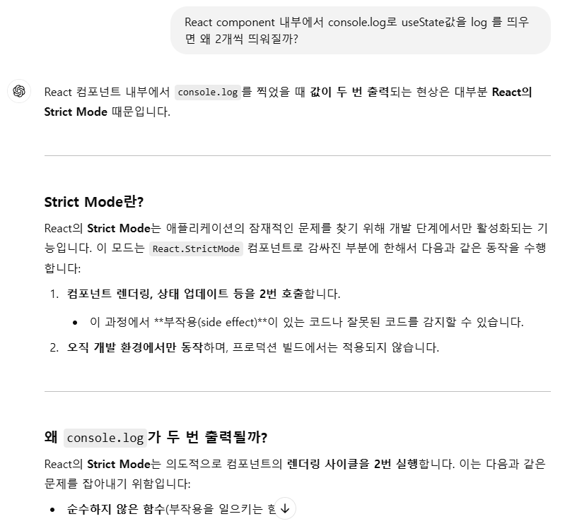

# 📚 목차

1. [Props with Component](#props-with-component)
2. [State](#state)
3. [Hooks](#hooks)

# Props with Component

> React가 사용자 정의 컴포넌트로 작성한 엘리먼트를 발견하면 JSX 어트리뷰트와 자식을 해당 컴포넌트에 단일 객체로 전달합니다. 이 객체를 “props”라고 합니다.

```JS
function Welcome(props) {
  return <h1>Hello, {props.name}</h1>;
}
```
이 함수는 데이터를 가진 하나의 props 객체 인자를 받아 React 엘리먼트를 반환함

또한 [ES6 class](https://developer.mozilla.org/en-US/docs/Web/JavaScript/Reference/Classes) 를 사용해 컴포넌트를 정의할 수도 있음

```JS
class Welcome extends React.Component {
  render() {
    return <h1>Hello, {this.props.name}</h1>;
  }
}
```

다음은 페이지에 "Hello, Sara"를 렌더링하는 예시
```JS
function Welcome(props) {
  return <h1>Hello, {props.name}</h1>;
}

const root = ReactDOM.createRoot(document.getElementById('root'));
const element = <Welcome name="Sara" />;
root.render(element);
```

이 예시에서는 다음과 같은 일들이 일어납니다.

1. `<Welcome name="Sara" />` 엘리먼트로 root.render()를 호출합니다.
2. React는 {name: 'Sara'}를 props로 하여 Welcome 컴포넌트를 호출합니다.
3. Welcome 컴포넌트는 결과적으로 `<h1>Hello, Sara</h1>` 엘리먼트를 반환합니다.
4. React DOM은 `<h1>Hello, Sara</h1>` 엘리먼트와 일치하도록 DOM을 효율적으로 업데이트합니다.

```JS
function App() {
  const buttonProps = {
    text: "메일",
    color: "red",
    a: 1,
    b: 2,
    c: 3,
  }

  return (
    <>
      <Button {...buttonProps} />
      <Button text={"카페"} />
      <Button text={"블로그"}>
        <div>자식요소</div>
      </Button>
    </>
  )
}
```
와 같이 스프레드 연산자와 객체를 이용해서도 Props를 전달할 수 있음<br>
또 **컴포넌트 하위에 html, 컴포넌트** 등을 작성하여도 props.children 으로 props를 전달받을 수 있음

### Props Drilling 이란?

- Props Drilling, Context API, react-query (Data Fetching Hook Library), useResource에 관련한 내용이 담긴 토스 유튜브

[토스 SSR 관련 유튜브](https://youtu.be/IKyA8BKxpXc)

<br><br>

---

# State

> **변화할 수 있는 동적의 값**

### useState 기본 예제

```JS
import "./App.css"
import { useState } from "react"

function App() {
  const [count, setCount] = useState(0)         // 구조 분해 할당을 이용
  const [light, setLight] = useState("off")     // 구조 분해 할당을 이용

  return (
    <>
      <div>
        <h1>{light}</h1>
        <button
          onClick={() => {
            setLight(light === "ON" ? "OFF" : "ON")
          }}
        >
          {light === "ON" ? "끄기" : "켜기"}
        </button>
      </div>
      <h1>{count}</h1>
      <button
        onClick={() => {
          setCount(count + 1)
        }}
      >
        +
      </button>
    </>
  )
}

export default App
```
useState 를 사용함으로써 리액트에게 컴포넌트의 변화를 알려 Re-Rendering 되게 함

### 참고 사항

useState hook을 사용한 양방향 바인딩으로는 한글 IME 입력 오류가 발생하지 않지만,<br>
Vue의 v-model 양방향 바인딩으로는 한글 IME 입력 오류가 발생함.<br>
즉, Vue에서는 입력중인 마지막 글자는 인식하지 못함 (Vue 개구리다..)



<br><br>

---

# Hooks

> 클래스 컴포넌트의 기능을 함수 컴포넌트에서도 사용할 수 있도록 도와주는 메서드들
>> 이름 앞에 접두사 use가 붙음

1. useState
    - State 기능을 낚아채오는 Hook
2. useRef
    - Reference 기능을 낚아채오는 Hook
3. useEffect
4. useReducer
5. ... 등등 이 존재

### Hooks 들의 특징

1. 함수 컴포넌트 내부에서만 호출 가능
2. 조건문, 반복문 내에서 호출 불가
3. Custom Hook 제작 가능

