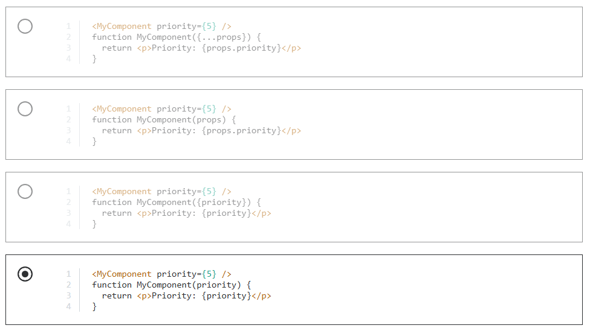
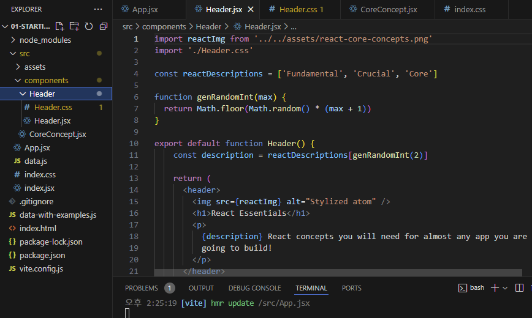

# 03_Props, State, Hooks

## 강의 목차

- '한입 리액트' : React 입문
- '리액트 완벽 가이드' : 리액트 핵심 - 컴포넌트, JSX, 속성, 상태 등 / 리액트 핵심 - 심화 단계

---

### Props로 데이터 전달하기

- 부모 컴포넌트에서 자식 컴포넌트로 전달하는 것만 가능 → 반대로 자식에서 부모에게 전달 불가능!
- props라는 매개변수를 통해 속성들을 묶어서 객체형태로 전달
    - 구조 분해 할당 사용 가능
    - props를 전달하는 부모 컴포넌트에선 스프레드 연산자 사용 가능
- 컴포넌트에서 전달 받는 props가 없을 때, `Button.defaultProps = { color: "black}` 과 같이 설정해주면 오류 없이 렌더링이 된다
- 부모 컴포넌트에서 태그 사이에 넣은 요소는 자식 컴포넌트의 props에서 children으로 전달

### Prop(속성)으로 컴포넌트 재사용

- Props
    - 데이터를 컴포넌트로 전달하고 그 데이터를 그 곳에 사용할 수 있다
    - props의 값으로 모든 종류의 값을 전달할 수 있다 → 문자(string), 숫자(int), 배열(array), 객체(object) 등
    - props를 사용하는 함수에선 일반적으로 매개변수의 이름을 props로 지정한다
    - 해당 컴포넌트 함수를 직접 코드에 호출하는 것이 아님
        - 대신 html 요소로 사용하는 것
        - 리액트가 실제 함수를 호출하는 것
        - 리액트는 props 매개변수에 대한 값을 전달하고, 함수에 전달되는 값은 객체가 되어 모든 키 값의 쌍들을 보유하는 객체가 된다
        - 모든 커스텀 특성은 키(key)로, 속성의 값은 값으로 그룹화 된다
        - 키값 쌍들을 모두 가진 하나의 객체를 props 매개변수를 통해 얻는 것
        - 아래와 같이 사용
        
        ```jsx
        
        import componentsImg from './assets/components.png'
        
        function CoreConcept(props) {
          return (
            <li>
              
              <h3>{props.title}</h3>
              <p>{props.description}</p>
            </li>
          )
        }
        
        function App() {
          return (
            <div>
              <Header />
              <main>
                <section id="core-concepts">
                  <h2>Core Concepts</h2>
                  <ul>
                    <CoreConcept 
                      title="Components" 
                      description="bbb"
                      img={componentsImg}
                    />
                    <CoreConcept />
                    <CoreConcept />
                    <CoreConcept />
                  </ul>
                </section>
                <h2>Time to get started!</h2>
              </main>
            </div>
          );
        }
        
        export default App;
        
        ```
        

### Prop(속성) 대체 문법

- 스프레드, 구조 분해 할당 사용하기

```jsx
import reactImg from './assets/react-core-concepts.png'
import { CORE_CONCEPTS } from './data.js'

const reactDescriptions = ['Fundamental', 'Crucial', 'Core']

function genRandomInt(max) {
  return Math.floor(Math.random() * (max + 1))
}

function Header() {
  const description = reactDescriptions[genRandomInt(2)]

  return (
    <header>
      
      <h1>React Essentials</h1>
      <p>
        {description} React concepts you will need for almost any app you are
        going to build!
      </p>
    </header>
  )
}

// function CoreConcept(props) {
//   return (
//     <li>
//       
//       <h3>{props.title}</h3>
//       <p>{props.description}</p>
//     </li>
//   )
// }

// 구조 분해 할당
function CoreConcept({title, image, description}) {
  return (
    <li>
      
      <h3>{title}</h3>
      <p>{description}</p>
    </li>
  )
}

function App() {
  return (
    <div>
      <Header />
      <main>
        <section id="core-concepts">
          <h2>Core Concepts</h2>
          <ul>
            <CoreConcept 
              title={CORE_CONCEPTS[0].title} 
              description={CORE_CONCEPTS[0].description}
              image={CORE_CONCEPTS[0].image}
            />
            {/* 리액트 스프레드 연산자 */}
            <CoreConcept {...CORE_CONCEPTS[1]}/>
            <CoreConcept {...CORE_CONCEPTS[2]}/>
            <CoreConcept {...CORE_CONCEPTS[3]}/>
          </ul>
        </section>
        <h2>Time to get started!</h2>
      </main>
    </div>
  );
}

export default App;

```

---

### 퀴즈 2 : 동적인 값과 Prop(속성)

질문1. 다음 중 JSX 내 동적인 값이나 자바스크립트 표현을 출력하기 위해 어떤 문법을 사용할 수 있습니까?

- { }

질문2. 다음 중 JSX에서 동적인 값으로 출력될 수 있는 것은 무엇입니까? (예를 들어, 중괄호 사이)

- 유효한 아무 자바스크립트 표현문 (ex. 1+1)

질문3. 다음 중 리액트 프로젝트에서 이미지를 로딩/사용할 때 주로 사용하는 방법은 무엇입니까?

-  src를 import문으로 생성된 path(경로)로 지정한다

질문4. 다음 중 HTML 요소 속성에 동적인 값을 부여하는 방법은 무엇입니까?

- JSX에서 일반적으로 동적 값에 사용하는 것과 동일한 문법 사용하기 : 중괄호 { }

질문5. 다음 중 리액트 컴포넌트의 재사용성을 높히는 리액트의 주요 개념은 무엇입니까?

- Props(속성)

질문6. 다음 중 리액트에서 Prop(속성)이 동작하는 방식은 무엇입니까?

- Prop(커스텀 속성)을 컴포넌트에 지정하여 전달 받는 컴포넌트에서 추출 및 사용한다

질문7. 

다음 4개의 코드 중 Prop(속성)을 의도대로 설정 및 추출하기에 적절하지 **않은** 코드는?

*예를 들어, 다음 중 문구 “Priority:5”를 화면에 출력하지 **않는** 코드는?*



- 정답입니다. 오류가 미묘하지만 이 예제에서는 객체 구조 분해 할당(비구조화)가 사용되지 않았습니다. 따라서 여기서 "priority" prop은 props 객체에서 추출되지 않습니다. 대신, 이제 "priority"라는 이름의 전체 props 객체가 됩니다. 이름은 여러분 선택이기 때문에 문제가 되지 않을 수 있습니다. 그러나 이제 문단에서 "priority" 속성이 아닌 전체 객체가 출력됩니다. 그러므로 출력은 "Priority: 5"가 아니라 "Priority: [Object object]" (혹은 비슷한 형태)가 됩니다.

---

### 파일에 컴포넌트 저장 및 좋은 프로젝트 구조 활용

- 별도의 컴포넌트는 별도의 파일에 저장하기
- 경로 : src → components 폴더 생성
- 파일 이름은 컴포넌트 이름과 동일하게 저장하는 게 관례
- 해당 컴포넌트에 쓰인 변수와, import 등을 함께 저장하기
- 그리고 다른 파일에서 사용이 가능하도록 해야 하기 때문에 export 기능을 써야 함
    - `export default function Header() {}`
- App.jsx 파일에서 위 새로 만든 파일 import 하기
- 새로 만든 파일에서 이미지 등의 경우 경로가 바뀌는 것 잘 확인하기

---

### 컴포넌트 옆에 컴포넌트 스타일 파일 지정하기

- css 파일도 마찬가지로 분리했을 경우에는 해당 css파일이 적용되는 jsx 파일에 import를 작성한다
    - `import './Header.css'`
- 컴포넌트 별 CSS 파일로 구분을 하면 스타일 조절이 쉽고 직관적이지만 해당 컴포넌트에만 한정적으로 적용되는 것이 아니라는 것을 주의해야 함



### 컴포넌트 구성 : children Prop → 자녀 속성

- children prop에는 컴포넌트 텍스트 사이에 있는 내용이 포함되어 있다
- 컴포넌트가 다른 컴포넌트나 내용을 감싸서 컴포넌트를 구축하는 것 → `컴포넌트 합성`

```html
<section id="examples">
	<h2>Examples</h2>
	<menu>
		<TabButton>Components</TabButton>
	</menu>
</section>
```

```jsx
export default function TabButton(props) {
  return (
    <li>
      <button>{props.children}</button>
    </li>
  )
}

// 혹은,

export default function TabButton({children}) {
  return (
    <li>
      <button>{children}</button>
    </li>
  )
}
```

혹은

```jsx
<section id="examples">
	<h2>Examples</h2>
	<menu>
		<TabButton label="Components"></TabButton>
	</menu>
</section>
```

```jsx
export default function TabButton({label}) {
  return (
    <li>
      <button>{label}</button>
    </li>
  )
}
```

### 이벤트 핸들링

- 이벤트 객체
    - 합성 이벤트
        - 모든 웹 브라우저의 이벤트 객체를 하나로 통일한 형태
        - 모든 브라우저에서 쓸 수 있는 통합된 규격 이벤트 객체

### 이벤트 처리하기

- 명령형이 아닌 선언형으로!
- 속성 값으로 `이벤트` 를 설정하고, 컴포넌트 안에서 정의한 해당 함수 값을 속성 값으로 제공하기

```jsx
export default function TabButton({children}) {
  function handleClick() {
    console.log('hello!')
  }
  return (
    <li>
      <button onClick={handleClick} >{children}</button>
    </li>
  )
}

// 이름은 자유지만 관습적으로 짓는다
// 속성 값으로 제공하는 함수는 ()를 붙여서 실행하면 안 된다
```

### 함수를 prop(속성) 값으로 전달하기

- 버튼을 누를 때마다 다른 컴포넌트의 내용이 보이도록 하기

```jsx
// App.jsx

import { CORE_CONCEPTS } from './data.js'
import Header from './components/Header/Header.jsx';
import CoreConcept from './components/CoreConcept.jsx';
import TabButton from './components/TabButton.jsx';

function App() {
  function handleSelect() {
    console.log('hello!')
  }

  return (
    <div>
      <Header />
      <main>
        <section id="core-concepts">
          <h2>Core Concepts</h2>
          <ul>
            <CoreConcept 
              title={CORE_CONCEPTS[0].title} 
              description={CORE_CONCEPTS[0].description}
              image={CORE_CONCEPTS[0].image}
            />
            {/* 리액트 스프레드 연산자 */}
            <CoreConcept {...CORE_CONCEPTS[1]}/>
            <CoreConcept {...CORE_CONCEPTS[2]}/>
            <CoreConcept {...CORE_CONCEPTS[3]}/>
          </ul>
        </section>
        <section id="examples">
          <h2>Examples</h2>
          <menu>
            <TabButton onSelect={handleSelect}>Components</TabButton>
            <TabButton onSelect={handleSelect}>JSX</TabButton>
            <TabButton onSelect={handleSelect}>Props</TabButton>
            <TabButton onSelect={handleSelect}>State</TabButton>
          </menu>
          Dynamic Content
        </section>
        <h2>Time to get started!</h2>
      </main>
    </div>
  );
}

export default App;

```

```jsx
// TabButton.jsx

export default function TabButton({children, onSelect}) {
  return (
    <li>
      <button onClick={onSelect} >{children}</button>
    </li>
  )
}
```

### 이벤트 함수에 커스텀 인자 전달하기

```jsx

import { CORE_CONCEPTS } from './data.js'
import Header from './components/Header/Header.jsx';
import CoreConcept from './components/CoreConcept.jsx';
import TabButton from './components/TabButton.jsx';

function App() {
  function handleSelect(selectedButton) {
    console.log(selectedButton)
  }

  return (
    <div>
      <Header />
      <main>
        <section id="core-concepts">
          <h2>Core Concepts</h2>
          <ul>
            <CoreConcept 
              title={CORE_CONCEPTS[0].title} 
              description={CORE_CONCEPTS[0].description}
              image={CORE_CONCEPTS[0].image}
            />
            {/* 리액트 스프레드 연산자 */}
            <CoreConcept {...CORE_CONCEPTS[1]}/>
            <CoreConcept {...CORE_CONCEPTS[2]}/>
            <CoreConcept {...CORE_CONCEPTS[3]}/>
          </ul>
        </section>
        <section id="examples">
          <h2>Examples</h2>
          <menu>
            <TabButton onSelect={() => handleSelect('Components')}>Components</TabButton>
            <TabButton onSelect={() => handleSelect('JSX')}>JSX</TabButton>
            <TabButton onSelect={() => handleSelect('Props')}>Props</TabButton>
            <TabButton onSelect={() => handleSelect('State')}>State</TabButton>
          </menu>
          Dynamic Content
        </section>
        <h2>Time to get started!</h2>
      </main>
    </div>
  );
}

export default App;

```

---

### 퀴즈 3 : 추천 실습 및 이벤트 핸들링

질문1. 다음 중 컴포넌트 함수를 저장할 때 주로 사용되는 방법은 무엇입니까?

- 여러 파일에 나누어 저장 (한 파일 당 한 컴포넌트)

질문2. “children” Prop(속성)의 목적은 무엇입니까?

- 열림과 닫힘 태그 사이에 있는 내용을 전달하고 사용하는 데 사용한다

질문3. 다음 중 리액트 프로젝트에서 사용자 이벤트를 핸들링하는 방법은 무엇입니까?

- 내장 prop 사용 - onClick 등
- 특정 이벤트가 발생했을 때 트리거되는 함수를 정의할 수 있도록 함

질문4. 이벤트 이후에 코드를 실행시키려면, onClick과 같은 이벤트 prop(속성)에 어떠한 값이 전달되어야 합니까?

- 실행되어야 하는 함수의 포인터 (예  onClick={handleClick} )

질문5. 이벤트로부터 독립적인 함수는 어떻게 “구성 및 설정”할 수 있습니까? (예: 어떤 인자를 전달할지 정의하는 등)

- 함수를 다른 함수로 감싼다 (onClick={() ⇒ handleClick(5)})
- 이벤트를 핸들링하는 함수의 실행을 다른 함수로 감싸면, 그 다른 함수가 이벤트 핸들링의 prop(속성)의 값으로 전달된다. 그러므로 메인 함수 (이 예시에서는=>handleClick)는 이벤트가 발생할 때만 실행

---

### useState (React Hooks)

- 현재 가지고 있는 형태나 모양을 정의, 변화 할 수 있는 동적인 값
- 컴포넌트는 각자 state를 가질 수 있음
- `useState` 는 2개의 값을 반환
    1. 새롭게 생성된 state의 현재 값, state에 초기 값을 주면 해당 값으로 출력됨 → `useState(0) -> 0` 
    2. 함수 → state의 상태를 변화시키는 함수 : 상태 변화 함수
    3. `const [state, setState] = useState` 
- 리렌더링!!!! → let, const 등 일반 변수는 리렌더링 불가
- 사용자 입력 저장하기 → 예시 코드
    
    ```jsx
    const Register = () => {
      const [name, setName] = useState("이름");
      const [birth, setBirth] = useState("");
      const [country, setCountry] = useState("");
      const [bio, setBio] = useState("");
    
      const onChangeName = (e) => {
        setName(e.target.value);
      };
    
      const onChangeBirth = (e) => {
        setBirth(e.target.value);
      };
    
      const onChangeCountry = (e) => {
        setCountry(e.target.value);
      };
    
      const onChangeBio = (e) => {
        setBio(e.target.value);
      };
    
      return (
        <div>
          <div>
            <input
              value={name}
              onChange={onChangeName}
              placeholder={"이름"}
            />
          </div>
    
          <div>
            <input
              value={birth}
              onChange={onChangeBirth}
              type="date"
            />
          </div>
    
          <div>
            <select value={country} onChange={onChangeCountry}>
              <option value=""></option>
              <option value="kr">한국</option>
              <option value="us">미국</option>
              <option value="uk">영국</option>
            </select>
            {country}
          </div>
    
          <div>
            <textarea value={bio} onChange={onChangeBio} />
          </div>
        </div>
      );
    };
    
    export default Register;
    ```
    
    ```jsx
    // 여러 개의 state와 이벤트 핸들러 통합하기
    
    import { useState } from "react";
    // 간단한 회원가입 폼
    // 1. 이름
    // 2. 생년월일
    // 3. 국적
    // 4. 자기소개
    
    const Register = () => {
      const [input, setInput] = useState({
        name: "",
        gender: "",
        bio: "",
      });
    
      const onChange = (e) => {
        console.log(e.target.name + " : " + e.target.value);
        setInput({
          ...input,
          [e.target.name]: e.target.value,
        });
      };
    
      return (
        <div>
          <div>
            <input
              name="name"
              value={input.name}
              onChange={onChange}
              placeholder={"이름"}
            />
          </div>
    
          <div>
            <input
              name="birth"
              value={input.birth}
              onChange={onChange}
              type="date"
            />
          </div>
    
          <div>
            <select
              name="country"
              value={input.country}
              onChange={onChange}
            >
              <option value=""></option>
              <option value="kr">한국</option>
              <option value="us">미국</option>
              <option value="uk">영국</option>
            </select>
          </div>
    
          <div>
            <textarea
              name="bio"
              value={input.bio}
              onChange={onChange}
            />
          </div>
        </div>
      );
    };
    
    export default Register;
    
    ```
    

### UI를 업데이트 하지 않는 법

- 앱 함수가 실행되지 않으면 JSX 코드도 재평가 되지 않음

```jsx

import { CORE_CONCEPTS } from './data.js'
import Header from './components/Header/Header.jsx';
import CoreConcept from './components/CoreConcept.jsx';
import TabButton from './components/TabButton.jsx';

function App() {
  let tabContent = 'please click a button'
  function handleSelect(selectedButton) {
    tabContent = selectedButton
  }

  return (
    <div>
      <Header />
      <main>
        <section id="core-concepts">
          <h2>Core Concepts</h2>
          <ul>
            <CoreConcept 
              title={CORE_CONCEPTS[0].title} 
              description={CORE_CONCEPTS[0].description}
              image={CORE_CONCEPTS[0].image}
            />
            {/* 리액트 스프레드 연산자 */}
            <CoreConcept {...CORE_CONCEPTS[1]}/>
            <CoreConcept {...CORE_CONCEPTS[2]}/>
            <CoreConcept {...CORE_CONCEPTS[3]}/>
          </ul>
        </section>
        <section id="examples">
          <h2>Examples</h2>
          <menu>
            <TabButton onSelect={() => handleSelect('Components')}>Components</TabButton>
            <TabButton onSelect={() => handleSelect('JSX')}>JSX</TabButton>
            <TabButton onSelect={() => handleSelect('Props')}>Props</TabButton>
            <TabButton onSelect={() => handleSelect('State')}>State</TabButton>
          </menu>
          {tabContent}
        </section>
        <h2>Time to get started!</h2>
      </main>
    </div>
  );
}

export default App;

// 이 경우에는 let으로 버튼의 텍스트를 정의하고 함수 실행시 tabContent 가 버튼 텍스트가 되도록 설정한 후
// html 코드 안에 { 중괄호 } 를 사용하여 tabContent 를 넣어주었지만, 실행 X
// 앱 함수가 다시 실행되지 않았기 때문에 제일 처음 {tabContent}만 출력이 되고, 이후 버튼 클릭 시에는 변경사항이 저장되지 않음
```

### State(상태) 관리 & Hooks(훅) 사용법

- 일반적인 변수로는 UI를 업데이트 할 수 없다
- `import { useState } from 'react';` → 리액트 훅 사용하기 (use 로 시작하는 모든 함수는 리액트 훅)
- `const [ selectedTopic, setSelectedTopic ] = useState('please click a button')`
    - 일반 함수지만 리액트 컴포넌트나, 다른 리액트 훅에서 호출되어야 한다
    - 컴포넌트 함수 안에서 바로 호출해야 하며 다른 코드 안에 중첩되면 안된다
    - 최상위에서 호출, if문이나 loop도 X
    - const 로 반환되는 값은 array 이며, 항상 두 개의 요소가 반환된다
        - 그래서 배열 구조 분해를 이용하여 두 개의 요소를, 두 개의 별도 상수에 저장한다
    - `selectedTopic` → 이 컴포넌트 실행 주기의 현재 데이터 스냅샷 : 초기값 저장, 다시 실행이 될 땐 업데이트 된 값이 저장 / 실질적으로 관리하는 요소는 이 요소
    - `setSelectedTopic` → 함수 / 이 상태를 업데이트하기 위해 실행되며, 저장된 값을 업데이트 + 다시 실행되기 때문에 `selectedTopic` 해당 값이 계속 업데이트 됨

```jsx
import { useState } from 'react';
import { CORE_CONCEPTS } from './data.js'
import Header from './components/Header/Header.jsx';
import CoreConcept from './components/CoreConcept.jsx';
import TabButton from './components/TabButton.jsx';

function App() {
  const [ selectedTopic, setSelectedTopic ] = useState('please click a button')

  function handleSelect(selectedButton) {
    setSelectedTopic(selectedButton)
  }

  return (
    <div>
      <Header />
      <main>
        <section id="core-concepts">
          <h2>Core Concepts</h2>
          <ul>
            <CoreConcept 
              title={CORE_CONCEPTS[0].title} 
              description={CORE_CONCEPTS[0].description}
              image={CORE_CONCEPTS[0].image}
            />
            {/* 리액트 스프레드 연산자 */}
            <CoreConcept {...CORE_CONCEPTS[1]}/>
            <CoreConcept {...CORE_CONCEPTS[2]}/>
            <CoreConcept {...CORE_CONCEPTS[3]}/>
          </ul>
        </section>
        <section id="examples">
          <h2>Examples</h2>
          <menu>
            <TabButton onSelect={() => handleSelect('Components')}>Components</TabButton>
            <TabButton onSelect={() => handleSelect('JSX')}>JSX</TabButton>
            <TabButton onSelect={() => handleSelect('Props')}>Props</TabButton>
            <TabButton onSelect={() => handleSelect('State')}>State</TabButton>
          </menu>
          {selectedTopic}
        </section>
        <h2>Time to get started!</h2>
      </main>
    </div>
  );
}

export default App;

```

### 데이터 기반 State(상태) 가져오기 및 출력

```jsx
// data.js

export const EXAMPLES = {
  components: {
    title: 'Components',
    description:
      'Components are the building blocks of React applications. A component is a self-contained module (HTML + optional CSS + JS) that renders some output.',
    code: `
function Welcome() {
  return <h1>Hello, World!</h1>;
}`,
  },
  jsx: {
    title: 'JSX',
    description:
      'JSX is a syntax extension to JavaScript. It is similar to a template language, but it has full power of JavaScript (e.g., it may output dynamic content).',
    code: `
<div>
  <h1>Welcome {userName}</h1>
  <p>Time to learn React!</p>
</div>`,
  },
  props: {
    title: 'Props',
    description:
      'Components accept arbitrary inputs called props. They are like function arguments.',
    code: `
function Welcome(props) {
  return <h1>Hello, {props.name}</h1>;
}`,
  },
  state: {
    title: 'State',
    description:
      'State allows React components to change their output over time in response to user actions, network responses, and anything else.',
    code: `
function Counter() {
  const [isVisible, setIsVisible] = useState(false);

  function handleClick() {
    setIsVisible(true);
  }

  return (
    <div>
      <button onClick={handleClick}>Show Details</button>
      {isVisible && <p>Amazing details!</p>}
    </div>
  );
}`,
  },
};
```

```jsx
// App.jsx

import { useState } from 'react';
import { CORE_CONCEPTS } from './data.js'
import Header from './components/Header/Header.jsx';
import CoreConcept from './components/CoreConcept.jsx';
import TabButton from './components/TabButton.jsx';
import { EXAMPLES } from './data.js';

function App() {
  const [ selectedTopic, setSelectedTopic ] = useState('components')

  function handleSelect(selectedButton) {
    setSelectedTopic(selectedButton)
  }

  return (
    <div>
      <Header />
      <main>
        <section id="core-concepts">
          <h2>Core Concepts</h2>
          <ul>
            <CoreConcept 
              title={CORE_CONCEPTS[0].title} 
              description={CORE_CONCEPTS[0].description}
              image={CORE_CONCEPTS[0].image}
            />
            {/* 리액트 스프레드 연산자 */}
            <CoreConcept {...CORE_CONCEPTS[1]}/>
            <CoreConcept {...CORE_CONCEPTS[2]}/>
            <CoreConcept {...CORE_CONCEPTS[3]}/>
          </ul>
        </section>
        <section id="examples">
          <h2>Examples</h2>
          <menu>
            <TabButton onSelect={() => handleSelect('Components')}>Components</TabButton>
            <TabButton onSelect={() => handleSelect('jsx')}>JSX</TabButton>
            <TabButton onSelect={() => handleSelect('props')}>Props</TabButton>
            <TabButton onSelect={() => handleSelect('state')}>State</TabButton>
          </menu>
          <div id="tab-content">
            <h3>{EXAMPLES[selectedTopic].title}</h3>
            <p>{EXAMPLES[selectedTopic].description}</p>
            <pre>
              <code>
                {EXAMPLES[selectedTopic].code}
              </code>
            </pre>
          </div>
        </section>
        <h2>Time to get started!</h2>
      </main>
    </div>
  );
}

export default App;

```

---

### 퀴즈 4 : State(상태)와 계산된 값

질문1. 리액트 앱에서 State(상태)의 존재 목적은 무엇입니까?

- 변화가 생겼을 때 리액트가 컴포넌트를 재평가하게 하는 데이터

질문2. “Hooks(훅)의 규칙”에는 두 가지가 있습니다. 다음 중 그 규칙에 **옳지 않은** 것은?

- 리액트 훅은 다른 훅 옆에서 호출할 수 없다 → 필요한 만큼 얼마든지 호출 가능 / 바로 옆도 가능

질문3. “파생된 State(상태)” / “계산된 값” 의 배경 개념은 무엇입니까?

- 계산된 값들은 다른 State(상태)로 부터 파생될 수 있으므로 분리된 상태로 관리해서는 안 된다

### useRef (React Hooks)

- 새로운 레퍼런스 객체를 생성하는 기능
- `useState`와 차이점
    - `useState` 는 값이 변경되면 컴포넌트 리렌더링이 이루어진다
    - `useRef` 는 어떤 경우에도 리렌더링을 유발하지 않는다
- 컴포넌트가 렌더링하는 특정 돔 요소에 접근 가능
    - 해당 요소 조작 가능 → 특정 요소의 스타일을 변경시키는 조작 가능
- 예시 코드 - 업데이트 카운트 등

```jsx
import { useState, useRef } from "react";

// 간단한 회원가입 폼
// 1. 이름
// 2. 생년월일
// 3. 국적
// 4. 자기소개

const Register = () => {
  const [input, setInput] = useState({
    name: "",
    birth: "",
    country: "",
    bio: "",
  });
  const countRef = useRef(0);
  const inputRef = useRef();

  const onChange = (e) => {
    // countRef.current++;
    count++;
    console.log(count);
    setInput({
      ...input,
      [e.target.name]: e.target.value,
    });
  };

  const onSubmit = () => {
    if (input.name === "") {
      // 이름을 입력하는 DOM 요소 포커스
      inputRef.current.focus();
    }
  };

  return (
    <div>
      <div>
        <input
          ref={inputRef}
          name="name"
          value={input.name}
          onChange={onChange}
          placeholder={"이름"}
        />
      </div>

      <div>
        <input
          name="birth"
          value={input.birth}
          onChange={onChange}
          type="date"
        />
      </div>

      <div>
        <select
          name="country"
          value={input.country}
          onChange={onChange}
        >
          <option value=""></option>
          <option value="kr">한국</option>
          <option value="us">미국</option>
          <option value="uk">영국</option>
        </select>
      </div>

      <div>
        <textarea
          name="bio"
          value={input.bio}
          onChange={onChange}
        />
      </div>

      <button onClick={onSubmit}>제출</button>
    </div>
  );
};

export default Register;

```

---

### 조건적 콘텐츠 렌더링

- 삼항 연산자 사용  `{!selectedTopic ? (A) : (B)}`
- && 연산자 사용
- 변수 사용

```jsx
import { useState } from 'react';
import { CORE_CONCEPTS } from './data.js'
import Header from './components/Header/Header.jsx';
import CoreConcept from './components/CoreConcept.jsx';
import TabButton from './components/TabButton.jsx';
import { EXAMPLES } from './data.js';

function App() {
  const [ selectedTopic, setSelectedTopic ] = useState()

  function handleSelect(selectedButton) {
    setSelectedTopic(selectedButton)
  }

  return (
    <div>
      <Header />
      <main>
        <section id="core-concepts">
          <h2>Core Concepts</h2>
          <ul>
            <CoreConcept 
              title={CORE_CONCEPTS[0].title} 
              description={CORE_CONCEPTS[0].description}
              image={CORE_CONCEPTS[0].image}
            />
            {/* 리액트 스프레드 연산자 */}
            <CoreConcept {...CORE_CONCEPTS[1]}/>
            <CoreConcept {...CORE_CONCEPTS[2]}/>
            <CoreConcept {...CORE_CONCEPTS[3]}/>
          </ul>
        </section>
        <section id="examples">
          <h2>Examples</h2>
          <menu>
            <TabButton onSelect={() => handleSelect('components')}>Components</TabButton>
            <TabButton onSelect={() => handleSelect('jsx')}>JSX</TabButton>
            <TabButton onSelect={() => handleSelect('props')}>Props</TabButton>
            <TabButton onSelect={() => handleSelect('state')}>State</TabButton>
          </menu>
            {!selectedTopic ? (
              <p>Please select a topic.</p>
            ) : (
              <div id="tab-content">
                <h3>{EXAMPLES[selectedTopic].title}</h3>
                <p>{EXAMPLES[selectedTopic].description}</p>
                <pre>
                  <code>
                    {EXAMPLES[selectedTopic].code}
                  </code>
                </pre>
              </div>  
            )}
        </section>
        <h2>Time to get started!</h2>
      </main>
    </div>
  );
}

export default App;

```

### CSS 스타일링 및 동적 스타일링

- JSX의 경우 클래스 속성을 사용하기 위해선 `class` 가 아닌 `className` 을 사용해야 한다

```jsx
// TabButton.jsx

export default function TabButton({children, onSelect, isSelected}) {
  return (
    <li>
      <button className={isSelected ? 'active' : undefined} onClick={onSelect} >{children}</button>
    </li>
  )
}
```

```jsx
// App.jsx

import { useState } from 'react';
import { CORE_CONCEPTS } from './data.js'
import Header from './components/Header/Header.jsx';
import CoreConcept from './components/CoreConcept.jsx';
import TabButton from './components/TabButton.jsx';
import { EXAMPLES } from './data.js';

function App() {
  const [ selectedTopic, setSelectedTopic ] = useState()

  function handleSelect(selectedButton) {
    setSelectedTopic(selectedButton)
  }

  return (
    <div>
      <Header />
      <main>
        <section id="core-concepts">
          <h2>Core Concepts</h2>
          <ul>
            <CoreConcept 
              title={CORE_CONCEPTS[0].title} 
              description={CORE_CONCEPTS[0].description}
              image={CORE_CONCEPTS[0].image}
            />
            {/* 리액트 스프레드 연산자 */}
            <CoreConcept {...CORE_CONCEPTS[1]}/>
            <CoreConcept {...CORE_CONCEPTS[2]}/>
            <CoreConcept {...CORE_CONCEPTS[3]}/>
          </ul>
        </section>
        <section id="examples">
          <h2>Examples</h2>
          <menu>
            <TabButton
              isSelected={selectedTopic === 'components'}
              onSelect={() => handleSelect('components')}
            >
              Components
            </TabButton>
            <TabButton
              isSelected={selectedTopic === 'jsx'}
              onSelect={() => handleSelect('jsx')}
            >
              JSX
            </TabButton>
            <TabButton
              isSelected={selectedTopic === 'props'}
              onSelect={() => handleSelect('props')}
            >
              Props
            </TabButton>
            <TabButton
              isSelected={selectedTopic === 'state'}
              onSelect={() => handleSelect('state')}
            >
              State
            </TabButton>
          </menu>
            {!selectedTopic ? (
              <p>Please select a topic.</p>
            ) : (
              <div id="tab-content">
                <h3>{EXAMPLES[selectedTopic].title}</h3>
                <p>{EXAMPLES[selectedTopic].description}</p>
                <pre>
                  <code>
                    {EXAMPLES[selectedTopic].code}
                  </code>
                </pre>
              </div>  
            )}
        </section>
        <h2>Time to get started!</h2>
      </main>
    </div>
  );
}

export default App;

```

### 리스트 데이터 동적 출력

- map 함수 사용하여 JSX 코드로 변환하기

```jsx
<ul>
  {CORE_CONCEPTS.map((conceptItem) => (
    <CoreConcept key={conceptItem.title} {...conceptItem} />
  ))}
</ul>
```

---

### Fragments(프래그먼트) 사용법

- JSX는 하나의 상위 혹은 부모 요소를 가지고 있어야 한다
- `import { useState, Fragment } from 'react';`
    - div를 대체할 수 있으며 `div` 가 중첩되지 않도록 만들 수 있다
    - 프래그먼트에 대한 대안으로는 <> </> 빈 괄호 사용이 있다

### 여러 JSX 슬롯  활용법

```jsx
import { useState } from "react";
import { EXAMPLES } from "../data.js";
import TabButton from './TabButton.jsx'
import Section from "./Section.jsx";
import Tabs from "./Tabs.jsx";

export default function Examples() {
  const [selectedTopic, setSelectedTopic] = useState();

  function handleSelect(selectedButton) {
    // selectedButton => 'components', 'jsx', 'props', 'state'
    setSelectedTopic(selectedButton);
    // console.log(selectedTopic);
  }

  let tabContent = <p>Please select a topic.</p>;

  if (selectedTopic) {
    tabContent = (
      <div id="tab-content">
        <h3>{EXAMPLES[selectedTopic].title}</h3>
        <p>{EXAMPLES[selectedTopic].description}</p>
        <pre>
          <code>{EXAMPLES[selectedTopic].code}</code>
        </pre>
      </div>
    );
  }

  return (
    <Section title="Examples" id="examples">
      <Tabs buttons={
        <>
          <TabButton
            isSelected={selectedTopic === 'components'}
            onClick={() => handleSelect('components')}
          >
            Components
          </TabButton>
          <TabButton
            isSelected={selectedTopic === 'jsx'}
            onClick={() => handleSelect('jsx')}
          >
            JSX
          </TabButton>
          <TabButton
            isSelected={selectedTopic === 'props'}
            onClick={() => handleSelect('props')}
          >
            Props
          </TabButton>
          <TabButton
            isSelected={selectedTopic === 'state'}
            onClick={() => handleSelect('state')}
          >
            State
          </TabButton>
        </>
      }>
        {tabContent}
      </Tabs>
      <menu>
      
      </menu>
      
    </Section>
  )
}

```

- 하나의 속성으로 버튼을 전부 넣기 → `div` 혹은, `<>, </>` 로 감싸면 하나의 요소로 묶인다

### 컴포넌트 타입 동적으로 설정하기

- 내장과 커스텀 컴포넌트의 차이
    - 커스텀은 동적 값이어야 한다 `ButtonsContainer={Section}`
    - 내장 요소 (menu, div 등) 의 경우엔 문자열로 설정 `ButtonsContainer="menu"`
    - 꼭 첫 문자는 대문자로 작성