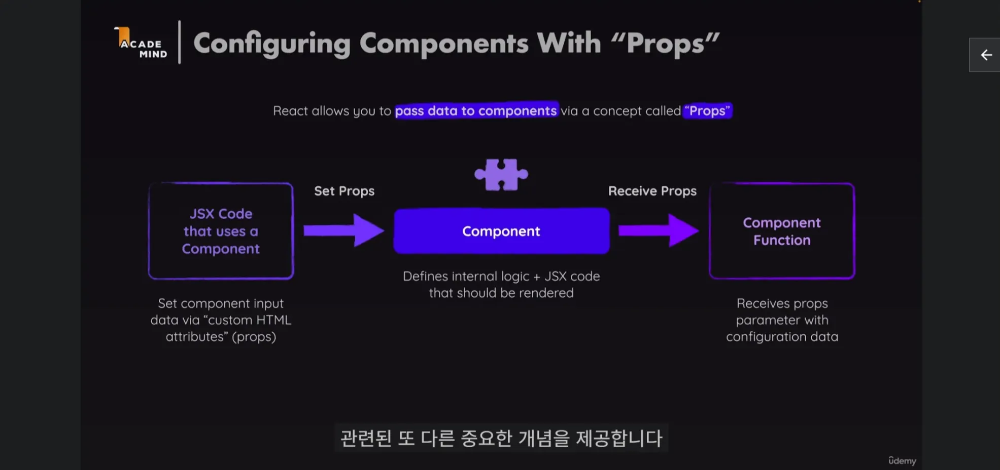
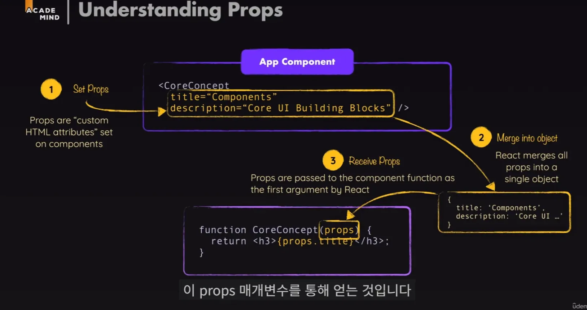
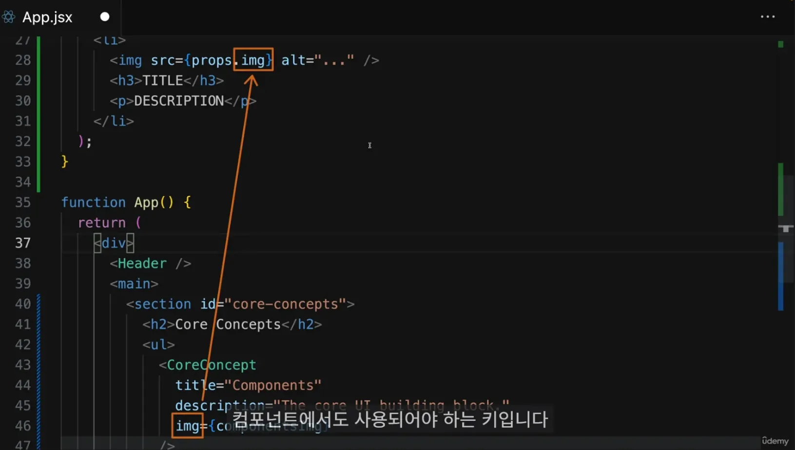
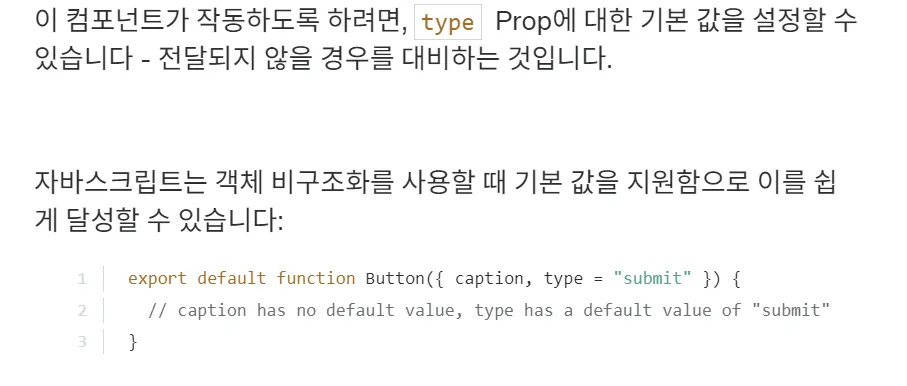

# 03_Props_State_Hooks

## 그 전 각 컴포넌트의 특징
- 데이터를 컴포넌트로 전달하고 그 데이터를 그 곳에 사용할 수 있다는 것
  - 사용할 때 마다 다른 데이터를 전달할 수 있음
  - 즉 재사용성을 높여주는 것

- 커스텀 컴포넌트에 커스텀 속성을 정할 수 있음
  ⇒ 개발자의 몫이기 때문에 개발자 마음대로 정할 수 있음
    
<br>

# Props란? : 컴포넌트를 설정하는 개념  ⇒ 핵심 UI 빌딩블록
- 문자열 or 숫자열 모든 것을 사용할 수 있음
- 즉 props의 매개변수는 리액트에 의해 설정 
  <br> ⇒ 컴포넌트 함수를 직접 코드에 호출하는 것X
    - **HTML 요소로 사용하는 것 : 실제로는 리액트가 실제 함수를 부르는 것**



- 컴포넌트를 설정하는 개념을 `props`라고 부름

```jsx
  <Header title={"hello"} leftChild={<Button 
  text={"< 뒤로가기"}/>}/>
```
⇒ 여기서 보면 `title`과 `leftChild` 가 Props가 됨

<br>


- 또한 Props로 내려준 입력 값을 받아들이고 사용하기 위해 `매개변수를` 추가
    - 매개 변수에 대해 일반적으로 선택되는 이름

```jsx
  //여기서 text, children
  const Button = ({text, color = 'blue', children}) => {
    console.log(text, color)
    const onClickButton = (e) => {
      console.log(e) 
      console.log(text, "click event 발동")
    }

```
<br>

## 쉽게 이해하기

### Props란?
- Props는 `속성`이라고 생각
- 레고 블록을 상상
- 레고 블록에는 여러 가지 `색깔, 크기, 모양`이 있죠? 이런 특징들이 바로 레고 블록의 '속성'
-  React에서 Props는 이와 비슷한 역할을 함

#### 비유: 레고 블록 놀이

1. **레고 블록 = React 컴포넌트**
    - 레고 블록을 조립해서 집이나 자동차를 만들 듯, 
    React 컴포넌트를 조립해서 웹페이지를 만듬
2. **`블록의 특징 = Props`**
    - **빨간 2x4 블록, 파란 1x2 블록처럼** 각 블록의 특징이 Props
3. **조립 설명서 = 컴포넌트 사용법**
    - 레고 조립 설명서처럼, 각 컴포넌트를 어떻게 사용할지 알려줌

## 실제 예시

레고 집을 만드는 것처럼 간단한 웹페이지를 만들어봅시다.

```jsx
// 벽돌 컴포넌트
const Brick = ({ color, size }) => {
  return <div style={{ backgroundColor: color, width: size, height: '20px' }}>벽돌</div>;
};

// 지붕 컴포넌트
const Roof = ({ color }) => {
  return <div style={{ backgroundColor: color, width: '100px', height: '50px' }}>지붕</div>;
};

// 집 컴포넌트
const House = () => {
  return (
    <div>
      <Roof color="brown" />
      <Brick color="red" size="100px" />
      <Brick color="red" size="100px" />
      <Brick color="red" size="100px" />
    </div>
  );
};

```

이 예시에서:

- `Brick`과 `Roof`는 레고 블록 같은 기본 컴포넌트
- **`color`와 `size`는 Props로, 각 블록의 특징을 정의**
- `H**ouse` 컴포넌트는 이 블록들을 조립해서 집을 만듬**

<br>
<br>

## 객체가 되는 과정



## Props의 객체화 과정

1. JSX에서 컴포넌트에 속성을 전달
2. React는 이 속성들을 하나의 객체로 모음
3. 이 객체가 컴포넌트 함수의 첫 번째 매개변수로 전달




## Props 사용 방법

| 방법 | 설명 | 예시 |
| --- | --- | --- |
| 객체 구조 분해 | 함수 매개변수에서 필요한 props만 추출 | `function Welcome({ name, age }) { ... }` |
| props 객체 그대로 사용 | 전체 props 객체를 받아 사용 | `function Welcome(props) { return <h1>Hello, {props.name}</h1>; }` |
| 중첩된 구조 분해 | 복잡한 props 구조에서 특정 값만 추출 | `function Profile({ user: { name, age } }) { ... }` |

### 예시

```jsx
// JSX에서 props 전달
<Welcome name="Alice" age={30} />

// 컴포넌트 정의
function Welcome(props) {
  return <h1>Hello, {props.name}! You are {props.age} years old.</h1>;
}

// 구조 분해를 사용한 컴포넌트
function Welcome({ name, age }) {
  return <h1>Hello, {name}! You are {age} years old.</h1>;
}

```

이 예시에서:

1. JSX에서 `name`과 `age`를 props로 전달
2. React는 이를 `{ name: "Alice", age: 30 }` 형태의 객체로 변환
3. 이 객체가 `Welcome` 함수의 `props` 매개변수로 전달
4. **컴포넌트 내에서는 `props.name`과 `props.age`로 값에 접근하거나, 구조 분해를 통해 직접 `name`과 `age`를 사용할 수 있음**

```jsx
props를 사용할 때 키값으로 접근해야 하는지는 선택한 방법에 따라 다름
객체 구조 분해를 사용하면 `직접 변수명`으로 접근할 수 있고, 
props 객체를 그대로 사용하면 `키`값으로 접근해야 함 

두 방법 모두 유효하며, 상황과 개인 선호에 따라 선택할 수 있음
```

### ⚠️ 놓친 포인트 : 구조 분해 할당으로 받을 것이 아니면 묶어서 하나로 받을 수 있음
  ⇒ 하지만 `권장 사항`은 아님

---

props를 하나의 객체로 받아 사용할 수 음
이 방식을 사용하면 모든 props를 하나의 매개변수로 받음

```jsx
function Welcome(props) {
  return <h1>Hello, {props.name}! You are {props.age} years old.</h1>;
}

```

<br>

| 특징 | 설명 |
| --- | --- |
| 장점 | 1. 모든 props를 한 번에 받을 수 있어 유연성이 높습니다. |
|  | 2. 전달받은 props의 수나 이름이 변경되어도 함수 선언부를 수정할 필요가 없습니다. |
|  | 3. 추가적인 props를 쉽게 전달하고 사용할 수 있습니다. |
| 단점 | 1. 코드에서 어떤 props를 사용하는지 명확하게 보이지 않을 수 있습니다. |
|  | 2. 타입 체크나 자동 완성 기능을 사용하기 어려울 수 있습니다. |
|  | 3. 필요하지 않은 props도 모두 전달받게 되어 메모리 사용이 비효율적일 수 있습니다. |

<br>

```jsx
function UserProfile(props) {
  return (
    <div>
      <h1>{props.name}</h1>
      <p>Age: {props.age}</p>
      <p>Email: {props.email}</p>
      {props.isAdmin && <p>Admin User</p>}
    </div>
  );
}

// 사용
<UserProfile name="Alice" age={30} email="alice@example.com" isAdmin={true} />

```

<br>

이 방식은 특히 많은 props를 전달받거나, 동적으로 props가 변경될 수 있는 경우에 유용
하지만 코드의 가독성과 유지보수성을 위해 **구조 분해 할당을 사용하는 것이 일반적으로 권장**

<br>

## 더 다양한 Prop(속성) 문법



<br>


# State 이해하기

## state 사용으로 인한 이점 : JS와 비교
| 특성 | React State | JavaScript 변수 | State 사용의 이점 |
|------|-------------|-----------------|-------------------|
| 정의 | 컴포넌트의 데이터를 저장하고 관리하는 객체 | 일반적인 데이터 저장 변수 | 컴포넌트의 동적 데이터 관리에 최적화 |
| 반응성 | 변경 시 자동으로 컴포넌트 리렌더링 | 변경 시 자동 리렌더링 없음 | UI가 데이터 변화에 자동으로 반응 |
| 지속성 | 컴포넌트 생명주기 동안 유지 | 함수 실행 후 소멸 (지역 변수의 경우) | 여러 렌더링 사이에서 데이터 유지 |
| 업데이트 방식 | setState 함수를 통한 비동기 업데이트 | 직접 값 할당 | 성능 최적화 및 일관된 상태 관리 |
| 불변성 | 직접 수정 불가, 새 값으로 대체 | 직접 수정 가능 | 예측 가능한 상태 변화와 버그 감소 |
| 컴포넌트 독립성 | 각 컴포넌트가 자체 State 소유 | 전역/지역 변수로 관리 | 모듈화와 재사용성 향상 |


## state와 setState 사용과 실제 예시 이해하기

| 기능 | 설명 | 예시 코드 |
| --- | --- | --- |
| 상태 초기화 | useState를 통해 
초기 상태 설정 | `const [searchTerm, setSearchTerm] = useState('');` |
| 사용자 입력 반영 | 입력 변경 시 상태 업데이트 | `setSearchTerm(e.target.value);` |
| 상태 초기화 | 상태를 빈 문자열로 리셋 | `setSearchTerm('');` |
| 기본값 설정 | 상태를 특정 값으로 설정 | `setSearchTerm('Default');` |
| 이전 상태 기반 업데이트 | 현재 상태를 기반으로 
새 상태 계산 | `setSearchTerm(prev => prev + ' 추가');` |

예시 코드:

```jsx
import React, { useState } from 'react';

function SearchBar() {
  const [searchTerm, setSearchTerm] = useState(''); // 상태 초기화

  const handleSearch = (e) => {
    setSearchTerm(e.target.value); // 사용자 입력 반영
  };

  const clearSearch = () => {
    setSearchTerm(''); // 상태 초기화
  };

  const setDefaultSearch = () => {
    setSearchTerm('Default'); // 기본값 설정
  };

  const appendToSearch = () => {
    setSearchTerm(prev => prev + ' 추가'); // 이전 상태 기반 업데이트
  };

  return (
    <div>
      <input
        type="text"
        value={searchTerm}
        onChange={handleSearch}
        placeholder="검색어를 입력하세요"
      />
      <button onClick={clearSearch}>Clear</button>
      <button onClick={setDefaultSearch}>Set Default</button>
      <button onClick={appendToSearch}>Append</button>
      <p>Current search: {searchTerm}</p>
    </div>
  );
}

export default SearchBar;

```

<br>
<br>

# 리액트 훅 : `use`로 시작하는 모든 함수

<aside>
- 특이한 점 : 다른 리액트 Hooke안에서 호출되어야 함
- 다른 내부 함수에 중첩되거나 if/else 조건문 사용도 안됨
</aside>


| 훅 이름 | 주요 기능 | 사용 예시 | 주의사항 |
|---------|----------|-----------|----------|
| useState | 상태 관리 | `const [state, setState] = useState(initialState);` | 상태 업데이트는 비동기적으로 이루어짐 |
| useEffect | 부수 효과 처리 | `useEffect(() => { // 효과 }, [dependencies]);` | 의존성 배열을 올바르게 지정해야 함 |
| useContext | 컨텍스트 사용 | `const value = useContext(MyContext);` | 컨텍스트 제공자가 필요함 |
| useReducer | 복잡한 상태 로직 관리 | `const [state, dispatch] = useReducer(reducer, initialArg, init);` | 상태 업데이트 로직을 분리할 때 유용 |
| useRef | DOM 참조, 변경 가능한 값 저장 | `const inputRef = useRef(null);` | 값 변경 시 리렌더링 발생하지 않음 |
| useMemo | 계산 결과 메모이제이션 | `const memoizedValue = useMemo(() => computeExpensiveValue(a, b), [a, b]);` | 성능 최적화에 사용, 과도한 사용 주의 |

