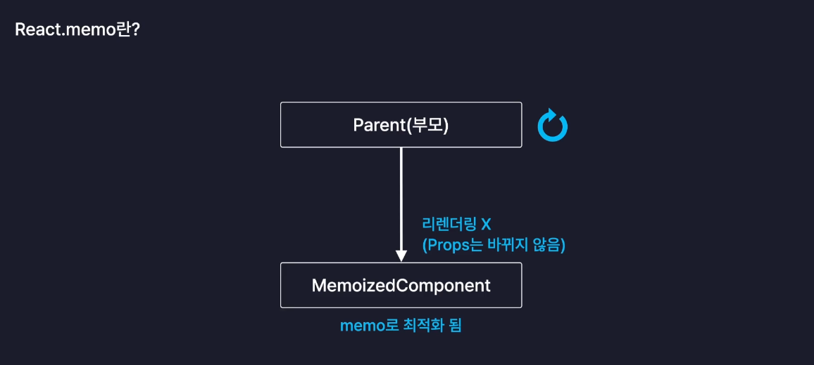

# 10_Optimization

### Optimization

- 웹 서비스의 성능을 개선하는 모든 행위를 일컫음
- 아주 단순한 것부터 아주 어려운 방법까지 매우 다양함

일반적인 웹 서비스 최적화 방법

- 서버의 응답속도 개선
- 이미지, 폰트, 코드 파일 등의 정적 파일 로딩 개선
- 불필요한 네트워크 요청 줄임

React App 내부의 최적화 방법

- 컴포넌트 내부의 불 필요한 연산 방지
- 컴포넌트 내부의 불 필요한 함수 재생성 방지
- 컴포넌트의 불 필요한 리렌더링 방지

### useMemo

- 메모이제이션 기법을 기반으로 불 필요한 연산을 최적화 하는 리액트 훅
    - 메모이제이션 : 최초로 한 번 계산했을 때의 결과값을 메모리 어딘가에 보관하고, 다음에 다시 이 연산이 필요해지면 저장되어 있던 해당 결과값을 바로 돌려주는 것
    - 똑같은 연산을 수행하지 않음

### 예시 코드

```jsx
import './List.css'
import TodoItem from './TodoItem'
import { useState } from 'react'

const List = ({ todos, onUpdate, onDelete }) => {
  const [search, setsearch] = useState("")
  
  const onChangeSearch = (e) => {
    setsearch(e.target.value)
  }

  const getFilteredDate = () => {
    if(search === "") {
      return todos
    }
    return todos.filter((todo) =>
      todo.content
        .toLowerCase()
        .includes(search.toLowerCase())
    )
  }

  const filteredTodos = getFilteredDate()

  const getAnalyzedData = () => {
    const totalCount = todos.length
    const doneCount = todos.filter((todo)=>todo.isDone).length
    const notDoneCount = totalCount - doneCount

    return {
      totalCount,
      doneCount,
      notDoneCount
    }
  }
  
  const {totalCount, doneCount, notDoneCount} = getAnalyzedData()

  return (
    <div className="List">
      <h4>Todo List🎐</h4>
      <div>
        <div>할일! : {totalCount}개</div>
        <div>완료^_^ : {doneCount}개</div>
        <div>해야 하는 것.. : {notDoneCount}개</div>
      </div>
      <input
        value={search}
        onChange={onChangeSearch}
        placeholder="검색어를 입력하세요 ^_^ !"
      />
      <div className='todos_wrapper'>
        {filteredTodos.map((todo) => {
          return (
          <TodoItem
            key={todo.id}
            {...todo}
            onUpdate={onUpdate}
            onDelete={onDelete}
            />
          )
        })}
      </div>
    </div>
  )
  }
  
  export default List
```

- todo app 업데이트 : 완료한 투두 및 전체 투두의 수 체크!
- 그러나 해당 기능은 filter라는 메서드를 사용하기 때문에 todo의 개수가 증가하면 그만큼 시간이 걸린다
    - filter 메서드는 배열 전체를 다 순회하기 때문에
    - 그래서 `getAnalyzedData` 함수가 불필요하게 호출되는 것을 막아야 하는데, 위 코드에서는 컴포넌트 내에서 바로 호출되고 있음 → List 컴포넌트가 리렌더링 될 때마다 호출
- 그래서 `getAnalyzedData` 해당 연산 자체를 메모이제이션 할 수 있는 방법이 필요~!
    - useMemo 라는 훅 사용하기!
    
    ```jsx
      const {totalCount, doneCount, notDoneCount} = useMemo(()=>{
      
        const totalCount = todos.length
        const doneCount = todos.filter((todo)=>todo.isDone).length
        const notDoneCount = totalCount - doneCount
    
        return {
          totalCount,
          doneCount,
          notDoneCount
        }
      }, [todos])
      // 두 번째 인수 -> 의존성 배열 : deps
      // useEffect와 같이 [] 해당 배열에 포함된 값이 변했을 때, 첫 번째의 콜백함수 다시 실행
    ```
    

### 내장 메서드 memo

- React.memo
    - 컴포넌트를 인수로 받아, 최적화된 컴포넌트로 만들어 변환
    - 부모 컴포넌트가 리렌더링 되어도, 자신이 만든 props가 바뀌지 않으면 리렌더링 발생하지 않도록 메모이제이션 됨
    
    
    

```jsx
import './Header.css'
import {memo} from 'react'

const Header = () => {
  return (
    <div className="Header">
      <h3>오늘은 💿</h3>
      <h1>{new Date().toDateString()}</h1>
    </div>
  )
}

const memoizedHeader = memo(Header)

export default memoizedHeader
```

1.  `import {memo} from 'react'` 
2. `const memoizedHeader = memo(Header)` 
3. `export default memoizedHeader`

- memo 메서드는 props가 바뀌었을 때만 컴포넌트를 리렌더링 하도록 최적화하기 때문에 리렌더링이 발생할 때마다, 현재 props와 과거 props를 비교 → 값을 비교해서 리렌더링 할 것인가 정함
    - memo 메서드는 위 과정에서 비교 시, 얕은 비교를 하기 때문에 객체 타입의 값은 무조건 다른 값이라고 판단을 함
    - 즉 함수같은 객체 타입은 매번 전달이 될 때마다 다른 주소 값을 가지게 되기 때문에 memo 메서드는 props가 바뀌었다고 판단
    - 즉 memo를 적용하더라도, 객체 타입의 값이 props로 전달되면 리렌더링이 될 수 밖에 없음 → 최적화 X
        - 이런 상황에서 두 가지 방법 사용 가능
            1. App 컴포넌트에서 해당 함수들 자체를 메모이제이션 하기
            2. memo 함수 안에 콜백함수를 두 번째 인수로 전달하여 최적화 기능을 커스터마이징 하기
                1. 이렇게 되면 해당 memo 메서드는 부모 컴포넌트가 리렌더링 될 때마다 반환값에 따라 props가 바뀌었는지, 안 바뀌었는지 판단
            
            ```jsx
            // memo -> 고차 컴포넌트, Higher Order Component (HOC)
            export default memo(TodoItem, (prevProps, nextProps)=>{
              // 반환값에 따라, props가 바뀌었는지 안 바뀌었는지 판단
              // T -> Props 바뀌지 않음 -> 리렌더링 X
              // F -> Props 바뀜 -> 리렌더링 O
            
              if(prevProps.id !== nextProps.id) return false
              if(prevProps.isDone !== nextProps.isDone) return false
              if(prevProps.content !== nextProps.content) return false
              if(prevProps.date !== nextProps.date) return false
            
              return true
            })
            ```
            

### useCallback

- 불 필요한 함수 재생성 방지하기

```jsx
import './App.css'
import Header from './components/Header'
import Editor from './components/Editor'
import List from './components/List'
import { useState, useRef, useReducer, useCallback } from 'react'

const mockData = [
  {
    id: 0,
    isDone: false,
    content: "react 공부하기",
    date: new Date().getTime(),
  },
  {
    id: 1,
    isDone: false,
    content: "FE study 공부하기",
    date: new Date().getTime(),
  },
  {
    id: 2,
    isDone: false,
    content: "면접 대비 !!",
    date: new Date().getTime(),
  }
]

function reducer(state, action) {
  switch(action.type) {
    case 'CREATE':
      return [action.data, ...state]
    case 'UPDATE':
      return state.map((item)=>
        item.id === action.targetId
          ? {...item, isDone: !item.isDone}
          :item
      )
    case 'DELETE':
      return state.filter((item) => item.id !== action.targetId)
    default:
      return state
  }
}

function App() {

  const [todos, dispatch] = useReducer(reducer, mockData)
  const idRef = useRef(3)

  // 마운트 될 때만 해당 함수 생성
  const onCreate = useCallback((content) => {
    dispatch({
      type: "CREATE",
      data: {
        id: idRef.current++,
        isDone: false,
        content: content,
        date: new Date().getTime()
      }
    })
  }, [])

  const onDelete = useCallback((targetId) => {
    dispatch({
      type: "DELETE",
      targetId: targetId,
    })
  }, [])

  const onUpdate = useCallback((targetId) => {
    dispatch({
      type: "UPDATE",
      targetId: targetId
    })
  }, [])

  return (
    <div className='App'>
      <Header />
      <Editor onCreate={onCreate} />
      <List todos={todos} onUpdate={onUpdate} onDelete={onDelete} />
    </div>
  )
}

export default App

```

- 최적화는 `1. 기능 구현` 먼저, `2. 최적화` 순으로 진행하기
- 꼭 최적화가 필요할 것 같은 연산이나, 컴포넌트에 적용하기