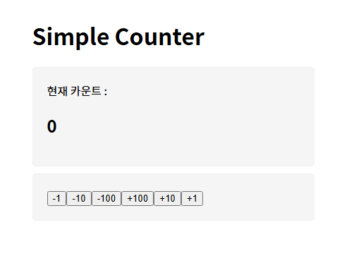

# PJT1_카운터 앱 실습



```jsx
// App.jsx

import './App.css'
import Viewer from './components/Viewer'
import Controller from './components/Controller'
import { useState } from 'react'

// 섹션 태그로 묶는 이유 - css 스타일링을 적용할 때 컴포넌트들마다 적용하기 위함
// App에서 State를 설정해야 하는 이유 !
// -> viewer 와 controller 컴포넌트는 부모 자식 관계가 아니기 때문에 그 어떤 값도 전달할 수 없음

function App() {
  const [count, setCount] = useState(0)

  const onClickButton = (value) => {
    setCount(count + value)
  }

  return (
    <div className='App'>
      <h1>Simple Counter</h1>
      <section>
        <Viewer count={count} />
      </section>
      <section>
        <Controller onClickButton={onClickButton} />
      </section>
    </div>
  )
}

export default App
```

```jsx
// Viewer.jsx

const Viewer = ({count}) => {
  return (
    <div>
      <div>현재 카운트 : </div>
      <h1>{count}</h1>
    </div>
  )
}

export default Viewer
```

```jsx
// Controller.jsx

const Controller = ({onClickButton}) => {
  return (
    <div>
      <button
      onClick={() => {
        onClickButton(-1)
      }}>-1</button>
      <button onClick={() => {
        onClickButton(-10)
      }}>-10</button>
      <button onClick={() => {
        onClickButton(-100)
      }}>-100</button>
      <button onClick={() => {
        onClickButton(100)
      }}>+100</button>
      <button onClick={() => {
        onClickButton(10)
      }}>+10</button>
      <button onClick={() => {
        onClickButton(1)
      }}>+1</button>
    </div>
  )
}

export default Controller
```


