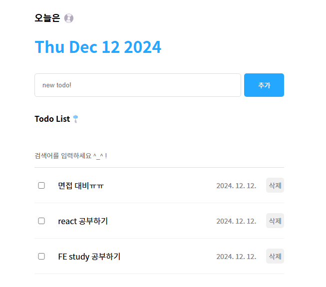

# PJT2_투두리스트 실습



```jsx
// App.jsx

import './App.css'
import Header from './components/Header'
import Editor from './components/Editor'
import List from './components/List'
import { useState, useRef } from 'react'

const mockData = [
  {
    id: 0,
    isDone: false,
    content: "react 공부하기",
    date: new Date().getTime(),
  },
  {
    id: 1,
    isDone: false,
    content: "FE study 공부하기",
    date: new Date().getTime(),
  },
  {
    id: 2,
    isDone: false,
    content: "면접 대비 !!",
    date: new Date().getTime(),
  }
]

function App() {

  const [todos, setTodos] = useState(mockData)
  const idRef = useRef(3)

  const onCreate = (content) => {
    const newTodo = {
      id: idRef.current++,
      isDone: false,
      content: content,
      date: new Date().getTime()
    }
    setTodos([newTodo, ...todos])
  }

  const onUpdate = (targetId) => {
    // todos State의 값들 중에
    // targetId와 일치하는 id를 갖는 투두 아이템의 isDone 변경

    // 인수 : todos 배열에서 targetId와 일치하는 id를 갖는 요소의 데이터만 딱 바꾼 새로운 배열
    setTodos(todos.map((todo)=>{
      if(todo.id === targetId){
        return {
          ...todo,
          isDone: !todo.isDone
        }
      }
      return todo
    }))
  }

  const onDelete = (targetId) => {
    // 인수 : todos 배열에서 targetId와 일치하는 id를 갖는 요소만 삭제한 새로운 배열
    setTodos(todos.filter((todo)=> todo.id !== targetId))
  }
  return (
    <div className='App'>
      <Header />
      <Editor onCreate={onCreate} />
      <List todos={todos} onUpdate={onUpdate} onDelete={onDelete} />
    </div>
  )
}

export default App

```

```css
/* App.css */

.App {
  width: 500px;
  margin: 0 auto;
  display: flex;
  flex-direction: column;
  gap: 10px;
}
```

### 1. **`App.js`**

```jsx
import './App.css'
import Header from './components/Header'
import Editor from './components/Editor'
import List from './components/List'
import { useState, useRef } from 'react'
```

- **의존성**:
    - `App.css`: 스타일링을 위한 CSS 파일.
    - `Header`, `Editor`, `List`: 각각의 컴포넌트를 import.
    - `useState`, `useRef`: React의 훅으로 상태와 참조를 관리.

```jsx
const mockData = [
  { id: 0, isDone: false, content: "react 공부하기", date: new Date().getTime() },
  { id: 1, isDone: false, content: "FE study 공부하기", date: new Date().getTime() },
  { id: 2, isDone: false, content: "면접 대비 !!", date: new Date().getTime() },
]
```

- **`mockData`**:
    - 초기 투두 데이터 배열.
    - 각 객체는 `id`, `isDone`(완료 여부), `content`(내용), `date`(생성 시간)를 가짐.
    - **용도**: 애플리케이션 실행 시 기본값으로 사용.

```jsx
function App() {
  const [todos, setTodos] = useState(mockData)
  const idRef = useRef(3)
```

- **`todos`**:
    - **상태**: 현재 관리 중인 투두 리스트를 저장.
    - 초기값은 `mockData`이며, 이후 추가/수정/삭제에 따라 업데이트.
- **`setTodos`**:
    - `todos` 상태를 업데이트하는 함수.
- **`idRef`**:
    - **참조 값**: 새로 추가될 항목의 고유 ID를 생성하기 위해 사용.
    - 초기값은 `3`이며, 새로운 항목 추가 시 자동으로 증가.

```jsx
const onCreate = (content) => {
  const newTodo = {
    id: idRef.current++,
    isDone: false,
    content: content,
    date: new Date().getTime()
  }
  setTodos([newTodo, ...todos])
}
```

- **`onCreate`**:
    - 새로운 투두를 생성하는 함수.
    - **매개변수**: `content`(사용자가 입력한 내용).
    - 새 객체를 생성해 `todos` 상태의 맨 앞에 추가.

```jsx
const onUpdate = (targetId) => {
  setTodos(todos.map((todo) => {
    if (todo.id === targetId) {
      return { ...todo, isDone: !todo.isDone }
    }
    return todo
  }))
}
```

- **`onUpdate`**:
    - 특정 `id`를 가진 투두의 `isDone` 값을 반전시킴.
    - **매개변수**: `targetId`(업데이트할 항목의 ID).
    - **동작**:
        1. `todos`를 순회하며, `id`가 일치하는 항목을 찾음.
        2. 해당 항목의 `isDone` 값을 반전(`true ↔ false`).
        3. 나머지 항목은 그대로 유지.

```jsx
const onDelete = (targetId) => {
  setTodos(todos.filter((todo) => todo.id !== targetId))
}
```

- **`onDelete`**:
    - 특정 `id`를 가진 투두를 삭제.
    - **매개변수**: `targetId`(삭제할 항목의 ID).
    - **동작**: `todos` 배열에서 `targetId`와 일치하지 않는 항목만 유지.

```jsx
return (
  <div className='App'>
    <Header />
    <Editor onCreate={onCreate} />
    <List todos={todos} onUpdate={onUpdate} onDelete={onDelete} />
  </div>
)
```

- **렌더링 구조**:
    - **`Header`**: 날짜와 제목 표시.
    - **`Editor`**: 새로운 투두 추가.
    - **`List`**: 현재 투두 목록 표시.
    - 각 컴포넌트에 필요한 데이터와 함수를 `props`로 전달.
    

---

---

```jsx
// Header.jsx

import './Header.css'

const Header = () => {
  return (
    <div className="Header">
      <h3>오늘은 💿</h3>
      <h1>{new Date().toDateString()}</h1>
    </div>
  )
}

export default Header
```

```css
/* Header.css */

.Header > h1 {
color: rgb(35, 167, 255);
}
```

### 2. **`Header.js`**

```jsx
import './Header.css'

const Header = () => {
  return (
    <div className="Header">
      <h3>오늘은 💿</h3>
      <h1>{new Date().toDateString()}</h1>
    </div>
  )
}

export default Header
```

- **역할**:
    - 현재 날짜를 **`new Date().toDateString()`*로 표시.
    - *`Header.css`*를 통해 스타일 지정.
- **`return`**:
    - `<h3>`: 제목 텍스트.
    - `<h1>`: 현재 날짜 표시.
    

---

---

```jsx
// Editor.jsx

import './Editor.css'
import { useState, useRef } from 'react'

const Editor = ({ onCreate }) => {
  const [content, setContent] = useState("")
  const contentRef = useRef()

  const onChangeContent = (e) => {
    setContent(e.target.value)
  }

  const onKeydown = (e) => {
    if(e.keyCode === 13) {
      onSubmit()
    }
  }

  const onSubmit = () => {
    if (content === '') {
      contentRef.current.focus()
      return
    }
    onCreate(content)
    setContent("")
  }
  return (
    <div className="Editor">
      <input
      ref={contentRef}
      onKeyDown={onKeydown}
      value={content}
      onChange={onChangeContent}
      placeholder="new todo!" />
      <button onClick={onSubmit}>추가</button>
    </div>
  )
}

export default Editor
```

```css
/* Editor.css */

.Editor {
  display: flex;
  gap: 6px;
}

.Editor input {
  flex: 1;
  padding: 15px;
  border: 1px solid rgb(220, 220, 220);
  border-radius: 5px;
}

.Editor button {
  cursor: pointer;
  width: 80px;
  border: none;
  background-color: rgb(35, 167, 255);
  color: white;
  border-radius: 5px;
}
```

### 3. **`Editor.js`**

```jsx
import './Editor.css'
import { useState, useRef } from 'react'

const Editor = ({ onCreate }) => {
  const [content, setContent] = useState("")
  const contentRef = useRef()
```

- **`content`**:
    - 사용자가 입력한 텍스트를 저장하는 상태.
    - 초기값은 빈 문자열 `""`.
- **`contentRef`**:
    - 입력 필드에 포커스를 설정하기 위해 사용.

```jsx
const onChangeContent = (e) => {
  setContent(e.target.value)
}
```

- **`onChangeContent`**:
    - 입력 필드 값이 변경될 때 호출.
    - **매개변수**: `e`(이벤트 객체).
    - 입력값(`e.target.value`)으로 `content` 상태를 업데이트.

```jsx
const onSubmit = () => {
  if (content === '') {
    contentRef.current.focus()
    return
  }
  onCreate(content)
  setContent("")
}
```

- **`onSubmit`**:
    - 입력값이 비어있을 경우, 입력창에 포커스를 줌.
    - 비어있지 않으면 부모의 `onCreate` 호출 및 상태 초기화.
    

---

---

```jsx
// List.jsx

import './List.css'
import TodoItem from './TodoItem'
import { useState } from 'react'

const List = ({ todos, onUpdate, onDelete }) => {
  const [search, setsearch] = useState("")
  
  const onChangeSearch = (e) => {
    setsearch(e.target.value)
  }

  const getFilteredDate = () => {
    if(search === "") {
      return todos
    }
    return todos.filter((todo) => todo.content.toLowerCase().includes(search.toLowerCase()))
  }

  const filteredTodos = getFilteredDate()
  
  return (
    <div className="List">
      <h4>Todo List🎐</h4>
      <input
        value={search}
        onChange={onChangeSearch}
        placeholder="검색어를 입력하세요 ^_^ !"
      />
      <div className='todos_wrapper'>
        {filteredTodos.map((todo) => {
          return (
          <TodoItem
            key={todo.id}
            {...todo}
            onUpdate={onUpdate}
            onDelete={onDelete}
            />
          )
        })}
      </div>
    </div>
  )
  }
  
  export default List
```

```css
/* List.css */

.List { 
  display: flex;
  flex-direction: column;
  gap: 20px;
}

.List > input {
  width: 100%;
  border: none;
  border-bottom: 1px solid rgb(220, 220, 220);
  padding: 15px 0px;
}

.List > input:focus {
  outline: none;
  border-bottom: 1px solid rgb(35, 167, 255);
}

.List .todos_wrapper {
  display: flex;
  flex-direction: column;
  gap: 20px;
}
```

### 4. **`List.js`**

```jsx
import './List.css'
import TodoItem from './TodoItem'
import { useState } from 'react'

const List = ({ todos, onUpdate, onDelete }) => {
  const [search, setsearch] = useState("")
```

- **`search`**:
    - 검색창의 입력값을 저장하는 상태.

```jsx
const onChangeSearch = (e) => {
  setsearch(e.target.value)
}
```

- **`onChangeSearch`**:
    - 검색 입력값이 변경될 때 호출.
    - 입력값(`e.target.value`)으로 `search` 상태를 업데이트.

```jsx
const getFilteredDate = () => {
  if (search === "") return todos
  return todos.filter((todo) =>
    todo.content.toLowerCase().includes(search.toLowerCase())
  )
}
```

- **`getFilteredDate`**:
    - 검색어가 없으면 전체 `todos` 반환.
    - 검색어가 있으면 해당 단어가 포함된 항목만 필터링.
    

---

---

```jsx
// TodoItem.jsx

import './TodoItem.css'

const TodoItem  = ({ id, isDone, content, date, onUpdate, onDelete }) => {

  const onChangeCheckbox = () => {
    onUpdate(id)
  }

  const onClickDelete = () => {
    onDelete(id)
  }

  return (
    <div className="TodoItem">
      <input onChange={onChangeCheckbox} readOnly checked={isDone} type="checkbox" />
      <div className="content">{content}</div>
      <div className="date">{new Date(date).toLocaleDateString()}</div>
      <button onClick={onClickDelete}>삭제</button>
    </div>
  )
}

export default TodoItem
```

```css
/* TodoItem.css */

.TodoItem {
  display: flex;
  align-items: center;
  gap: 20px;
  padding-bottom: 20px;
  border-bottom: 1px solid rgb(240, 240, 240);
}

.TodoItem input {
  width: 20px;
}

.TodoItem .content {
  flex: 1;
}

.TodoItem .date {
  font-size: 14px;
  color: gray;
}

.TodoItem button {
  cursor: pointer;
  color: gray;
  font-size: 14px;
  border: none;
  border-radius:5px;
  padding: 5px;
}
```

### 5. **`TodoItem.js`**

```jsx
const TodoItem = ({ id, isDone, content, date, onUpdate, onDelete }) => {

  const onChangeCheckbox = () => {
    onUpdate(id)
  }

  const onClickDelete = () => {
    onDelete(id)
  }
```

- **`onChangeCheckbox`**:
    - 완료 여부를 변경.
    - 부모의 `onUpdate`를 호출.
- **`onClickDelete`**:
    - 해당 항목을 삭제.
    - 부모의 `onDelete`를 호출.

```jsx
return (
  <div className="TodoItem">
    <input onChange={onChangeCheckbox} readOnly checked={isDone} type="checkbox" />
    <div className="content">{content}</div>
    <div className="date">{new Date(date).toLocaleDateString()}</div>
    <button onClick={onClickDelete}>삭제</button>
  </div>
)
```

- **HTML 구조**:
    - **Checkbox**: 완료 여부를 표시.
    - **Content**: 투두 내용 표시.
    - **Date**: 생성 날짜 표시.
    - **삭제 버튼**: 항목 삭제.