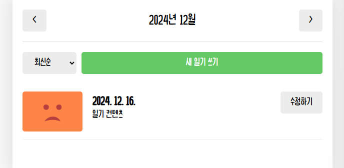

# 실전 프로젝트. 감정 일기장 만들기

**페이지 라우팅**
- [React의 SPA 방식](#react의-spa-방식)
- [페이지 라우팅](#페이지-라우팅-1)
- [페이지 이동](#페이지-이동)
- [동적 경로](#동적-경로)

**UI 구현**
- [폰트, 이미지, 레이아웃 설정하기](#폰트-이미지-레이아웃-설정하기)
- [헤더에 현재 날짜 출력하기](#헤더에-현재-날짜-출력하기)


**기능 구현**
- [최신 순/오래된 순 정렬](#최신-순오래된-순-정렬)


## React의 SPA 방식

### 페이지 라우팅
- **정의**: 사용자가 특정 경로(URL)에 접속했을 때 해당 경로에 맞는 페이지를 렌더링하는 과정.

---

### Multi Page Application (MPA)

**특징**
- 서버가 여러 개의 HTML 페이지를 미리 만들어 제공.
- 경로마다 개별적인 페이지를 서버에서 렌더링하여 제공.
- 서버 사이드 렌더링(Server-Side Rendering, SSR) 방식 사용.

**장점**
- 초기 렌더링 속도가 빠르고 SEO(Search Engine Optimization)에 유리함.

**단점**
- **페이지 이동의 비효율성**:
  - 매번 서버로 요청을 보내 전체 페이지를 다시 불러와야 함.
  - 네트워크 비용이 크고 사용자 경험(UX)이 매끄럽지 못함.
- **서버 부하**:
  - 다수의 사용자 접속 시 서버에 큰 부하를 줌.

---
### Single Page Application (SPA)

**등장 배경**
- MPA 방식의 비효율성을 해결하기 위해 등장.
- 초기 요청 이후 추가적인 페이지 이동이 서버 요청 없이 이루어짐.

**장점**
- **매끄러운 페이지 이동**:
  - 화면 전체를 새로 고침하지 않고 필요한 부분만 변경.
- **효율성**:
  - 네트워크 비용 절감 및 빠른 반응 속도.
- **서버 부하 감소**:
  - 서버로의 요청을 최소화.

---

### React의 SPA 방식

**1. Bundling**
- React에서 작성한 모든 컴포넌트와 자바스크립트 파일은 빌드 도구(Vite, Webpack 등)에 의해 하나로 묶임.
- 번들링된 자바스크립트 파일이 브라우저로 전달되어 React 앱을 구동.

**2. 클라이언트 사이드 렌더링 (Client-Side Rendering, CSR)**
- 초기 요청 시 서버는 기본 구조인 `index.html`만 전달.
- 이후 React 앱이 번들링된 자바스크립트 파일을 다운로드받아 브라우저에서 실행.
- React 앱이 브라우저 내에서 필요한 컴포넌트를 렌더링하여 페이지를 표시.

**3. 페이지 이동**
- 링크를 클릭하면 서버에 요청을 보내는 대신 React 앱 내부에서 처리.
- 새로운 경로에 필요한 컴포넌트만 렌더링하여 화면을 교체.
- 브라우저 전체를 새로고침하지 않고 필요한 부분만 업데이트하여 성능 향상.

<br>

## 페이지 라우팅

### React Router

React에서 페이지 라우팅을 구현하기 위해 사용하는 라이브러리

```bash
npm i react-router-dom
```

---

### `BrowserRouter` 설정

```jsx
  <BrowserRouter>
    <App />
  </BrowserRouter>
```
- `<App />` 컴포넌트를 `<BrowserRouter>`로 감싸면, 리액트 앱의 모든 컴포넌트가 브라우저의 주소를 사용할 수 있게 됨
- 브라우저 주소(URL)의 변화를 감지하고 이에 따라 컴포넌트를 렌더링

---
### `Routes`/`Route`

**Routes 컴포넌트**
  - `<Routes>` 내부에는 `<Route>` 컴포넌트만 포함 가능
  - URL 경로에 따라 해당 컴포넌트를 렌더링
  - `<Routes>` 외부에 작성된 컴포넌트는 모든 페이지에서 공통으로 렌더링

**Route 컴포넌트**
  - `path`: 경로 설정
    - `path="*"`는 정의되지 않은 모든 경로를 처리
    - 사용자가 잘못된 URL로 접근 시 Not Found 페이지를 렌더링
  - `element`: 해당 경로에서 렌더링할 컴포넌트 지정

--- 
### 실습

1. `"/"`: 모든 일기를 조회하는 home 페이지
2. `"/new"`: 새로운 일기를 작성하는 new 페이지
3. `"/diary"`: 일기를 상세히 조회하는 diary 페이지

```jsx
import './App.css'
import { Routes, Route } from "react-router-dom"
import Home from './pages/Home'
import Diary from './pages/Diary'
import New from './pages/New'


function App() {

  return (
    <Routes>
      <Route path="/" element={<Home />} />
      <Route path="/new" element={<New />} />
      <Route path="/diary" element={<Diary />} />
      <Route path="*" element={<Notfound />} /> 
    </Routes>
  )
}
export default App
```

<br>

## 페이지 이동

### `<Link>` 태그

**특징**
- React Router에서 제공하는 컴포넌트.
- 새로고침 없이 **SPA 방식으로 페이지 이동**을 처리.

**실습**

```jsx
<Link to="/">Home</Link>
<Link to="/new">New</Link>
<Link to="/diary">Diary</Link>
```

---

### `<a>` 태그

**특징**
- HTML의 기본 태그로, 페이지를 새로고침하면서 이동
- 전체 페이지를 다시 로드하므로 React SPA의 장점을 잃게 됨
  - SPA의 빠른 이동 기능을 사용하지 못하며 성능이 저하될 수 있음
  - 전체 페이지가 새로 로드되므로 사용자 경험(UX)이 떨어짐

**사용방법**
```jsx
<a href="/경로">링크 텍스트</a>
```
---
### `useNavigate` 함수

**특징**
- React Router에서 제공하는 훅
- 코드에서 동적으로 페이지를 이동할 때 사용
  - 버튼 클릭, 조건 충족 등 특정 이벤트에 따라 페이지를 전환할 때 유용.

**사용 방법**
```jsx
import { useNavigate } from "react-router-dom";

const navigate = useNavigate();
navigate("/경로");
```

**실습**
```jsx
const nav = useNavigate();

const onClickButton = () => {
  nav("/new");
};

<button onClick={onClickButton}>New 페이지로 이동</button>
```

<br>

## 동적 경로

### 동적 경로(Dynamic Segments)

동적인 데이터를 포함하고 있는 경로<br>
고정된 URL이 아닌, 상품 ID나 검색어 등 변화하는 데이터를 URL에 포함


**URL Parameter**
- 특징
  - `/`뒤에 아이템의 id를 명시하는 방식
  - 아이템의 id등의 변경되지 않는 값을 주소로 명시하기 위해 사용
- 예시
  - `~/product/1`
  - `~/product/2`

**Query String**
- 특징
  - `?` 뒤에 변수명과 값을 명시하는 방식
  - 검색어 등의 자주 변경되는 값을 주소로 명시하기 위해 사용됨
- 예시
  - `~/search?q=검색어`

---
### URL Parameter 방식


**`useParams`**

React Router에서 제공하는 훅으로, **URL Parameter**의 데이터를 가져올 수 있음.


**실습**

- 라우트 설정
  - `:id`는 동적으로 전달받을 데이터를 의미.
```jsx
<Route path="/diary/:id" element={<Diary />} />
```

- 컴포넌트에서 데이터 사용

```jsx
import { useParams } from "react-router-dom"

const Diary = () => {
  const params = useParams()
  return (
    <div>
      {params.id}번 일기입니다.
    </div>
  )
}

export default Diary
```
---

### Query String 방식

**`useSearchParams`**

React Router에서 제공하는 훅으로, Query String의 데이터를 가져오거나 설정할 수 있음

**실습**

- 컴포넌트에서 데이터 사용
  - 사용자가 `~/search?q=검색어`로 접속하면, 화면에 `검색어: 검색어`가 출력됨.
  - 버튼을 클릭하면 Query String이 `?q=새 검색어`로 변경됨.
```jsx
import { useSearchParams } from "react-router-dom"

const Home = () => {
  const [params, setParams] = useSearchParams()

  return (
    <div>
      검색어: {params.get("q")}
      <button onClick={() => setParams({ q: "새 검색어" })}>
        검색어 변경
      </button>
    </div>
  )
}

export default Home
```

<br>

## 폰트, 이미지, 레이아웃 설정하기

### 폰트 설정

폰트 파일은 `public` 폴더 아래에 위치
```css
/* index.css */

@font-face {
  font-family: "NanumPenScript";
  src: url("/NanumPenScript-Regular.ttf");
}

body * {
  font-family: "NanumPenScript";
}
```

---
### 이미지 설정

이미지 파일은 `src/assets` 폴더 아래에 위치

```jsx
// App.jsx
import { getEmotionImage } from "./util/get-emotion-image"
 
 function App() {
  return (
    <div>
      
      
      
      
      
    </div>
  )
 }
```

```js
// src/util/get-emotion-image.js

import emotion1 from './../assets/emotion1.png'
import emotion2 from './../assets/emotion2.png'
import emotion3 from './../assets/emotion3.png'
import emotion4 from './../assets/emotion4.png'
import emotion5 from './../assets/emotion5.png'

export function getEmotionImage(emotionId) {
  switch (emotionId) {
    case 1: return emotion1
    case 2: return emotion2
    case 3: return emotion3
    case 4: return emotion4
    case 5: return emotion5
    default: return null
  }
}
```

---

### 폰트 파일은 `public`폴더에 넣고, 이미지 파일은 `src/assets`폴더에 넣는 이유는?

**폰트 파일**
- 폰트 파일은 일반적으로 URL로 직접 참조되며, 경로가 변경되지 않아야 안정적으로 작동.
- `public` 폴더에 넣으면 빌드 시 파일 경로가 변경되지 않고 원본 경로(`/파일명`)로 접근 가능.

**이미지 파일**
- `src/assets`에 있는 파일은 빌드 도구(Vite/Webpack 등)에 의해 번들링되어 최적화됨.
- React 컴포넌트에서 import를 통해 사용 가능.
- 번들링 과정에서 이미지 파일은 **dataURI 포맷**으로 변환되거나 최적화된 URL로 변경됨.

> **dataURI 포맷**<br>
  이미지가 Base64 문자열로 변환되어 포함.<br>
  자동으로 브라우저 메모리에 캐싱됨 -> 새로고침 시 재요청하지 않도록 최적화되어 성능이 향상

<br>

**확인해 보는 법 - 프로젝트를 배포 모드로 실행**

```bash
npm run build
```
- src 폴더의 코드는 압축 및 번들링되어 dist 폴더에 저장.
```bash
npm run preview
```
- 로컬 서버를 실행해 빌드된 결과물을 미리 확인.

---

### 레이아웃 설정

```css
html,
body {
  margin: 0px;
  width: 100%;
  background-color: rgb(246, 246, 246);
}

#root {
  background-color: white;
  max-width: 600px;
  width: 100%;
  margin: 0 auto;
  min-height: 100vh; 
  height: 100%;
  box-shadow: rgba(100, 100, 100, 0.2) 0px 0px 29px 0px;
}
```
**1. `width: 100%`와 `max-width: 600px`:**
- `#root` 요소는 부모 요소(브라우저 화면 너비)를 기준으로 너비를 `100%`로 설정.
- 하지만 너비가 `600px` 이상이 되지 않도록 제한.

**2. `min-height: 100vh`와 `height: 100%`:**
- 요소의 높이는 부모 요소의 높이(`100%`)를 따름.
- 하지만 최소 높이는 뷰포트 높이(`100vh`)로 보장하여 콘텐츠가 부족해도 화면 전체를 채움.

<br>

## 헤더에 현재 날짜 출력하기



```jsx
<Header 
  title={`${pivotDate.getFullYear()}년 ${pivotDate.getMonth() + 1}월`}
  ...
/>
```
- **`getFullYear()`**
  - `pivotDate`의 연도를 가져온다.
- **`getMonth()`**
  - `pivotDate`의 월을 가져온다.
  - JavaScript에서 Month는 0부터 시작하므로 +1을 해준다.

- **템플릿 리터럴**
  - 문자열 내에서 변수를 삽입할 수 있는 ES6 문법
  - `${}`를 사용해 변수 값을 삽입한다.

<br>

## 최신 순/오래된 순 정렬

### `toSorted()`

- `toSorted()` 메서드는 내부적으로 비교 함수를 사용해 요소를 정렬
- 비교 함수의 반환값에 따라 요소의 순서를 결정
  - **양수**: `b`가 `a`보다 앞에 위치
  - **0**: 두 요소의 순서를 유지
  - **음수**: `a`가 `b`보다 앞에 위치

**비교 함수의 기본 구조**
```js
(a, b) => {
  return a - b // a가 작으면 음수, 크면 양수
}
```

**예제**

참고 자료: [Array.prototype.toSorted()](https://developer.mozilla.org/ko/docs/Web/JavaScript/Reference/Global_Objects/Array/toSorted)

```js
const values = [1, 10, 21, 2];
const sortedValues = values.toSorted((a, b) => a - b);

console.log(sortedValues); // [1, 2, 10, 21]
```

- **정렬 과정** (비교를 통해 배열을 정렬)
  1. `21 - 1 = 20` → 1이 앞에 위치.
  2. `1 - 10 = -9` → 1이 앞에 위치.
  3. `10 - 2 = 8` → 2가 앞에 위치.

---

### `sort()` vs `toSorted()`

- `sort()`: 값 반환하지 않고 정렬만 하는 함수
- `toSorted()`: 원본 배열은 변경하지 않고 정렬된 새로운 배열을 반환

---

### `getSortedData()`

```jsx
  const [sortType, setSortType] = useState("latest")
  const onChangeSortType = (e) => {
    setSortType(e.target.value)
  }
  
  const getSortedData = () => {
    return data.toSorted((a, b) => {
      if (sortType === 'oldest') { // 오래된 순 정렬
        return Number(a.createdDate) - Number(b.createdDate)
      } else { // 최신 순 정렬
        return Number(b.createdDate) - Number(a.createdDate)
      }
    })
  }
```

**정렬 로직**
- `sortType === "oldest"`:
  - `a.createdDate`가 더 작으면 앞으로 정렬(오래된 순).
- `sortType === "latest"`:
  - `b.createdDate`가 더 작으면 앞으로 정렬(최신 순).


<br>

## 형변환

```jsx
  const getSortedData = () => {
    return data.toSorted((a, b) => {
      if (sortType === 'oldest') { // 오래된 순 정렬
        return Number(a.createdDate) - Number(b.createdDate)
      } else { // 최신 순 정렬
        return Number(b.createdDate) - Number(a.createdDate)
      }
    })
  }
```
