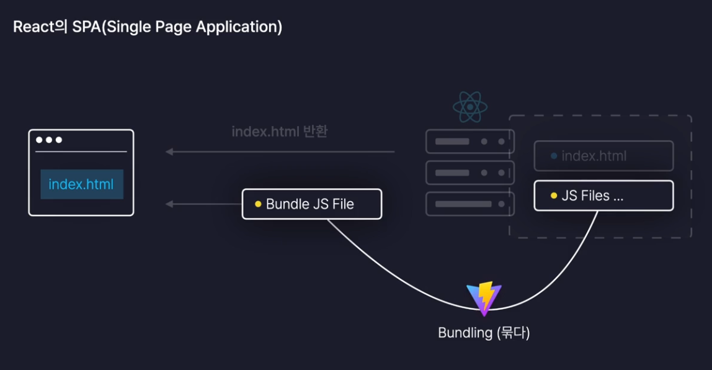

# PJT3_감성 일기장 실습

### 페이지 라우팅이란 ?

- 경로에 따라 알맞은 페이지를 렌더링 하는 과정

### MPA

- multi page application (MPA)
- 애초에 서버가 여러개의 페이지를 가지고 있음
- 많은 서비스가 사용하는 전통적인 방식
- 동작방식이 직관적
- MPA 방식에서 브라우저가 새로운 페이지를 요청했을 때, 서버 측에서 미리 완성해놓은 html 파일을 보내주면 브라우저가 그대로 렌더링하는 방식 → 서버 사이드 렌더링, SSR
- MPA ≠ SSR
- 서로 다른 페이지에 공통의 요소가 있더라도 페이지 이동 시 새로운 html 파일로 다 그리기 때문에 비효율 적임
- 리액트 앱은 MPA 방식을 따르지 않는다 → 페이지 이동을 빠르게 처리하기가 어렵기 때문

### SPA

- Single Page Application → 리액트가 사용하는 방식
- 페이지 이동이 매끄럽고 효율적
- 다수의 사용자가 접속해도 크게 상관 없음
- 항상 index.html을 반환하여 렌더링
- vite에 의해 하나의 번들로 묶여서 브라우저에 전달




---

### 라우팅 설정하기

```jsx
// main.jsx

import React from "react";
import ReactDOM from "react-dom/client";
import App from "./App.jsx";
import "./index.css";
import { BrowserRouter } from "react-router-dom"

ReactDOM.createRoot(document.getElementById("root")).render(
  <BrowserRouter>
    <App />
  </BrowserRouter>
);
```

```jsx
// App.jsx

import "./App.css";
import { Routes, Route } from "react-router-dom"
import Home from "./pages/Home";
import Diary from "./pages/Diary";
import New from "./pages/New";
import Notfound from "./pages/Notfound";

// 1. '/' -> 모든 일기를 조회하는 홈
// 2. '/new' -> 새로운 일기를 작성하는 페이지
// 3. '/diary' -> 일기 상세 페이지

function App() {
  return (
    <Routes>
      <Route path="/" element={<Home />} />
      <Route path="/new" element={<New />} />
      <Route path="/diary" element={<Diary />} />
			// * -> 와일드카드, 위 경로들과 일치하지 않았을 때 Notfound로 렌더링
      <Route path="*" element={<Notfound />} />
    </Routes>
  )
}

export default App;

```

- `BrowserRouter` 로 App 컴포넌트를 감싸면, 리액트의 모든 컴포넌트들이 현재 브라우저의 주소를 불러와서 쓸 수 있고 주소의 변화를 감지할 수 있다
    - 즉, 리액트의 모든 컴포넌트들이 페이지 라우팅과 관련된 모든 데이터를 공급 받아 사용할 수 있다
- `Routes` 컴포넌트 안에는 `Route` 컴포넌트만 들어갈 수 있다
- `Routes` 컴포넌트 밖에 배치되는 요소들은 페이지 라우팅과는 관련 없이 모든 페이지에 동일하게 렌더링 된다
    - 모든 페이지에 공통적으로 들어가는 요소가 아니라면, `Routes` 컴포넌트 외부에 배치하는 것은 X

### 라우팅 페이지 이동

```jsx
// App.jsx

import "./App.css";
import { Routes, Route, Link, useNavigate } from "react-router-dom"
import Home from "./pages/Home";
import Diary from "./pages/Diary";
import New from "./pages/New";
import Notfound from "./pages/Notfound";

// 1. '/' -> 모든 일기를 조회하는 홈
// 2. '/new' -> 새로운 일기를 작성하는 페이지
// 3. '/diary' -> 일기 상세 페이지

function App() {
  const nav = useNavigate()

  const onClickButton = () => {
    nav('/new')
  }

  return (
    <>
      <div>
        <Link to={"/"}>Home</Link>
        <Link to={"/new"}>New</Link>
        <Link to={"/diary"}>Diary</Link>
      </div>
      <button onClick={onClickButton}>New Page !</button>
      <Routes>
        <Route path="/" element={<Home />} />
        <Route path="/new" element={<New />} />
        <Route path="/diary" element={<Diary />} />
        <Route path="*" element={<Notfound />} />
      </Routes>
    </>
  )
}

export default App;

```

- `Link` 컴포넌트 사용
    - 내부 링크를 만들 경우 사용
    - 기존  html의 a 태그 사용 시, 새로고침 되며 이동
- `useNavigate` 사용
    - 함수를 이용해서 특정 이벤트가 발생했을 때 페이지 이동

### 페이지 라우팅 - 동적 경로 설정하기


1번 방법 - URL 파라미터 사용

```jsx
// App.jsx

<>
  <div>
    <Link to={"/"}>Home</Link>
    <Link to={"/new"}>New</Link>
    <Link to={"/diary"}>Diary</Link>
  </div>
  <button onClick={onClickButton}>New Page !</button>
  <Routes>
    <Route path="/" element={<Home />} />
    <Route path="/new" element={<New />} />
    <Route path="/diary/:id" element={<Diary />} />
    <Route path="*" element={<Notfound />} />
  </Routes>
</>
```

- `<Route path="/diary/:id" element={<Diary />} />`  → 동적  라우팅 설정하기 위해 작성

```jsx
// Diary.jsx

import { useParams } from "react-router-dom"

const Diary = () => {
  const params = useParams()

  return (
    <div>
      {params.id}번 일기
    </div>
  )
}

export default Diary
```

- `useParams` url 파라미터의 값을 가져오는 역할을 하는 커스텀 훅

2번 방법 - 쿼리 스트링 사용

- 별도로 Route 컴포넌트에 설정할 것도 없고, 쿼리 스트링을 사용하는 컴포넌트에 `useSearchParams` import 하기

```jsx
import { useSearchParams } from "react-router-dom"

const Diary = () => {
  const [params, setParams] = useSearchParams()
  // const params = useParams()

  return (
    <div>
      {params.id}번 일기
    </div>
  )
}

export default Diary
```

### 폰트 및 이미지 설정

- public 폴더에 이미지를 넣을 경우
    - `img`  태그로 불러오기 → ``
    - 그러나 해당 폴더에는 폰트만 넣는 것이 좋다
    - 이미지를 넣을 경우 vite에서 자동으로 제공하는 이미지 최적화가 진행되지 않는다
        - 이미지 메모리 캐싱 유무 → 일반 주소(public)로 불러온 이미지는 계속 다시 로드
- src > assets 폴더에 이미지를 넣을 경우
    - `import`로 불러오기 → `import emotion1 from './assets/emotion1.png'` / ``
    - 이미지 최적화! → 캐싱
    - 이미지가 아주 많을 경우엔 이야기가 달라짐 →public 폴더가 더 괜찮을 수 있다
    - 소수의 이미지일 경우에만  assets 폴더!
- 최적화 확인하는 방법
    - `npm run build`
    - `npm run preview`
    - 위 순서대로 진행
    

```jsx
// Apps.jsx

import "./App.css";
import { Routes, Route, Link, useNavigate } from "react-router-dom"
import Home from "./pages/Home";
import Diary from "./pages/Diary";
import New from "./pages/New";
import Notfound from "./pages/Notfound";

import { getEmotionImage } from "./util/get-emotion-image";

// 1. '/' -> 모든 일기를 조회하는 홈
// 2. '/new' -> 새로운 일기를 작성하는 페이지
// 3. '/diary' -> 일기 상세 페이지

function App() {
  const nav = useNavigate()

  const onClickButton = () => {
    nav('/new')
  }

  return (
    <>
      <div>
        
        
        
        
        
      </div>
      <div>
        <Link to={"/"}>Home</Link>
        <Link to={"/new"}>New</Link>
        <Link to={"/diary"}>Diary</Link>
      </div>
      <button onClick={onClickButton}>New Page !</button>
      <Routes>
        <Route path="/" element={<Home />} />
        <Route path="/new" element={<New />} />
        <Route path="/diary/:id" element={<Diary />} />
        <Route path="*" element={<Notfound />} />
      </Routes>
    </>
  )
}

export default App;
```

```jsx
// get-emotion-image.jsx

import "./App.css";
import { Routes, Route, Link, useNavigate } from "react-router-dom"
import Home from "./pages/Home";
import Diary from "./pages/Diary";
import New from "./pages/New";
import Notfound from "./pages/Notfound";

import { getEmotionImage } from "./util/get-emotion-image";

// 1. '/' -> 모든 일기를 조회하는 홈
// 2. '/new' -> 새로운 일기를 작성하는 페이지
// 3. '/diary' -> 일기 상세 페이지

function App() {
  const nav = useNavigate()

  const onClickButton = () => {
    nav('/new')
  }

  return (
    <>
      <div>
        
        
        
        
        
      </div>
      <div>
        <Link to={"/"}>Home</Link>
        <Link to={"/new"}>New</Link>
        <Link to={"/diary"}>Diary</Link>
      </div>
      <button onClick={onClickButton}>New Page !</button>
      <Routes>
        <Route path="/" element={<Home />} />
        <Route path="/new" element={<New />} />
        <Route path="/diary/:id" element={<Diary />} />
        <Route path="*" element={<Notfound />} />
      </Routes>
    </>
  )
}

export default App;
```

---

### 웹 스토리지 이용하기

- 리액트 앱 새로고침 → 전부 리셋
- 내용을 그대로 유지하고 싶다면 → 웹 브라우저 내장 DB 이용하기
    - 웹 브라우저에 기본적으로 내장되어 있는 데이터베이스로 별도의 프로그램 설치, 라이브러리 설치가 필요 없다
    - 세션 스토리지
        - 브라우저 탭 별로 데이터 보관
        - 탭이 종료되기 전까진 데이터 유지
        - 탭이 종료되면 데이터 삭제
    - 로컬 스토리지
        - 사이트 주소별로 데이터 보관
        - 사용자가 직접 삭제하기 전까진 데이터 보관
    - 자바스크립트 내장 함수 만으로 접근 가능
    - `값 저장 : localStorage.setItem(key, value)`
    - `값 꺼냄 : localStorage.getItem(key)`