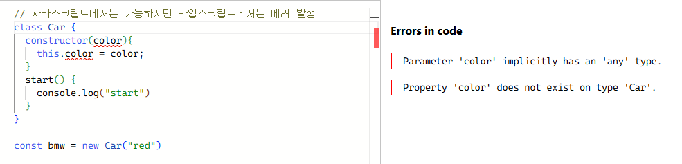
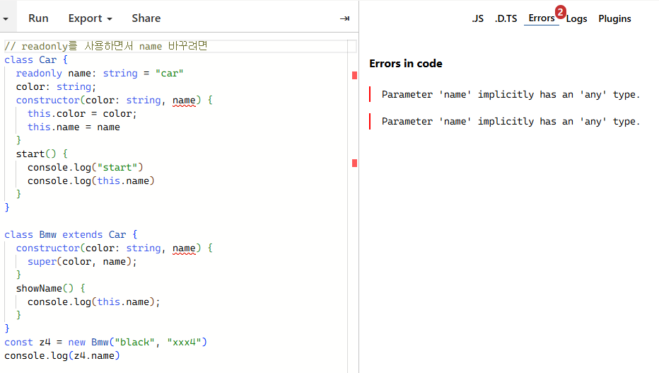

## [6] Class

### 1. 타입스크립트 클래스 선언

- 타입스크립트에서 클래스를 작성할 때에는 반드시 멤버 변수를 선언해야 하며 선언하지 않으면 타입 에러가 발생한다. 멤버 변수 대신에 public이나 readonly 키워드를 사용해도 된다.
  ```typescript
  class Car {
    // color: string;  // 멤버 변수 미리 선언하거나
    constructor(public color:string){ // public 또는 readonly 사용 
      this.color = color;
    }
    start() {
      console.log("start")
    }
  }
  const bmw = new Car("red")
  ```

</br>

### 2. 클래스 접근 제한자(Access modifier) 
* `public : 자식 클래스, 클래스 인스턴스에서 접근할 수 있다.`
  ```typescript
  // public
  class Car {
    name: string = "car"
    color: string;
    constructor(color: string) {
      this.color = color;
    }
    start() {
      console.log("start")
    }
  }

  class Bmw extends Car {
    constructor(color: string) {
      super(color); // super : 부모 클래스의 생성자/메서드 호출
    }
    showName() {
      console.log(this.name); // super는 부모 클래스의 생성자나 메서드를 호출하는 데 사용, 속성(필드)에 접근하려면 this를 사용하는 것이 일반적임
    }
  }

  const z4 = new Bmw("black")
  ```
</br>

* `private : 해당 클래스 내부에서만 접근 가능`
  ```typescript
  // private
  class Car {
    // private 설정하면 name은 Car에서만 사용 가능
    // private name: string = "car";
    #name: string = "car" // '#'으로도 표현 가능(private)
    color: string;
    constructor(color: string) {
      this.color = color;
    }
    start() {
      console.log("start")
      console.log(this.#name)
    }
  }
  ```
  - cf. #은 TypeScript의 ECMAScript Private 필드를 의미하며 일반 private보다 더 강력하다. private는 컴파일된 JavaScript에서 약간의 우회로 접근 가능하지만 #은 JavaScript에서도 완전히 접근을 차단합니다.

</br>

* `protected : 자식 클래스에서 접근 가능`
  ```typescript
  // protected
  class Car {
    protected name: string = "car"                       
    color: string;
    constructor(color: string) {
      this.color = color;
    }
    start() {
      console.log("start")
      console.log(this.name)
    }
  }

  class Bmw extends Car {
    constructor(color: string) {
      super(color);
    }
    showName() {
      console.log(this.name); 
    }
  }
  const z4 = new Bmw("black")
  // console.log(z4.name)  // error : Identifier expected.
  // public인 경우 클래스 인스턴스 접근 가능하므로 정상 작동
  // protected인 경우 자식 클래스 내부에서는 참조할 수 있지만 클래스 인스턴스로는 참조 할 수 없기 때문에 에러 발생
  ```

  ```typescript
  // name 값 수정정
  class Car {
    name: string = "car" 
    color: string;
    constructor(color: string) {
      this.color = color;
    }
    start() {
      console.log("start")
      console.log(this.name)
    }
  }

  class Bmw extends Car {
    constructor(color: string) {
      super(color);
    }
    showName() {
      console.log(this.name);
    }
  }
  const z4 = new Bmw("black")
  console.log(z4.name)  
  z4.name = 'xxx4'  // public으로 설정하면 name 값 수정 가능
  ```
</br>

### 3. readonly
  - 읽기 전용
  
  - 출력은 "xxx4"로 됨.(에러가 뜨긴하는데 영상에서 안짚고 넘어감...)
  - 읽기 전용 프로퍼티는 수정할 수 없다. 만약 수정하고 싶다면 constructor 내부에서 그 작업을 수행할 수 있도록 설정해야 한다.

</br>

### 4. static 
- 정적 멤버 변수를 생성할 수 있다.
  ```typescript
  // static
  class Car {
    readonly name: string = "car" 
    color: string;
    static wheels = 4;
    constructor(color: string, name) {
      this.color = color;
      this.name = name
    }
    start() {
      console.log("start")
      console.log(this.name)
      console.log(Car.wheels)
    }
  }

  class Bmw extends Car {
    constructor(color: string, name) {
      super(color, name);
    }
    showName() {
      console.log(this.name);
    }
  }
  const z4 = new Bmw("black", "xxx4")
  console.log(Car.wheels)  
  ```
  - 정적 멤버 변수에 접근할 때는 `this`를 사용하지 않고 클래스명을 넣어야 한다.

</br>

### 5. 추상 클래스
- 추상 클래스는 `abstract` 키워드를 사용하여 정의된다.
- 일반적으로 new를 이용해 객체를 생성할 수 없다. 상속을 통해서만 사용할 수 있다.
- 추상 클래스 내부에 있는 추상 메서드는 반드시 **상속받은 클래스**에서 구체적인 구현이 필요하다.
- 추상화는 프로퍼티나 이름만 선언하고 구체적인 기능은 상속받은 클래스에서 구현하는 것을 의미한다.
  - 추상 클래스를 상속받은 여러 객체들이 동일한 메서드를 가질 수 있지만 각 객체의 구체적인 기능은 다를 수 있다.
  ```typescript
  // 추상 클래스
  abstract class Car {
    readonly name: string = "car" 
    color: string;
    static wheels = 4;
    constructor(color: string) {
      this.color = color;
    }
    start() {
      console.log("start")
    }
    abstract doSomething(): void;
  }

  class Bmw extends Car {
    constructor(color: string) {
      super(color);
    }
    doSomething(){
      alert(3);
    }
  }
  ```