## [3] Interface

### 1. 인터페이스와 옵셔널 프로퍼티

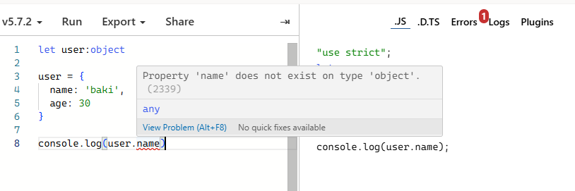
- 에러 : name 속성 존재 하지 않음 => interface 사용하기
- 인터페이스는 객체에 특정 속성 값을 정의하여 에러를 방지할 수 있도록 도와준다.

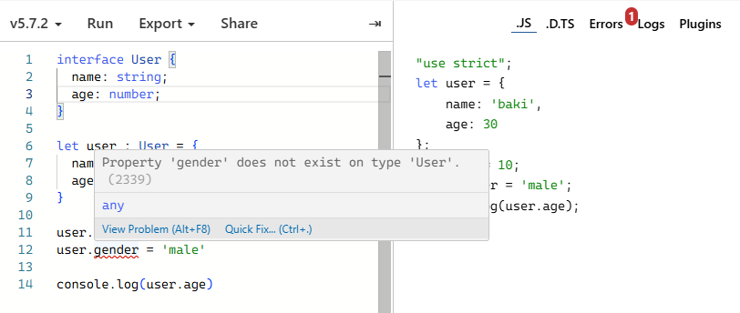
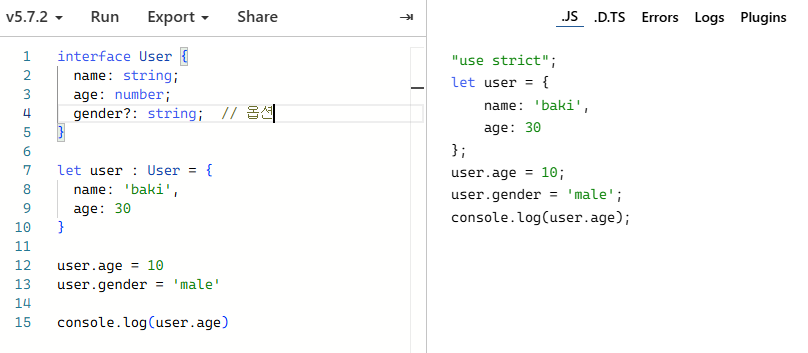
- 옵셔널 프로퍼티는 인터페이스에서 속성 뒤에 ?를 추가하여 선택적으로 설정할 수 있다. 해당 속성(ex. gender)은 있을 수도 있고 없을 수도 있지만 존재한다면 지정된 타입을 따라야 한다.
- cf. user.이후에 어떤 프로퍼티 있는지 자동으로 뜸

 

### 2. 읽기 전용 프로퍼티와 인터페이스의 활용
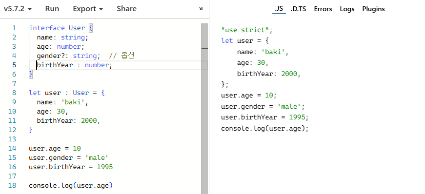
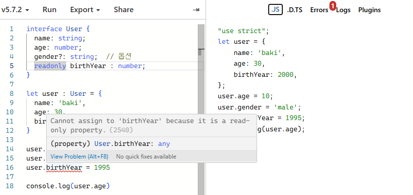
- readonly 키워드를 사용하면 값에 접근은 가능하지만 수정은 불가능하다.
  - birthYear가 읽기 전용이면 값 수정 불가

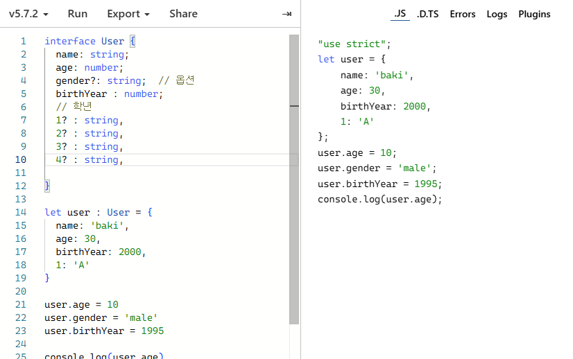
- 위 처럼 옵셔널로 하지말고 문자열 **인덱스 시그니처** 추가하기

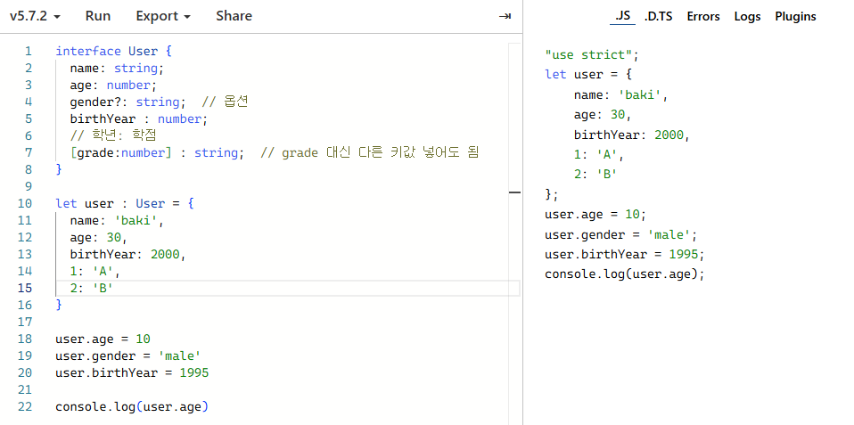
- number를 키로 하고 string 벨류 갖는 프로퍼티를 여러개 받을 수 있다는 의미이다.

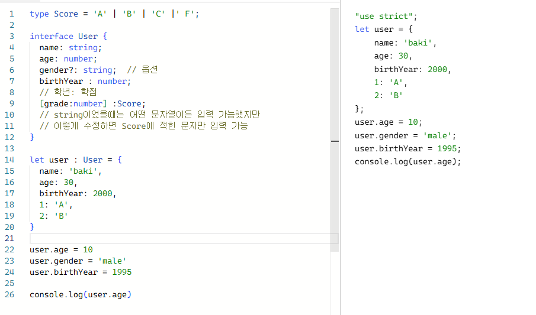
- 성적 범위가 string으로 받기에는 범위가 넓다 -> **문자열 리터럴 타입**
- 성적을 String으로 관리하는 것은 제한적이기 때문에 특정 값(A, B, C, F)으로 제한하는 스코어 타입을 정의할 수 있다.
- 스코어 타입을 활용하면 오직 A, B, C, F 중 하나의 값만 입력 가능하며 이 외의 값이 입력될 경우 에러가 발생한다.

 

### 3. 인터페이스를 활용한 함수 정의
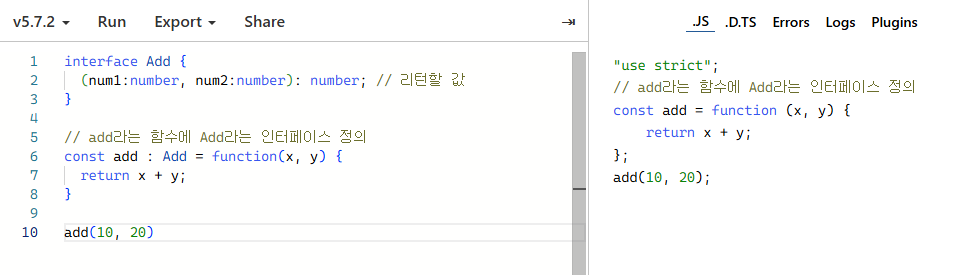
- 인터페이스를 통해 함수의 매개변수와와 리턴값을 정의할 수 있다.
- 함수의 정의가 인터페이스와 일치하지 않을 경우 타입 에러가 발생한다.

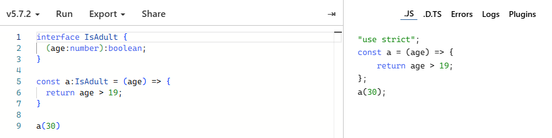
- 성인 여부를 판단하는 함수를 정의할 경우 숫자인 나이(age)를 입력받아 boolean 값을 반환하도록 설정할 수 있다.
- 화살표 함수로도 간단하게 정의할 수 있다.

 

### 4. 인터페이스를 활용한 클래스 정의
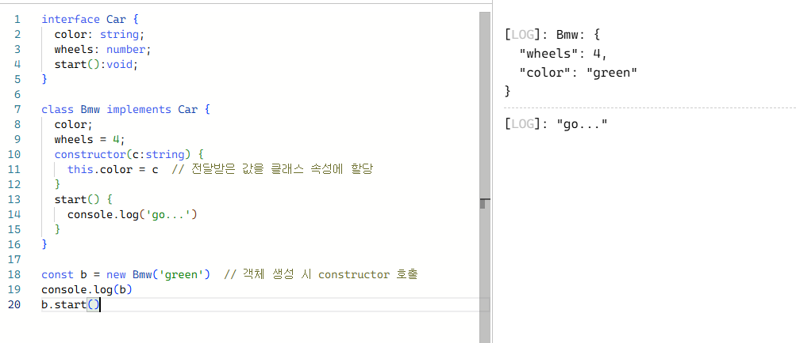
- implements를 사용해야 한다.
- Car라는 인터페이스 정의 후 BMW라는 클래스를 생성하기
- 모든 속성 값을 입력해야 한다.
- cf. constructor는 TypeScript와 JavaScript 클래스에서 사용되는 메서드로, 클래스의 인스턴스를 초기화하는 역할을 한다. 객체를 생성할 때 호출되며 클래스의 속성을 설정하거나 초기 작업을 수행한다. 클래스 내에 하나만 정의할 수 있다.

 

### 5. 인터페이스의 확장 및 활용

- 인터페이스는 확장이 가능하며 다른 인터페이스의 속성을 상속받을 수 있다.
- 특정 속성을 포함한 인터페이스를 만들고 추가 속성을 더할 수 있다.

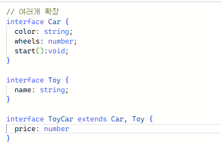
- 여러 개의 인터페이스를 동시에 확장하는 것이 가능하다.