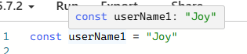
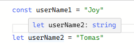
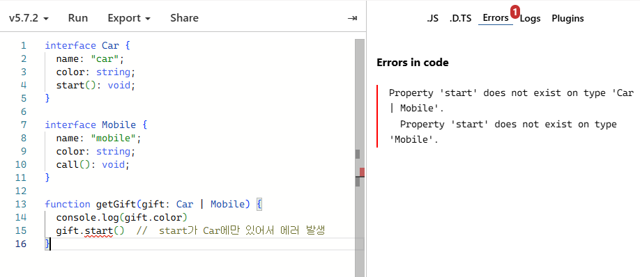
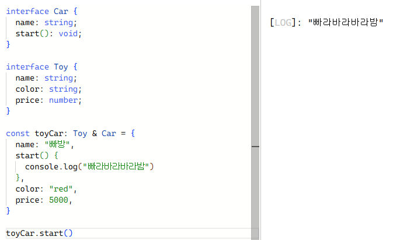

## [5] Literal, Union, Intersection Types

### 1. Literal type
- 자바스크립트에서 변수를 선언할 때 `const`는 변하지 않는 값을 선언할 때, `let`은 변할 수 있는 값을 선언할 때 사용한다.

- 타입스크립트에서 `const`와 `let`을 선언해보면


  - userName1은 "Joy"를, userName2는 문자열(string) 타입이라고 알려준다. userName1은 문자열이지만 변할 수 없으니 값은 가질 수가 없다.
  - let으로 선언한 userName2는 'Tomas'이지만 언제든 다른 값으로 변할 수 있으므로 넓은 개념인 문자열 타입으로 정의된다.
- 위 코드에서 userName2를 3으로 바꾸면 최초 할당된 값이 문자열이었기 때문에 에러가 발생한다.
- 숫자도 넣을 수 있게 하려면 명시적으로 작성해줘야 한다.
  ```typescript
  const userName1 = "Joy"
  let userName2: string | number = "Tomas"

  userName2 = 3;
  ```
- userName1처럼 **정해진 문자열 값을 가진 것을 문자열 리터럴 타입**이라고 한다.

</br>

- type활용하기
  ```typescript
  type Job = "police" | "developer" | "teacher";

  interface User {
    name: string;
    job: Job;
  }

  const user:User = {
    name: "Zoe",
    job: "developer",
  }

  interface HighschoolStudent {
    name: string;
    grade: 1 | 2 | 3; // union type
  }
  ```
</br>

### 2. Union type

- Car, Mobile 둘 다 이름(name)과 색상(color) 값을 가지고 있다. 

- 식별 가능한 유니언 타입
  ```typescript
    interface Car {
    name: "car";
    color: string;
    start(): void;
  }

  interface Mobile {
    name: "mobile";
    color: string;
    call(): void;
  }

  // 식별 가능한 유니온 타입
  function getGift(gift: Car | Mobile) {
    console.log(gift.color)
    if (gift.name === "car") {
      gift.start()
    } else {
      gift.call() 
    }
  }
  ```
  - 동일한 이름의 속성(name)을 다르게 주고(car, mobile) 함수 내부에서 이것의 타입을 다르게 줌으로써 두 개의 인터페이스(Car, Mobile)를 구분할 수 있다. (string 타입 아님)
  - 위와 같이 동일한 속성을 정의하고, 타입을 다르게 서로 분할할 수 있는 것을 식별 가능한 유니온 타입이라고 한다.

</br>

### 3. Intersection type
- 교차 타입은 여러 타입을 합쳐서 사용한다.
  ```typescript
  // Car와 Toy 합치기
  interface Car {
    name: string;
    start(): void;
  }

  interface Toy {
    name: string;
    color: string;
    price: number;
  }

  const toyCar: Toy & Car = {
    name: "빠방",
    start() {
      console.log("빠라바라바라밤")
    },
    color: "red",
    price: 5000,
  }

  toyCar.start()
  ```

  - 필요한 모든 기능을 가진 하나의 타입이 만들어진다.