## [1] 타입스크립트란?

- 타입스크립트

  - 자바스크립트의 상위 집합으로, 타입을 명시할 수 있는 프로그래밍 언어이다.
  - 코드를 작성할 때 변수나 함수의 타입을 정해줌으로써 오류를 미리 잡을 수 있도록 도와준다.

- 자바스크립트
  - 웹 페이지에 생동감을 주는 매우 인기 있는 프로그래밍 언어이다.
  - 브라우저에서 사용되며, 대부분의 웹사이트에서 동적 요소를 만들기 위해 사용된다. **하지만 자바스크립트는 타입을 강제하지 않기 때문에 개발 중에 오류가 숨겨질 수 있어 디버깅이 어려울 수 있다.**

 

### 1. 타입스크립트를 사용하는 이유

- 자바스크립트는 동적 타입 언어로 변수의 타입을 지정하지 않고 런타임에 타입이 결정된다. 따라서 코드 작성 단계에서는 타입 오류를 잡아내기 어렵고 런타임에 오류를 확인 할 수 있다. 이는 복잡한 코드에서 디버깅을 어렵게 만든든다.
- 타입스크립트는 정적 타입 언어로 코드를 컴파일하는 시점에서 타입을 검사하여 오류를 발견할 수 있다.

#### cf. 타입스크립트 플레이그라운드 활용하기

- [타입스크립트 플레이그라운드](https://www.typescriptlang.org/play)
- 별도의 설치 없이 코드 작성과 변환된 JavaScript 확인이 가능하다.
- 코드 작성 시 즉시 피드백이 제공되며 오류가 발생하면 빨간 줄로 표시된다.

 

### 2. 타입스크립트에서의 타입 규정

- 타입스크립트에서 타입을 명시하지 않으면 암묵적으로 any 타입이 지정될 수 있다.
- 하지만 any는 타입 안정성을 제공하지 않으므로 가능한 사용을 피하고 명시적으로 타입을 지정하는 것이 권장된다.

 

### 3. 타입스크립트의 에러 처리

- ex. 두 개의 인수가 필요한 상황에서 1개만 제공되었을 때 혹은 3개를 전달했을 때 에러 메시지가 표시된다.
- ex. 매개변수의 타입을 숫자로 고정할 경우 주어진 인수의 타입이 맞지 않는다면(문자) 에러로 반영된다.

 

---

 

## [2] 타입스크립트 - 기본 타입

### 1. 타입스크립트의 기본 타입

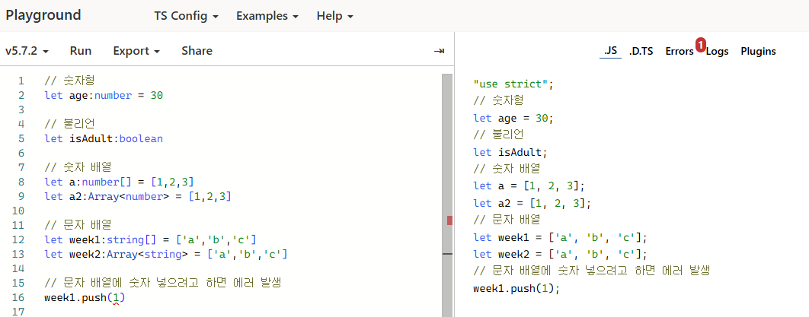
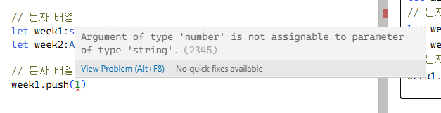

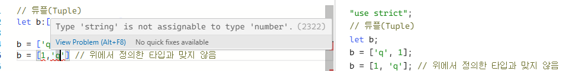
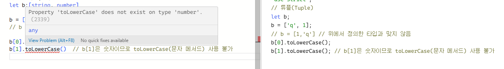

- 타입스크립트는 타입을 사전에 정의함으로써 코드 작성 시 에러를 피할 수 있게 도와준다.

### 2. void, never

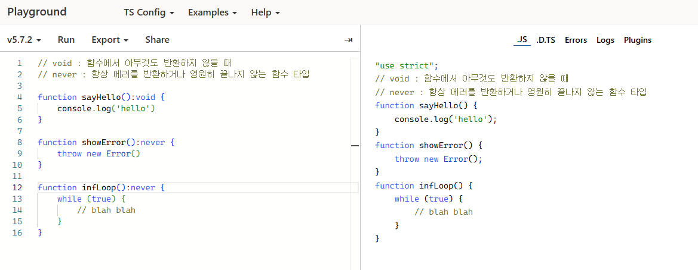

- void : 함수에서 아무것도 반환하지 않을 때 주로 사용된다.
- never : 항상 에러를 반환하거나 영원히 끝나지 않는 암시적인 타입으로 사용될 수 있다.

### 3. enum

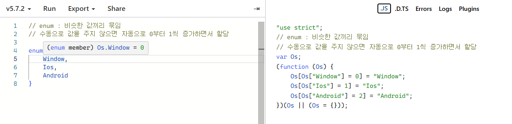

- enum은 값이 자동으로 0부터 1씩 증가하며 할당된다. 기본적으로 첫 번째 값은 0으로 시작된다.

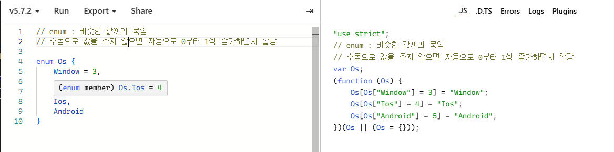
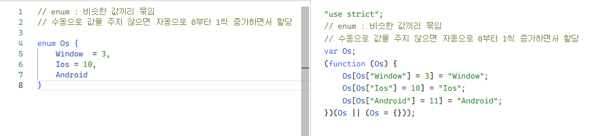

- 수동으로 값을 지정할 수 있으며, 예를 들어 Ios를 10으로 바꾸면 다른 값들이 자동으로 조정된다.

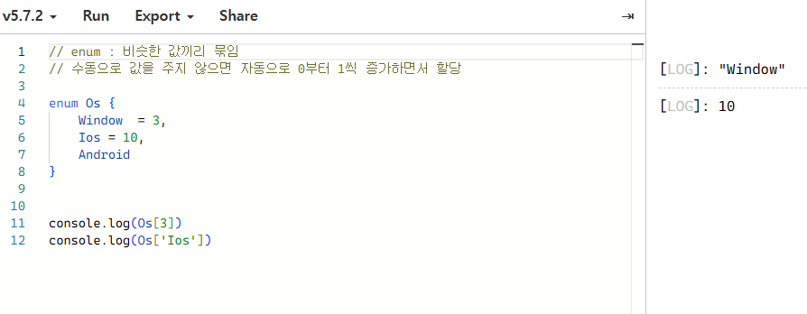

- 숫자 enum은 양방향 매핑이 가능하다다.

 

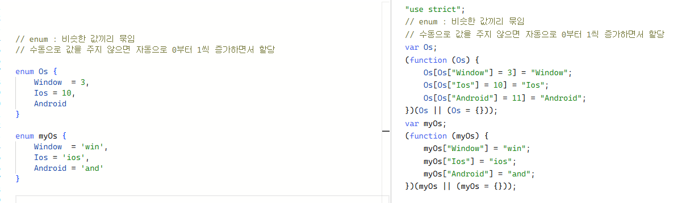

- 숫자뿐만 아니라 문자열 값도 입력할 수 있다. 문자 enum은 단방향 매핑만 가능하다.

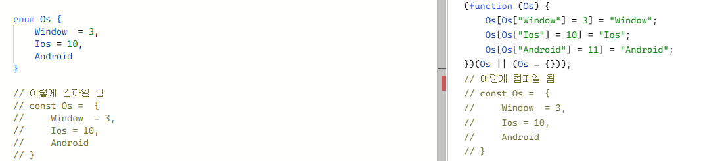
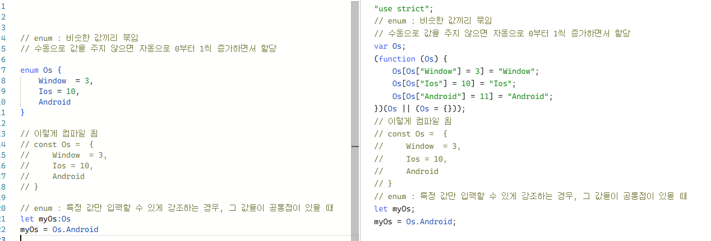

- 특정 값들만 입력하도록 제한해주고 싶을 때 enum을 사용하면 유용하다.
- 특정 값들에 대한 공통점을 강조할 수 있다.

 

#### 4. null, undefined

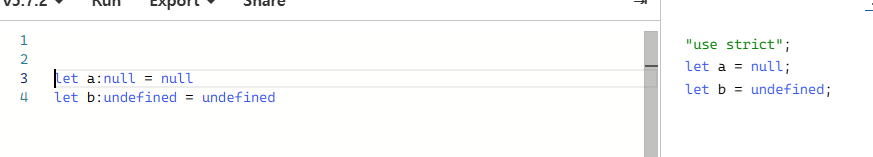

- null : 명시적으로 값이 없음을 나타낸다. **비어있음**을 의미
- undefined : 변수가 선언되었으나 초기화되지 않은 상태
