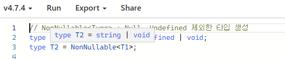

## [8] Utility Types
### 1. keyof
```typescript
// keyof

interface User {
  id: number;
  name: string;
  age: number;
  gender: "m" | "f";
}

type UserKey = keyof User; // 'id' | 'name' | 'age' | 'gender'

const uk:UserKey = "id" // User 인터페이스에 있는 키값 입력하면 정상 동작
```
  - 'keyof' 키워드를 사용하면 유저 인터페이스의 키 값을 의미하는 형태로 받을 수 있다.

</br>

### 2. Partial
```typescript
// Partial<T>
interface User {
  id: number;
  name: string;
  age: number;
  gender: "m" | "f";
}


// interface User {
//   id?: number;
//   name?: string;
//   age?: number;
//   gender?: "m" | "f";
// }
// 위 코드랑 같은 의미. User에 없는 프로퍼티 사용하려고 하면 에러 발생
let admin: Partial<User> = {
  id: 1,
  name: "Zoe",
}
```

</br>

### 3. Required 
```typescript
// Required<T> : 모든 프로퍼티를 필수로 바꿔줌
interface User {
  id: number;
  name: string;
  age?: number;
}

// Required 사용으로 인해 age도 필수 되어버림 
let admin: Required<User> = {
  id: 1,
  name: "Kiki",
  age: 30,
}
```
</br>

### 4. Readonly
```typescript
// Readonly<T>
interface User {
  id: number;
  name: string;
  age?: number;
}

let admin: Readonly<User> = {
  id: 1,
  name: "Bonie",
}

admin.id = 4; // 초기 값 할당은 가능하지만 수정은 불가능
// Cannot assign to 'id' because it is a read-only property.
```

</br>

### 5. Record
```typescript
// 1. Record<K,T>  Key, Type
type Grade = "1" | "2" | "3" | "4";
type Score = "A" | "B" | "C" | "D" ;

const score: Record<Grade, Score>= {
  1: "A",
  2: "B",
  3: "C",
  4: "D",
}


// 위 코드와 같은 의미
// interface Score {
//   "1": "A" | "B" | "C" | "D";
//   "2": "A" | "B" | "C" | "D";
//   "3": "A" | "B" | "C" | "D";
//   "4": "A" | "B" | "C" | "D";
// }

// const score: Score = {
//   1: "A",
//   2: "B",
//   3: "C",
//   4: "D",
// }
```
  - Record는 주어진 키와 타입으로 구성된 데이터를 다룰 수 있게 해준다.

```typescript
// 2. Record<K, T>
interface User {
  id: number;
  name: string;
  age: number;
}

function isValid(user:User) {
  const result: Record<keyof User, boolean> = {
    id: user.id >0,
    name: user.name !== "",
    age: user.age > 0,
  }
  return result
}
```
</br>

### 6. Pick
```typescript
// Pick<T, K>
interface User {
  id: number;
  name:string;
  age: number;
  gender: "M" | "W"
}

// User에서 id, name 가져와서 사용
const admin: Pick<User, "id" | "name"> = {
  id: 0,
  name: "Sam"
}

```
</br>

### 7. Omit, Exclude
```typescript
// Omit : 특정 프로퍼티 생략 가능
const admin2: Omit<User, "age" | "gender"> = {
  id: 0,
  name: "Sam",
}

// Omit은 프로퍼티 제외 Exclude는 type 제외

// Exclude<T1, T2>
// T1의 타입들 중에서 T2타입과 겹치는 타입 제외
type T1 = string | number | boolean
type T2 = Exclude<T1, number> // string | boolean
```

</br>

### 8. NonNullable<T>


```typescript
// NonNullable<Type> : Null, Undefined 제외한 타입 생성
type T1 = string | null | undefined | void;
type T2 = NonNullable<T1>;  // T2는 string
```
- 팝업에 뜨는 타입이 설명과 조금 차이가 있어서 찾아봤다.(타입스크립트 플레이그라운드에서 해보니 버전차이인듯 하다.)
  - cf. T1 & {} 의미
    - NonNullable<T1>을 T1에서 null과 undefined를 제외한 타입으로 축소한다.
    - & {}는 빈 객체 타입을 추가로 결합한 것으로 보이지만 타입스크립트 내부적으로 타입을 안전하게 다루기 위한 표현임. 실제로 타입 정의에는 영향 없음