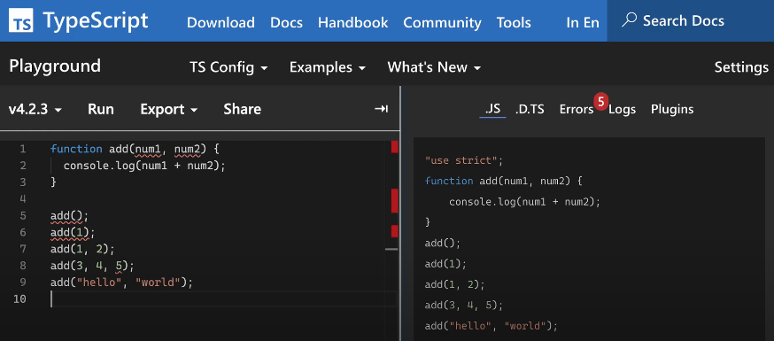

# 코딩앙마 TypeScript 정리

### 타입스크립트를 쓰는 이유

- JavaScript
    - 동적언어 → 런타임에 타입 결정
- TypeScript
    - 정적언어 → 컴파일 타임에 타입 결정



→ 미리 오류 발견 가능

---

### 기본 타입

- TypeScript

```tsx
let age:number = 30
let isAdult:boolean = true
let a:number[] = [1,2,3]
let a2:Array<number> = [1,2,3]

let week1:string[] = ['mon','tue','wed']
let week2:Array<string> = ['mon','tue','wed']

// 튜플
let b:[string, number]

b = ['z', 1]

b[0].toLowerCase() // -> 정상
b[1].toLowerCase() // -> 오류 

// void, never
// void -> 함수에서 아무것도 반환하지 않을 때
function sayHello(): void {
  console.log("hello")
}

// never -> 항상 에러를 반환하거나, 영원히 끝나지 않는 함수의 타입으로 사용 가능
function showError(): never {
  throw new Error()
}

function infLoop(): never {
  while (true) {
    // do something
  }
}

// enum -> 비슷한 값들끼리 묶기
// Os를 enum으로 정의,
// 값을 지정해주지 않으면 자동으로 해당 enum의 값에 0부터 1씩 증가하는 값이 지정됨
// 숫자가 아닌 문자열도 넣어줄 수 있다
enum Os {
  Window,  // 0
  Ios,     // 1
  Android, // 2
}

enum Os {
  Window = 3,  // 3
  Ios = 10,    // 10
  Android,     // 11
}

// 아래와 같은 방식으로도 사용 가능
enum Os {
  Window = "win",
  Ios = "ios",
  Android = "and",
}

let myOs: Os
myOs = Os.Window

// null, undefined
let a: null = null
let b: undefined = undefined
```

- JavaScript

```jsx
"use strict";
let age = 30;
let isAdult = true;
let a = [1, 2, 3];
let a2 = [1, 2, 3];
let week1 = ['mon', 'tue', 'wed'];
let week2 = ['mon', 'tue', 'wed'];

// 튜플
let b;
b = ['z', 1];
b[0].toLowerCase(); // -> 정상
b[1].toLowerCase(); // -> 오류 

// void, never
// void -> 함수에서 아무것도 반환하지 않을 때
function sayHello() {
    console.log("hello");
}

// never -> 항상 에러를 반환하거나, 영원히 끝나지 않는 함수의 타입으로 사용 가능
function showError() {
    throw new Error();
}
function infLoop() {
    while (true) {
        // do something
    }
}

// enum -> 비슷한 값들끼리 묶기
// Os를 enum으로 정의,
// 값을 지정해주지 않으면 자동으로 해당 enum의 값에 0부터 1씩 증가하는 값이 지정됨
// 숫자가 아닌 문자열도 넣어줄 수 있다
var Os;
(function (Os) {
    Os[Os["Window"] = 0] = "Window";
    Os[Os["Ios"] = 1] = "Ios";
    Os[Os["Android"] = 2] = "Android";
})(Os || (Os = {}));

(function (Os) {
    Os[Os["Window"] = 3] = "Window";
    Os[Os["Ios"] = 10] = "Ios";
    Os[Os["Android"] = 11] = "Android";
})(Os || (Os = {}));

// 아래와 같은 방식으로도 사용 가능
(function (Os) {
    Os["Window"] = "win";
    Os["Ios"] = "ios";
    Os["Android"] = "and";
})(Os || (Os = {}));

let myOs;

myOs = Os.Window;

// null, undefined
let a = null;
let b = undefined;

```

---

### 인터페이스

```tsx
type Score = "A" | "B" | "C" | "F"

let user: object

user = {
  name: "xx",
  age: 30,
}

// 오류 발생 -> object에는 특정 속성 값에 대한 정보가 없기 때문!
// 이렇게 프로퍼티를 정의해서 객체로 표현하고자 할 때는 interface 사용
interface User {
  name: string
  age: number
  // 있어도 되고 없어도 되는 옵셔널한 프로퍼티 넣을 때 -> ?
  gender?: string
  // 읽기 전용, 수정 불가능
  readonly birthYear: number
  // 위 Score에 정의한 값만 입력 가능
  [grade: number]: Score
}

let user: User = {
  name: "xx",
  age: 30,
  birthYear: 2000,
  1: "A",
  2: "B",
}

user.age = 10           // 오류 x
user.gender = "male"    // 옵션 -> 추가 가능, 오류 x
user.birthYear = 1990   // 읽기 전용 -> 수정 불가, 오류 o

console.log(user.name)

// 인터페이스로 함수로도 정의 가능

// 두 개의 매개변수(num1과 num2)를 받는다.
// 두 매개변수 모두 숫자 타입이다.
// 반환값은 숫자 타입이다.
interface Add {
  (num1: number, num2: number): number
}

const add: Add = function (x, y) {
  return x + y
}

add(10, 20) // 30

// 하나의 매개변수(age)를 받는다.
// 매개변수는 숫자 타입이다.
// 반환값은 boolean 타입이다.
interface IsAdult {
  (age: number): boolean
}

const a: IsAdult = (age) => {
  return age > 19
}

a(33) // true

// 인터페이스로 클래스도 정의 가능
// 인터페이스는 클래스가 가져야 할 속성과 메서드를 미리 정의하는 틀(청사진) 역할
// implements 사용

// Car 인터페이스는 모든 자동차가 color, wheels 속성과 start() 메서드를 가져야 한다고 요구
interface Car {
  color: string
  wheels: number
  start(): void
}

// 확장 가능 -> Car가 가지고 있던 속성을 그대로 받게 됨
// Benz extends Car: Benz 인터페이스는 Car 인터페이스를 상속받는다
// Benz는 Car의 속성(color, wheels)과 메서드(start())를 모두 포함하며, 추가로 door 속성과 stop() 메서드를 요구
interface Benz extends Car {
  door: number
  stop(): void
}

// implements Car: Bmw 클래스는 Car 인터페이스를 따르겠다고 선언
// color와 wheels는 Car 인터페이스에서 요구하는 속성이며, 클래스에서 반드시 정의해야 함
// start()는 Car 인터페이스에서 정의된 메서드이며, 클래스에서 구현해야 함
class Bmw implements Car {
  color
  wheels = 4
  constructor(c: string) {
    this.color = c
  }
  start() {
    console.log("go!")
  }
}

// const b = new Bmw("green"): Bmw 클래스의 객체를 생성, 생성자를 통해 color 속성을 "green"으로 초기화
// console.log(b): 객체의 속성을 확인, 결과는 { color: "green", wheels: 4 }.
// b.start(): start() 메서드를 호출, 콘솔에 "go!"가 출력
const b = new Bmw("green")
console.log(b)
b.start()

// 인터페이스 다중 확장
interface Car {
  color: string
  wheels: number
  start(): void
}

interface Toy {
  name: string
}

interface ToyCar extends Car, Toy {
  price: number
}

// ToyCar는 아래와 같은 속성과 메서드를 가짐
interface ToyCar {
  // Car에서 물려받은 것
  color: string
  wheels: number
  start(): void

  // Toy에서 물려받은 것
  name: string

  // ToyCar에서 정의한 것
  price: number
}
```

---

### 함수

```tsx
// 함수
function hello(name?: string) {
  return `Hello, ${name || "world"}`
}

const result = hello()       // 오류 x
const result2 = hello("sam") // 오류 x
const result3 = hello(123)   // 오류 o -> 옵션이지만 지정한 타입은 지켜야 함

```


```tsx
// 함수 정의: 가변 인자를 받아 모든 숫자를 더하는 함수
function add(...nums: number[]) {
  // reduce 메서드로 배열의 요소를 모두 더함. 초기값은 0
  return nums.reduce((result, num) => result + num, 0);
}

// 호출 예제: 1, 2, 3을 더한 결과를 반환
add(1, 2, 3); // 6

// 호출 예제: 여러 숫자를 더한 결과를 반환
add(1, 2, 3, 4, 5, 6, 7, 8, 9, 10); // 55

```


```tsx
// 인터페이스 정의: User 타입은 name 속성을 가짐
interface User {
  name: string;
}

// User 타입 객체 생성
const Sam: User = { name: 'Sam' };

// showName 함수 정의: this를 User로 고정하고, age와 gender를 매개변수로 받음
function showName(this: User, age: number, gender: 'm' | 'f') {
  // this.name과 매개변수를 출력
  console.log(this.name, age, gender);
}

// showName 함수에 this를 Sam으로 바인딩
const a = showName.bind(Sam);

// 바인딩된 함수 호출: age와 gender를 전달
a(30, 'm'); // 출력: Sam 30 m

```


```tsx
// 인터페이스 정의: User 타입은 name과 age 속성을 가짐
interface User {
  name: string;
  age: number;
}

// 함수 오버로딩 정의: 매개변수 조합에 따라 반환 타입이 달라짐
function join(name: string, age: string): string; // age가 문자열일 때는 문자열 반환
function join(name: string, age: number): User; // age가 숫자일 때는 User 객체 반환
function join(name: string, age: number | string): User | string {
  // age가 숫자일 경우
  if (typeof age === "number") {
    return {
      name, // User 객체 반환
      age,
    };
  } else {
    // age가 문자열일 경우
    return "나이는 숫자로 입력해주세요."; // 문자열 반환
  }
}

// 함수 호출 예제: 숫자를 입력해 User 객체를 반환받음
const sam: User = join("Sam", 30); // { name: "Sam", age: 30 }

// 함수 호출 예제: 문자열을 입력해 에러 메시지를 반환받음
const jane: string = join("Jane", "30"); // "나이는 숫자로 입력해주세요."

```

---

### 리터럴, 유니온 / 교차 타입


```tsx
// Literal Types
const userName1 = "Bob"; // userName1은 문자열 "Bob"으로 타입이 고정됨
let userName2: string | number = "Tom"; // userName2는 문자열 또는 숫자 타입을 가질 수 있음
userName2 = 3; // 숫자 타입으로 변경

// Job 타입 정의: "police", "developer", "teacher" 중 하나만 가질 수 있음
type Job = "police" | "developer" | "teacher";

// User 인터페이스 정의: name은 문자열, job은 Job 타입
interface User {
  name: string; // 사용자 이름
  job: Job; // 사용자의 직업
}

// User 타입의 객체를 생성
const user: User = {
  name: "Bob", // 이름은 "Bob"
  job: "developer", // 직업은 "developer"
};

// HighSchoolStudent 인터페이스 정의
interface HighSchoolStudent {
  name: number | string; // 이름은 숫자 또는 문자열 타입
  grade: 1 | 2 | 3; // 학년은 1, 2, 3 중 하나만 가능
}
```

---


```tsx
// Union Types
interface Car {
  name: "car"; // name은 문자열 "car"로 고정
  color: string; // 자동차 색상
  start(): void; // 자동차를 시작하는 함수
}

interface Mobile {
  name: "mobile"; // name은 문자열 "mobile"로 고정
  color: string; // 모바일 색상
  call(): void; // 전화를 거는 함수
}

function getGift(gift: Car | Mobile) {
  console.log(gift.color); // gift의 color 속성을 출력
  if (gift.name === "car") {
    gift.start(); // gift가 Car 타입이면 start() 호출
  } else {
    gift.call(); // gift가 Mobile 타입이면 call() 호출
  }
}
```

---


```tsx
// Intersection Types
interface Car {
  name: string; // 자동차 이름
  start(): void; // 자동차를 시작하는 함수
}

interface Toy {
  name: string; // 장난감 이름
  color: string; // 장난감 색상
  price: number; // 장난감 가격
}

// Car와 Toy 타입을 모두 만족하는 toyCar 객체 생성
const toyCar: Toy & Car = {
  name: "타요", // 이름은 "타요"
  start() {}, // start 메서드 구현
  color: "blue", // 색상은 "blue"
  price: 1000, // 가격은 1000
};
```

---

### 클래스


```tsx
// 접근 제한자(Access modifier) - public, private, protected
class Car {
  name: string = "car"; // public 접근 제한자 (생략 시 기본값)
  color: string;

  constructor(color: string) {
    this.color = color; // 생성자를 통해 color 값을 초기화
  }

  start() {
    console.log("start"); // "start" 출력
  }
}

class Bmw extends Car {
  constructor(color: string) {
    super(color); // 부모 클래스의 생성자를 호출
  }

  showName() {
    console.log(super.name); // 부모 클래스의 name 접근
  }
}

const z4 = new Bmw("black"); // Bmw 객체 생성

```

```tsx
// private 접근 제한자 사용
class Car {
  private name: string = "car"; // private로 name 선언 (클래스 내부에서만 접근 가능)
  color: string;

  constructor(color: string) {
    this.color = color;
  }

  start() {
    console.log("start");
    console.log(this.name); // 클래스 내부에서는 접근 가능
  }
}

class Bmw extends Car {
  constructor(color: string) {
    super(color);
  }

  showName() {
    // console.log(super.name); // 에러: private 속성은 자식 클래스에서도 접근 불가
  }
}

const z4 = new Bmw("black");

```

```tsx
// #을 사용한 private 필드
class Car {
  #name: string = "car"; // #name으로 private 필드를 선언
  color: string;

  constructor(color: string) {
    this.color = color;
  }

  start() {
    console.log("start");
    console.log(this.#name); // #name은 클래스 내부에서만 접근 가능
  }
}

class Bmw extends Car {
  constructor(color: string) {
    super(color);
  }

  showName() {
    // console.log(super.#name); // 에러: #name은 자식 클래스에서도 접근 불가
  }
}

const z4 = new Bmw("black");

```

```tsx
// protected 접근 제한자 사용
class Car {
  protected name: string = "car"; // protected로 name 선언 (자식 클래스에서 접근 가능)
  color: string;

  constructor(color: string) {
    this.color = color;
  }

  start() {
    console.log("start");
    console.log(this.name); // 클래스 내부에서는 접근 가능
  }
}

class Bmw extends Car {
  constructor(color: string) {
    super(color);
  }

  showName() {
    console.log(super.name); // 자식 클래스에서 접근 가능
  }
}

const z4 = new Bmw("black");

```

```tsx
// 접근 제한자 정리
/*
public - 자신 클래스, 클래스 인스턴스 모두 접근 가능
protected - 자식 클래스에서 접근 가능
private - 해당 클래스 내부에서만 접근 가능
*/

class Car {
  protected name: string = "car"; // protected로 선언
  color: string;

  constructor(color: string) {
    this.color = color;
  }

  start() {
    console.log("start");
    console.log(this.name);
  }
}

class Bmw extends Car {
  constructor(color: string) {
    super(color);
  }

  showName() {
    console.log(super.name); // 자식 클래스에서 접근 가능
  }
}

const z4 = new Bmw("black");

```

```tsx
// static과 readonly 사용
class Car {
  readonly name: string = "car"; // 읽기 전용 필드로 선언 (값 수정 불가)
  color: string;
  static wheels = 4; // static 필드로 선언 (클래스 자체에 속함)

  constructor(color: string, name: string) {
    this.color = color;
    this.name = name; // readonly이므로 생성자에서만 값 변경 가능
  }

  start() {
    console.log("start");
    console.log(this.name); // 인스턴스 필드 name 출력
    console.log(Car.wheels); // static 필드 wheels 출력
  }
}

class Bmw extends Car {
  constructor(color: string, name: string) {
    super(color, name);
  }

  showName() {
    console.log(super.name); // 부모 클래스의 name 접근
  }
}

const z4 = new Bmw("black", "zzzz4"); // Bmw 객체 생성
console.log(Car.wheels); // static 필드 wheels 출력
// z4.name = "zzzz4"; // 에러: readonly 필드는 값 변경 불가

```

---

추상클래스

- 프로퍼티나 메서드의 이름만 선언해주고, 구체적인 기능은 상속 받는 쪽에서 구현해주는 것을 의미


```tsx
// 추상 class
abstract class Car {
  color: string; // 색상 속성 정의

  constructor(color: string) {
    this.color = color; // 생성자를 통해 color 값을 초기화
  }

  start() {
    console.log("start"); // "start"를 출력하는 메서드
  }

  abstract doSomething(): void; // 추상 메서드, 하위 클래스에서 반드시 구현해야 함
}

// const car = new Car("red"); // 추상 클래스는 직접 인스턴스화할 수 없음

class Bmw extends Car {
  constructor(color: string) {
    super(color); // 부모 클래스(Car)의 생성자 호출
  }

  doSomething() {
    alert(3); // 추상 메서드를 구현한 내용, 3을 알림으로 표시
  }
}

const z4 = new Bmw("black"); // Bmw 클래스의 객체 생성

```

1. **추상 클래스 (`abstract class`)**
    - `abstract class`는 객체를 직접 생성할 수 없는 클래스. 주로 다른 클래스가 상속받아 사용할 수 있도록 설계됨.
    - 이 코드에서는 `Car`가 추상 클래스
        - `start()` 메서드는 구현되어 있어서 자식 클래스에서 그대로 사용할 수 있음.
        - `doSomething()` 메서드는 `abstract`로 선언되어서 자식 클래스가 반드시 구현해야 함.
2. **추상 메서드**
    - 추상 클래스 내에 선언된 메서드로, 구체적인 구현은 자식 클래스가 해야 함.
    - `Car` 클래스의 `doSomething()`이 이에 해당하며, `void` 타입을 반환함.
    - 이 메서드는 Bmw 클래스에서 `alert(3);`로 구현됨.
3. **`super()` 사용**
    - 자식 클래스가 부모 클래스의 생성자를 호출할 때 사용.
    - Bmw 클래스의 생성자에서 `super(color)`를 호출하여 `Car` 클래스의 생성자를 실행함.
4. **제약 사항**
    - 추상 클래스는 직접 객체를 생성할 수 없음.
        - 예를 들어, `const car = new Car("red");`는 에러를 발생시킴.
    - 추상 메서드는 반드시 자식 클래스에서 구현해야 함. 구현하지 않으면 컴파일 오류가 발생함.
5. **객체 생성**
    - `const z4 = new Bmw("black");`를 통해 `Bmw` 클래스의 객체를 생성함.
    - 이 객체는 `Car`의 속성과 메서드를 상속받고, `doSomething()` 메서드는 Bmw에서 구현된 내용을 따름.

---

### 제네릭

- 클래스나 함수, 인터페이스를 다양한 타입으로 재사용 할 수 있다


```tsx
// Generics
function getSize<T>(arr: T[]): number {
  return arr.length; // 배열의 길이를 반환
}

const arr1 = [1, 2, 3]; // 숫자로 이루어진 배열
getSize<number>(arr1); // 3

const arr2 = ["a", "b", "c"]; // 문자열로 이루어진 배열
getSize<string>(arr2); // 3

const arr3 = [false, true, true]; // 불리언 값으로 이루어진 배열
getSize(arr3); // 3

const arr4 = [{}, {}, { name: "Tim" }]; // 객체로 이루어진 배열
getSize(arr4); // 3

```

- **제네릭 함수 정의**
    - 함수 이름 옆에 `<T>`를 사용하여 제네릭 타입을 정의.
    - `T`는 타입을 나타내는 이름으로, 특정 타입으로 고정되지 않고 호출 시 타입이 결정됨.
    - `arr: T[]`는 T 타입의 배열을 의미.
    - 반환 타입은 `number`로, 배열의 길이를 반환함 (`arr.length`).
- **`getSize<T>` 함수 호출**
    - 호출할 때 `<T>`에 타입을 명시적으로 지정할 수 있음.
    - 예를 들어, `getSize<number>(arr1)`는 T를 `number`로 설정함.
    - 타입을 명시하지 않아도, TypeScript가 배열의 타입을 추론함.
- **예제 설명**
    - `arr1`은 숫자 배열로, `getSize<number>(arr1)`를 호출하면 배열의 길이인 `3`을 반환.
    - `arr2`는 문자열 배열로, `getSize<string>(arr2)`를 호출하면 배열의 길이 `3`을 반환.
    - `arr3`는 불리언 배열로, 타입을 명시하지 않아도 TypeScript가 `boolean` 타입으로 추론.
    - `arr4`는 객체 배열로, 역시 타입 추론을 통해 길이 `3`을 반환.
- **제네릭의 장점**
    - 타입을 고정하지 않고 유연하게 사용 가능.
    - 타입 안정성을 제공하여 컴파일 단계에서 타입 에러를 방지.
    - 재사용성이 높아짐. 다양한 타입에 대해 동일한 로직을 적용할 수 있음.

---


```tsx
interface Mobile<T> {
  name: string; // 제품 이름
  price: number; // 가격
  option: T; // 제네릭으로 옵션 타입을 정의
}

const m1: Mobile<{ color: string; coupon: boolean }> = {
  name: "S21", // 제품 이름
  price: 1000, // 가격
  option: {
    color: "red", // 옵션의 색상
    coupon: false, // 쿠폰 사용 여부
  },
};

const m2: Mobile<string> = {
  name: "S20", // 제품 이름
  price: 900, // 가격
  option: "good", // 옵션으로 문자열 타입을 사용
};
```

- **제네릭 인터페이스 정의**
    - `interface Mobile<T>`는 제네릭 인터페이스로, 옵션(`option`)의 타입을 유동적으로 설정할 수 있음.
    - `T`는 옵션의 타입을 나타내며, 인터페이스를 사용할 때 타입을 지정.
- **`m1` 객체**
    - `m1`은 `Mobile<{ color: string; coupon: boolean }>` 타입을 가짐.
    - `option` 속성은 객체 타입 `{ color: string; coupon: boolean }`을 따름.
    - `color`는 "red", `coupon`은 `false`로 설정.
- **`m2` 객체**
    - `m2`는 `Mobile<string>` 타입을 가짐.
    - `option` 속성은 문자열 타입이며, 값은 "good".
- **제네릭의 유용성**
    - 다양한 타입의 옵션을 동일한 인터페이스 구조에서 정의할 수 있음.
    - `Mobile` 인터페이스를 재사용할 때 각기 다른 옵션 타입을 지정할 수 있어 코드의 유연성이 높아짐.

---


```tsx
interface User {
  name: string; // 사용자 이름
  age: number; // 사용자 나이
}

interface Car {
  name: string; // 자동차 이름
  color: string; // 자동차 색상
}

interface Book {
  price: number; // 책의 가격
}

const user: User = { name: "a", age: 10 }; // User 타입 객체
const car: Car = { name: "bmw", color: "red" }; // Car 타입 객체
const book: Book = { price: 3000 }; // Book 타입 객체

function showName<T extends { name: string }>(data: T): string {
  // 제네릭 함수: name 속성을 가진 타입만 허용
  return data.name; // name 속성을 반환
}

showName(user); // "a" 출력
showName(car); // "bmw" 출력
// showName(book); // 오류 발생: Book에는 name 속성이 없음

```

1. **인터페이스 정의**
    - `User`:
        - `name`과 `age`를 가지는 객체를 정의.
    - `Car`:
        - `name`과 `color`를 가지는 객체를 정의.
    - `Book`:
        - `price`를 가지는 객체를 정의.
2. **객체 생성**
    - `user`는 `User` 인터페이스를 기반으로 생성된 객체.
    - `car`는 `Car` 인터페이스를 기반으로 생성된 객체.
    - `book`은 `Book` 인터페이스를 기반으로 생성된 객체.
3. **`showName` 함수**
    - 제네릭 함수로, `T`는 `{ name: string }`을 확장해야 함.
    - 즉, `T` 타입은 반드시 `name` 속성을 가져야 함.
    - `data: T`는 호출 시 전달된 객체의 타입을 따름.
    - 반환값은 `data.name`으로, 전달된 객체의 `name` 속성을 반환.
4. **호출 예시**
    - `showName(user)`와 `showName(car)`는 각각 `user`와 `car`의 `name` 값을 반환.
    - `showName(book)`은 오류를 발생시킴. 이유는 `Book` 타입에는 `name` 속성이 없기 때문.
5. **제네릭과 조건부 타입 사용**
    - `T extends { name: string }`는 제네릭 타입 `T`가 반드시 `name` 속성을 가져야 한다는 조건을 명시.
    - 이 조건 덕분에, `name`이 없는 객체는 함수 호출 시 컴파일 오류를 발생시킴.

---

### 유틸리티 타입


```tsx
// keyof
interface User {
  id: number; // 유저의 고유 식별자
  name: string; // 유저 이름
  age: number; // 유저 나이
  gender: "m" | "f"; // 성별 (m 또는 f만 가능)
}

type UserKey = keyof User; // 'id' | 'name' | 'age' | 'gender'

const uk: UserKey = "age"; // User의 키 중 하나인 'age'를 할당
```

- **`keyof` 키워드**
    - `keyof`는 인터페이스나 객체 타입의 키(key) 값을 유니언 타입으로 추출함.
    - 예를 들어, `keyof User`는 `User` 인터페이스의 모든 키(`id`, `name`, `age`, `gender`)를 유니언 타입으로 반환.
- **`UserKey` 타입**
    - `type UserKey = keyof User`는 `User` 인터페이스의 키를 유니언 타입으로 정의.
    - 결과적으로, `UserKey`는 `'id' | 'name' | 'age' | 'gender'` 타입이 됨.
- **`uk` 변수**
    - 타입이 `UserKey`로 지정된 변수.
    - `uk`에는 `'id'`, `'name'`, `'age'`, `'gender'` 중 하나의 값만 할당 가능.
    - 여기서는 `'age'`가 할당됨.
- **활용 예시**
    - `keyof`를 사용하면 객체의 키 값만을 타입으로 제한할 수 있음.
    - 예를 들어, 특정 키만 사용하도록 강제하거나, 객체 속성을 동적으로 참조하는 경우에 유용함.

---


```tsx
// Partial<T>
interface User {
  id: number; // 유저의 고유 식별자
  name: string; // 유저 이름
  age: number; // 유저 나이
  gender: "m" | "f"; // 성별 (m 또는 f만 가능)
}

// Partial<User>는 User 인터페이스의 모든 속성을 선택적으로 만듦
// 결과는 아래와 같음:
// interface User {
//   id?: number;
//   name?: string;
//   age?: number;
//   gender?: "m" | "f";
// }

let admin: Partial<User> = {
  id: 1, // id는 선택 속성이므로 추가 가능
  name: "Bob", // name도 선택 속성이므로 추가 가능
};

// 두 번째 예제
let admin2: Partial<User> = {
  id: 1,
  name: "Bob",
  job: "", // 오류 발생: User 인터페이스에 없는 속성이기 때문
};
```

- **`Partial<T>` 유틸리티 타입**
    - TypeScript에서 제공하는 유틸리티 타입으로, 모든 속성을 선택적으로 바꿈.
    - `Partial<User>`는 `User` 인터페이스의 모든 속성을 선택 속성(`?`)으로 변환.
    - 즉, `id`, `name`, `age`, `gender`를 포함하거나 포함하지 않아도 됨.
- **첫 번째 예제**
    - `admin` 객체는 `Partial<User>` 타입을 사용.
    - `id`와 `name`만 정의했지만, 나머지 속성(`age`, `gender`)은 생략 가능.
- **두 번째 예제**
    - `admin2` 객체는 `Partial<User>` 타입을 사용.
    - `id`와 `name`은 올바른 속성이지만, `job` 속성은 `User` 인터페이스에 정의되지 않아서 오류 발생.
- **`Partial<T>`의 유용성**
    - 객체 속성을 선택적으로 정의해야 하는 상황에서 유용.
    - 예를 들어, 일부 속성만 업데이트할 때 사용 가능.

---


```tsx
// Required<T>
interface User {
  id: number; // 유저의 고유 식별자
  name: string; // 유저 이름
  age?: number; // 유저 나이 (선택 속성)
}

// Required<User>는 User 인터페이스의 모든 속성을 필수로 만듦
let admin: Required<User> = {
  id: 1, // 필수 속성
  name: "Bob", // 필수 속성
  age: 30, // 원래 선택 속성이었지만, Required로 인해 필수 속성이 됨
};
```

1. **`Required<T>` 유틸리티 타입**
    - TypeScript에서 제공하는 유틸리티 타입으로, 모든 선택 속성(`?`)을 필수 속성으로 변환.
    - `Required<User>`는 `User` 인터페이스의 모든 속성을 필수로 만듦.
    - 예를 들어, `age`는 원래 선택 속성이었지만, `Required<User>`로 인해 필수 속성이 됨.
2. **객체 생성**
    - `admin` 객체는 `Required<User>` 타입을 따름.
    - `id`, `name`, `age` 모두 정의해야만 오류가 발생하지 않음.
3. **`Required<T>`의 유용성**
    - 모든 속성을 필수로 처리해야 할 때 유용.
    - 선택 속성의 누락으로 인한 문제를 방지할 수 있음.
    - 주로 데이터의 완전성을 확인하거나, 모든 값이 반드시 있어야 하는 상황에서 사용.

---


```tsx
// Readonly<T>
interface User {
  id: number; // 유저의 고유 식별자
  name: string; // 유저 이름
  age?: number; // 유저 나이 (선택 속성)
}

let admin: Readonly<User> = {
  id: 1, // 읽기 전용 속성
  name: "Bob", // 읽기 전용 속성
};

// admin.id = 4; // 오류 발생: Readonly로 인해 속성 값을 변경할 수 없음
```

1. **`Readonly<T>` 유틸리티 타입**
    - TypeScript에서 제공하는 유틸리티 타입으로, 모든 속성을 읽기 전용으로 설정.
    - `Readonly<User>`는 `User` 인터페이스의 모든 속성을 읽기 전용(`readonly`)으로 변환.
    - 읽기 전용 속성은 값이 초기화된 이후에 변경할 수 없음.
2. **객체 생성**
    - `admin` 객체는 `Readonly<User>` 타입을 따름.
    - `id`와 `name` 속성은 읽기 전용이므로 값을 변경하려고 하면 오류가 발생.
3. **오류 예제**
    - `admin.id = 4`와 같이 값을 변경하려고 하면 컴파일 오류가 발생.
    - 읽기 전용 속성은 초기화 후 수정이 불가능하다는 점을 강제.
4. **`Readonly<T>`의 유용성**
    - 데이터 불변성을 보장해야 할 때 유용.
    - 객체의 값을 보호하고, 잘못된 수정으로부터 데이터를 안전하게 유지할 수 있음.
    - 특히 함수나 클래스에서 객체를 인자로 받을 때 사용하면 해당 데이터가 수정되지 않도록 보호 가능.

---


```tsx
// Record<K, T>
type Grade = "1" | "2" | "3" | "4"; // 학년 타입
type Score = "A" | "B" | "C" | "D" | "F"; // 점수 타입

const score: Record<Grade, Score> = {
  1: "A", // 1학년의 점수는 "A"
  2: "C", // 2학년의 점수는 "C"
  3: "B", // 3학년의 점수는 "B"
  4: "D", // 4학년의 점수는 "D"
};
```

```tsx
// Record<K, T>를 활용한 유효성 검사 함수
interface User {
  id: number; // 유저의 고유 식별자
  name: string; // 유저 이름
  age: number; // 유저 나이
}

function isValid(user: User) {
  const result: Record<keyof User, boolean> = {
    id: user.id > 0, // id가 0보다 크면 true
    name: user.name !== "", // name이 빈 문자열이 아니면 true
    age: user.age > 0, // age가 0보다 크면 true
  };

  return result; // 각 속성의 유효성 결과 반환
}
```

- **첫 번째 코드: `Record<K, T>` 기본 사용**
1. **`Record<K, T>` 유틸리티 타입**
    - 객체의 키(`K`)와 값(`T`)의 타입을 정의함.
    - 여기서 `K`는 `Grade`, `T`는 `Score`로 정의됨.
    - 결과적으로, `score` 객체는 키로 `Grade` 값을, 값으로 `Score` 값을 가짐.
2. **`score` 객체**
    - 학년(`Grade`)에 해당하는 점수(`Score`)를 매핑.
    - 예를 들어, `1: "A"`는 1학년의 점수가 "A"임을 의미.

- **두 번째 코드: `Record<K, T>`를 활용한 유효성 검사**
1. **`Record<keyof User, boolean>`**
    - `keyof User`는 `User` 인터페이스의 키(`id`, `name`, `age`)를 유니언 타입으로 반환.
    - `Record<keyof User, boolean>`은 `id`, `name`, `age` 키에 대해 `boolean` 값을 가지는 객체를 의미.
2. **유효성 검사**
    - `id`: 0보다 크면 `true`.
    - `name`: 빈 문자열이 아니면 `true`.
    - `age`: 0보다 크면 `true`.
3. **결과 반환**
    - `result` 객체는 각 속성의 유효성 결과를 포함.
    - 예를 들어, `user.id`가 0이면 `result.id`는 `false`가 됨.

---


```tsx
// Pick<T, K>
interface User {
  id: number; // 유저의 고유 식별자
  name: string; // 유저 이름
  age: number; // 유저 나이
  gender: "M" | "W"; // 성별 (M 또는 W)
}

// User 인터페이스에서 'id'와 'name'만 선택하여 새로운 타입 생성
const admin: Pick<User, "id" | "name"> = {
  id: 0, // id 필수
  name: "Bob", // name 필수
};
```

- **`Pick<T, K>` 유틸리티 타입**
    - `T`는 원본 타입 또는 인터페이스.
    - `K`는 `T`의 키 중 일부를 선택하는 유니언 타입.
    - 결과적으로, `Pick<T, K>`는 `T`의 키 중 `K`에 해당하는 속성만 포함한 새로운 타입을 생성.
- **`admin` 객체**
    - `Pick<User, "id" | "name">` 타입을 가짐.
    - `User` 인터페이스에서 `id`와 `name`만 선택했기 때문에 이 두 속성만 포함.
    - `age`와 `gender` 속성은 포함되지 않음.
- **활용 예시**
    - 특정 속성만 포함된 타입을 정의할 때 유용.
    - 예를 들어, 데이터베이스 조회 시 필요한 속성만 반환하거나, 특정 기능에 필요한 속성만 처리하는 경우.
- **장점**
    - 원본 타입의 일부 속성을 재사용하여 중복 코드를 줄일 수 있음.
    - 타입 안정성을 유지하면서 필요한 속성만 선택 가능.

---


```tsx
// Omit<T, K>
interface User {
  id: number; // 유저의 고유 식별자
  name: string; // 유저 이름
  age: number; // 유저 나이
  gender: "M" | "W"; // 성별 (M 또는 W)
}

// User 인터페이스에서 'age'와 'gender'를 제외한 새로운 타입 생성
const admin: Omit<User, "age" | "gender"> = {
  id: 0, // id는 포함
  name: "Bob", // name도 포함
};
```

- **`Omit<T, K>` 유틸리티 타입**
    - `T`는 원본 타입 또는 인터페이스.
    - `K`는 제외하고 싶은 키의 유니언 타입.
    - 결과적으로, `Omit<T, K>`는 `T`에서 `K`에 해당하는 속성을 제외한 새로운 타입을 생성.
- **`admin` 객체**
    - `Omit<User, "age" | "gender">` 타입을 가짐.
    - `User` 인터페이스에서 `age`와 `gender` 속성을 제외.
    - 따라서 `admin` 객체는 `id`와 `name`만 포함.
- **활용 예시**
    - 특정 속성을 제외한 타입을 정의할 때 유용.
    - 예를 들어, 민감한 정보를 제외하거나 특정 기능에서 불필요한 속성을 제거할 때 사용.
- **장점**
    - 원본 타입을 수정하지 않고 필요에 따라 새로운 타입을 생성 가능.
    - 타입 안정성을 유지하면서 불필요한 속성을 제거 가능.

---


```tsx
// Exclude<T1, T2>
type T1 = string | number | boolean; // 유니언 타입
type T2 = Exclude<T1, number | string>; // T1에서 number와 string 타입을 제외
```

1. **`Exclude<T1, T2>` 유틸리티 타입**
    - `T1` 타입에서 `T2` 타입에 포함된 요소를 제거한 새로운 타입을 반환.
    - 여기서 `T1`은 `string | number | boolean`이고, `T2`는 `number | string`이므로 결과적으로 `boolean` 타입만 남음.
2. **`T1` 타입**
    - `T1`은 `string`, `number`, `boolean`을 포함한 유니언 타입.
    - 여러 타입을 하나로 묶은 타입.
3. **`T2` 타입**
    - `Exclude<T1, number | string>`의 결과는 `boolean`.
    - 이유는 `T1`에서 `number`와 `string`이 제거되었기 때문.
4. **활용 예시**
    - 특정 타입을 제거한 새로운 타입을 정의할 때 유용.
    - 예를 들어, 타입에서 특정 값이나 속성을 제외하여 더 구체적인 타입을 생성할 때 사용.
5. **장점**
    - 기존 타입을 수정하지 않고 특정 요소를 제외한 타입을 간단히 생성 가능.
    - 타입 안정성을 유지하면서 유연한 타입 변환이 가능.

---


```tsx
// NonNullable<Type>
type T1 = string | null | undefined | void; // 유니언 타입
type T2 = NonNullable<T1>; // T1에서 null과 undefined를 제외한 타입
```

- **`NonNullable<Type>` 유틸리티 타입**
    - 주어진 타입에서 `null`과 `undefined`를 제거한 새로운 타입을 반환.
    - `Type`에 포함된 `null`과 `undefined`를 제외하고 나머지 타입만 남김.
- **`T1` 타입**
    - `T1`은 `string | null | undefined | void`로 구성된 유니언 타입.
    - `string`, `null`, `undefined`, `void` 타입이 모두 포함되어 있음.
- **`T2` 타입**
    - `NonNullable<T1>`는 `T1`에서 `null`과 `undefined`를 제거한 타입.
    - 결과적으로 `T2`는 `string | void` 타입만 남음.
- **활용 예시**
    - 함수나 변수에서 `null`과 `undefined`를 허용하지 않도록 타입을 정제할 때 사용.
    - 예를 들어, 데이터 처리에서 `null`과 `undefined`를 제거하여 안정성을 확보할 수 있음.
- **장점**
    - 타입에서 `null`과 `undefined`를 제거하여 안전성을 보장.
    - 코드에서 `null`과 `undefined`로 인한 런타임 오류를 줄일 수 있음.